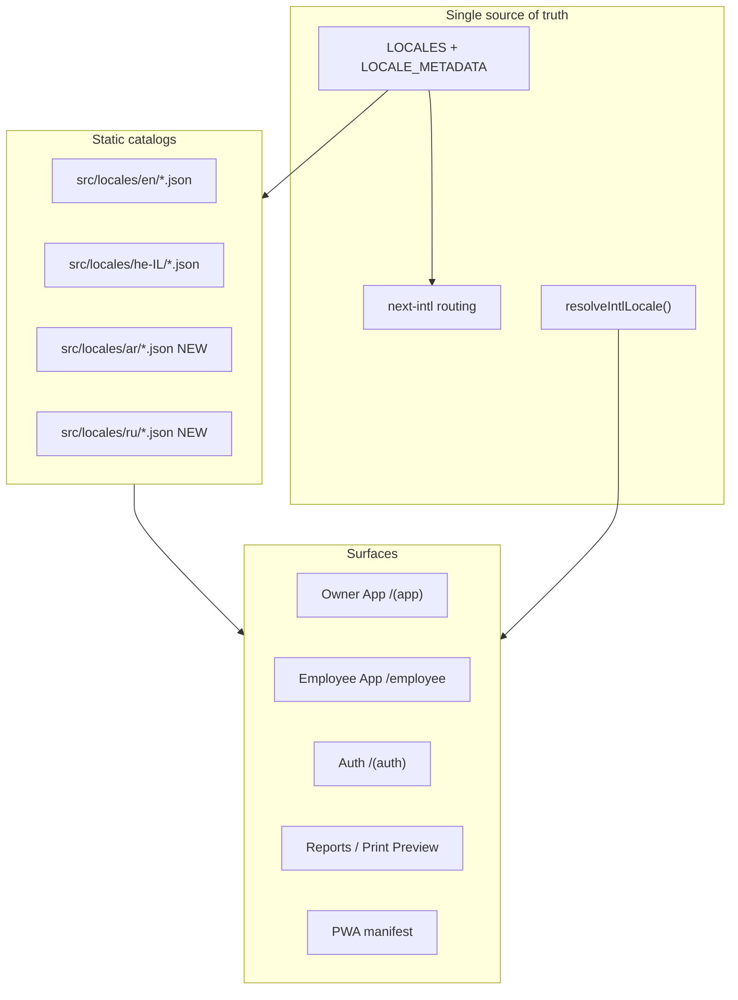
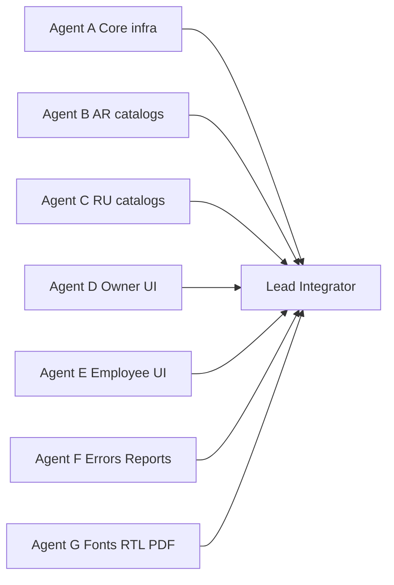

# ProjectFlow — Full Arabic + Russian Implementation Plan

## Current baseline (verified)

| Area | Today |
|------|-------|
| Locales | `he-IL` (RTL, default), `en` (LTR) only — [`src/shared/i18n/config.ts`](src/shared/i18n/config.ts) |
| Catalogs | 64 registered namespaces + orphan `attendance.json` → **~10,380 leaf keys** each in [`src/locales/en/`](src/locales/en/) and [`src/locales/he-IL/`](src/locales/he-IL/) |
| Routing | Always-prefixed `[locale]` via next-intl — [`src/shared/i18n/routing.ts`](src/shared/i18n/routing.ts) |
| Persistence | `NEXT_LOCALE` cookie + `profiles.locale_preference` (DB text, no enum) + auth metadata — [`src/shared/i18n/persist-locale-preference.ts`](src/shared/i18n/persist-locale-preference.ts), [`src/proxy.ts`](src/proxy.ts) |
| Merge fallback | Non-EN locales deep-merge EN under missing keys — [`src/shared/i18n/messages.ts`](src/shared/i18n/messages.ts) |
| Switchers | Owner [`src/components/shell/user-menu.tsx`](src/components/shell/user-menu.tsx), Employee [`src/modules/employee-app/ui/employee-user-menu.tsx`](src/modules/employee-app/ui/employee-user-menu.tsx) — both iterate `LOCALES` |
| Auth switcher | **None** on sign-in / employee login (URL prefix + cookie only) |
| CI parity | [`tests/unit/shared/i18n-messages.test.ts`](tests/unit/shared/i18n-messages.test.ts) — key/ICU/blank parity loops `LOCALES` |
| DB migration | **Not required** — `profiles.locale_preference` is free `text`; app validation enum must widen |
| PDF/Print fonts | Hebrew Noto embedded only — [`src/modules/reports/application/render-pdf.ts`](src/modules/reports/application/render-pdf.ts) |



---

## Phase 0 — Glossaries + generation tooling (Lead, before bulk translate)

Create terminology anchors **before** mass translation:

- **Arabic glossary** (≥50 critical strings): finance, projects, workforce, procurement — Israeli construction context; avoid Gulf/Egyptian colloquialisms; document decisions for: קבלן, מנהל עבודה, חשבונית, שוטף +N, מע"מ, עיכבון, קבלן משנה, etc.
- **Russian glossary** (≥50 critical strings): same domains; short UI labels; avoid bureaucratic Soviet phrasing.

Store glossaries in-repo as reference for translators/agents: `.cursor/plans/ar_ru_terminology_glossary.md` (working doc, not user-facing).

Add a one-shot generation script (dev-only, not CI):

```
scripts/generate-locale-namespace.ts --locale ar --namespace billing
```

Behavior:
1. Read EN canonical JSON
2. Apply glossary overrides for known keys
3. AI-translate remaining strings preserving ICU placeholders exactly (`{name}`, `{count, plural, ...}`)
4. Write to `src/locales/{ar|ru}/{namespace}.json`
5. Never translate enum codes, brand names (OneDrive, Google Drive, SUMIT), or identifiers

**Do not** implement runtime translation — all strings committed as static JSON.

---

## Phase 1 — Core locale infrastructure (Agent A)

### 1.1 Extend canonical config

Update [`src/shared/i18n/config.ts`](src/shared/i18n/config.ts):

```typescript
export const LOCALES = ['he-IL', 'en', 'ar', 'ru'] as const;

export const LOCALE_METADATA = {
  'he-IL': { code: 'he-IL', dir: 'rtl', label: 'עברית', htmlLang: 'he' },
  en:      { code: 'en',      dir: 'ltr', label: 'English', htmlLang: 'en' },
  ar:      { code: 'ar',      dir: 'rtl', label: 'العربية', htmlLang: 'ar' },
  ru:      { code: 'ru',      dir: 'ltr', label: 'Русский', htmlLang: 'ru' },
};
```

This automatically propagates to routing, switchers, `isLocale()`, bare-path redirects, and most tests.

### 1.2 Intl presentation mapping (country ≠ language)

Refactor [`src/shared/i18n/intl-locale.ts`](src/shared/i18n/intl-locale.ts):

| Route locale | BCP-47 for Intl | dir | Notes |
|--------------|-----------------|-----|-------|
| `he-IL` | `he-IL` | RTL | unchanged |
| `en` | `en-GB` | LTR | DD/MM/YYYY Israeli convention |
| `ar` | `ar-IL` | RTL | Israeli Arabic presentation; **ILS/VAT from org, not locale** |
| `ru` | `ru-IL` (fallback `ru-RU`) | LTR | Cyrillic; currency still from org |

Replace binary `resolveLabelLocale(): 'en' | 'he-IL'` with full `Locale` return type.

Add helpers: `isArabicLocale()`, `isRussianLocale()`, `isRtlLocale()` (already partially via `localeDirection`).

### 1.3 Widen app validation (no DB migration)

- [`src/modules/tenancy/validation/schemas.ts`](src/modules/tenancy/validation/schemas.ts) — `defaultLocale: z.enum([...LOCALES])`
- Audit ~30 files with binary `locale === 'he-IL' ? he : en` patterns (tenancy presets, payment terms, code-display, exports xlsx date format, project templates). **Rule:** preset seed names stay EN/HE in DB; UI labels for AR/RU come from catalogs, not hardcoded branches.

Critical hardcoded maps to extend:
- [`src/modules/business-catalog/domain/payment-term-labels.ts`](src/modules/business-catalog/domain/payment-term-labels.ts) — add `PAYMENT_TERM_LABELS_AR`, `PAYMENT_TERM_LABELS_RU`
- [`src/shared/i18n/code-display.ts`](src/shared/i18n/code-display.ts) — import AR/RU namespace JSON or route through dynamic loader
- [`src/modules/reports/domain/copy.ts`](src/modules/reports/domain/copy.ts), [`src/modules/exports/domain/export-copy.ts`](src/modules/exports/domain/export-copy.ts)

### 1.4 PWA manifest

Update [`src/modules/offline/domain/web-manifest.ts`](src/modules/offline/domain/web-manifest.ts):
- Extend `manifestLang()` for `ar` → `'ar'`, `ru` → `'ru'`
- Set `dir` from `LOCALE_METADATA` (not hardcoded `'auto'` only)
- Optionally wire unused `employeeApp.pwa.*` keys for localized short name

### 1.5 Auth language selector (minimal)

Add shared compact selector component: `src/shared/i18n/locale-switcher-inline.tsx`
- Renders 4 endonyms from `LOCALE_METADATA`
- On select: set cookie + `router.replace(pathname, { locale })` (no profile persist pre-auth)
- Mount on:
  - [`src/app/[locale]/(auth)/layout.tsx`](src/app/[locale]/(auth)/layout.tsx)
  - Employee login [`src/app/[locale]/employee/(public)/login/page.tsx`](src/app/[locale]/employee/(public)/login/page.tsx)
  - Employee set-pin page

---

## Phase 2 — Catalog generation (Agents B + C, parallel)

### Target

```
HE = EN = AR = RU = N (~10,380 keys)
missing = 0 | blank = 0 | ICU parity = pass
```

### Namespace split (parallel)

| Agent | Namespaces (priority order) |
|-------|----------------------------|
| **B — Arabic** | `common`, `nav`, `auth`, `errors`, `validation`, `employeeApp`, `workforce`, `billing`, `financial`, `projects`, `clients`, `vendors`, `expenses`, `commandCenter`, `notifications`, …all remaining |
| **C — Russian** | Same full set — **namespace-level file ownership** to avoid merge conflicts (B owns odd-index files, C even, or split by domain) |

### Generation workflow per namespace

1. Generate AR + RU from EN baseline via script
2. Run `npx vitest tests/unit/shared/i18n-messages.test.ts -t "billing"` (targeted)
3. Terminology pass against glossary for that namespace
4. Lead integrates + resolves conflicts

### Special namespaces

| Namespace | Extra care |
|-----------|------------|
| `validation`, `errors` | Exact error meaning; no softening |
| `commandCenter`, `notifications` | Alert tone, due-date wording |
| `reports`, `generatedDocuments` | Print labels, NET/GROSS/VAT |
| `externalStorage`, `integrations` | Keep provider brand names English |
| `workforce`, `employeeApp` | Attendance, PIN, clock in/out |
| `attendance.json` (orphan) | Either merge into `workforce` or add to `MESSAGE_NAMESPACES` + translate |

### Quality gate (manual sample)

After generation, Lead reviews ≥50 AR + ≥50 RU strings from glossary domains — check natural wording, Israeli context, consistent terminology.

---

## Phase 3 — Owner App validation (Agent D)

Representative route smoke in `/ar/` and `/ru/`:

- Dashboard, clients, projects (+ overview, contracts, change orders)
- Billing, payments, profitability, expenses
- Vendors, AP, recurring payments
- Employees, attendance, time reporting, subcontractors
- Command center, notifications, settings, storage, documents
- Profile / user menu language selector

Fix only:
- Raw i18n keys visible
- Overflow from long Russian strings (buttons, tabs, table headers, mobile cards)
- Missing `WithClientMessages` namespaces on client components

**No redesign.** Use existing RTL/LTR primitives — [`src/shared/i18n/ltr-island.tsx`](src/shared/i18n/ltr-island.tsx) for numbers, codes, email, PIN, phone.

---

## Phase 4 — Employee App validation (Agent E)

Routes: login, set-pin, home, attendance, hours, projects, documents, tasks, PWA install.

Fixes included in scope:
- Hardcoded `"—"` empty states on employee list pages → i18n keys
- Language selector on public auth pages (Phase 1.5)
- Credential share messages via [`createEmployeeAppCopyTranslator()`](src/shared/i18n/namespace-translator.ts) — extend for AR/RU

Permissions unchanged — only copy.

---

## Phase 5 — Validation, errors, notifications, reports (Agent F)

- Extend [`tests/unit/i18n/hebrew-runtime-acceptance.test.ts`](tests/unit/i18n/hebrew-runtime-acceptance.test.ts) → multi-locale runtime acceptance (raw-key scan, forbidden English residue in AR/RU UI)
- Extend [`tests/unit/i18n/scan-referenced-translations.ts`](tests/unit/i18n/scan-referenced-translations.ts) — validate client keys exist in **all** non-EN locales (today: he-IL only)
- Extend [`tests/unit/ux/no-technical-leakage-locales.test.ts`](tests/unit/ux/no-technical-leakage-locales.test.ts) to AR/RU
- Command center + notification copy: full catalog coverage (no HE/EN fallback on normal paths)
- Reports print preview: translate headers/labels via `reports` namespace; verify Arabic RTL print layout

---

## Phase 6 — Fonts, RTL, print/PDF (Agent G)

### Web UI — [`src/app/globals.css`](src/app/globals.css)

Extend `--font-sans` stack:
- Arabic: `'Noto Sans Arabic'`, `'Arial'`
- Russian: `'Noto Sans'`, `'Segoe UI'`, system Cyrillic fallbacks

Verify via browser: no tofu, correct Arabic shaping, Cyrillic coverage.

### Print shell — [`src/modules/reports/application/branded-document-shell.ts`](src/modules/reports/application/branded-document-shell.ts)

Locale-aware `font-family` in print CSS.

### PDF renderer — [`src/modules/reports/application/render-pdf.ts`](src/modules/reports/application/render-pdf.ts)

Today: Hebrew-only Noto + `HEBREW_RE` run splitting.

Extend:
1. Add font assets: `NotoSansArabic-Regular.ttf`, `NotoSans-Regular.ttf` (Cyrillic) under `src/modules/reports/fonts/`
2. Generalize text-run regex for Arabic (`\u0600-\u06FF`), Cyrillic (`\u0400-\u04FF`), Hebrew
3. RTL page flow for Arabic reports (mirror Hebrew approach)
4. LTR for Russian
5. Keep **PDF download disabled**; Print Preview only
6. Add tests: `render-pdf-arabic.test.ts`, `render-pdf-russian.test.ts` (glyph smoke, no WinAnsi fallback for non-ASCII)

---

## Phase 7 — Tests + CI (Lead)

### Unit (automatic in CI via `npm run test:unit`)

| Test file | Extension |
|-----------|-----------|
| [`i18n-messages.test.ts`](tests/unit/shared/i18n-messages.test.ts) | Auto-covers AR/RU once in `LOCALES`; add AR/RU completeness tests (no silent EN reuse) mirroring Hebrew checks |
| [`locale-direction.test.ts`](tests/unit/shared/locale-direction.test.ts) | AR = RTL, RU = LTR |
| [`auth-locale.test.ts`](tests/unit/shared/auth-locale.test.ts) | Cookie/profile resolution for ar/ru |
| [`client-message-wrappers.test.ts`](tests/unit/i18n/client-message-wrappers.test.ts) | All 4 locales |
| [`rtl-primitives.test.tsx`](tests/ui/rtl-primitives.test.tsx) | Arabic RTL cases |

### E2E (extend existing specs)

| Spec | Add |
|------|-----|
| [`tests/e2e/regression/locale.spec.ts`](tests/e2e/regression/locale.spec.ts) | `/ar/` RTL, `/ru/` LTR, cookie persistence |
| [`tests/e2e/authenticated/locale-profile-persistence.spec.ts`](tests/e2e/authenticated/locale-profile-persistence.spec.ts) | AR + RU profile survives refresh/re-login |
| New targeted smoke | Owner main routes AR/RU; Employee login/home/attendance AR/RU |

Playwright projects: add `desktop-ar`, `desktop-ru` (or parameterize existing).

### Performance check

Confirm per-locale dynamic import in [`messages.ts`](src/shared/i18n/messages.ts) — adding AR/RU catalogs must **not** bundle all 4 languages in one client chunk. Existing `pickClientMessages` + route-level `WithClientMessages` pattern unchanged.

---

## Phase 8 — Integration, release, final report (Lead)

### Pre-push checklist

- `npm run lint && npm run typecheck && npm run test:unit && npm run build`
- 4-locale parity: missing=0, blank=0, ICU=pass
- No business logic changes (VAT, currency, permissions, financial calculations)
- No unintended migration files
- No unrelated diagnostic/audit artifacts in diff
- Inspect diff scope

### Git / deploy (Owner-approved release only)

Per [`.cursor/rules/projectflow-release-preflight.mdc`](.cursor/rules/projectflow-release-preflight.mdc): full local CI preflight before push; monitor GitHub CI + Vercel.

Deliver **PROJECTFLOW AR/RU FULL LANGUAGE RELEASE REPORT** with all fields from user spec §31.

---

## Parallel agent ownership (conflict avoidance)



**Write boundaries:**
- A: `config.ts`, `intl-locale.ts`, `web-manifest.ts`, validation schemas, auth selector
- B: `src/locales/ar/**` only
- C: `src/locales/ru/**` only
- D/E: UI fixes in respective app folders (no catalog edits)
- F: test files + report/notification modules
- G: `globals.css`, `render-pdf.ts`, font assets
- Lead: merge conflicts, `payment-term-labels.ts`, `code-display.ts`, final parity verification

---

## Blockers (STOP conditions)

| Blocker | Action |
|---------|--------|
| DB CHECK constraint on locale discovered | STOP — report to Owner before migration |
| Swagger/external dependency | N/A for i18n |
| Font asset licensing/size | Use Noto (OFL); subset if bundle size regresses |
| Arabic PDF shaping failures | Fall back to HTML Print Preview (already primary path) |

---

## Completion criteria (all must pass)

- `/ar/...` and `/ru/...` routes work; AR RTL, RU LTR
- Owner + Employee selectors show עברית / English / العربية / Русский
- Locale persists: select → navigate → refresh → logout → login → profile
- HE = EN = AR = RU key count; 0 missing, 0 blank, ICU parity pass
- Core Owner + Employee flows translated; reports/notifications/errors/storage translated
- Fonts render; build + unit tests green
- Country/business rules unchanged (ILS, Israeli VAT, org timezone, permissions)
- Final report delivered; **no 5th language**
