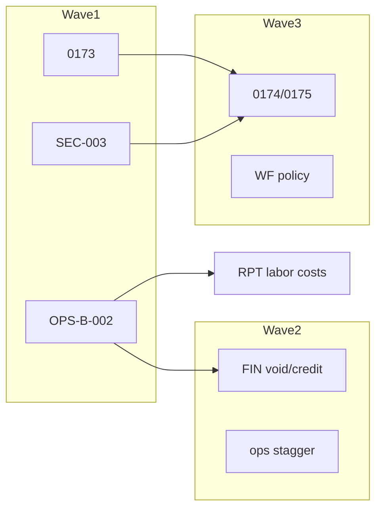

# ProjectFlow — תוכנית יישום מאסטר (שער שלמות Oct-3, Planning Only)

**מיקום יחיד:** [`.cursor/plans/complete_implementation_master.plan.md`](.cursor/plans/complete_implementation_master.plan.md) (`isProject: true`)

**סטטוס:** **BUILD COMPLETE (local)** (2026-10-09) — **לא** commit / push / deploy / Production SQL עד אישור Owner אחרי דוח

**מעקב התקדמות (Owner):** מרגע אישור Build — Lead **מעדכן את התוכנית בזמן אמת** (§S): todos, §P, §S.1 — לא רק בדוח הסיום.

**Owner decisions (locked):** UI-001/002 **NO CHANGE (customer portal DEFER)** · PM-012 **NO CHANGE (Google/Outlook DEFER)** · FIN2-001 **PRESERVE warn-only** · CRM-002 **PRESERVE (VERIFIED CORRECT)** · month-close **אופציונלי לנצח** · subcontractor expenses + contractor grants **PRESERVE** · תיאור הוצאה «עובדים» **אסור** לסיווג/מחיקה · **ProjectFlow ≠ payroll ≠ accounting** (§M, §R)

**Owner final clarifications (2026-10-09):** retro לכל סוגי הרשומות · approvals §R · migrations ללא תקרה §D · worker gates §F · scope §Q

**מקורות (חובה לקרוא ב-Build, לא זיכרון):**

| מקור | נתיב |
|------|------|
| 84 findings disposition | [`docs/audits/_verification-84-findings-final-disposition-2026-10-09.md`](docs/audits/_verification-84-findings-final-disposition-2026-10-09.md) |
| 15 flows + annex | [`docs/audits/PROJECTFLOW-FINAL-COMPLETE-VERIFICATION-2026-10-09.md`](docs/audits/PROJECTFLOW-FINAL-COMPLETE-VERIFICATION-2026-10-09.md) |
| Oct-3 DG handoff + tracks | [`.cursor/plans/developer_gc_subcontractor_management.plan.md`](.cursor/plans/developer_gc_subcontractor_management.plan.md) · [`docs/implementation/dev-gc-track-briefs.md`](docs/implementation/dev-gc-track-briefs.md) · [`docs/implementation/dev-gc-shared-contracts.md`](docs/implementation/dev-gc-shared-contracts.md) |
| Migrations 0154–0170 applied | [`docs/implementation/dev-gc-migration-ledger.md`](docs/implementation/dev-gc-migration-ledger.md) |
| עלות Vercel/Supabase | [`docs/audits/_vercel-supabase-consumption-audit-2026-10-09.md`](docs/audits/_vercel-supabase-consumption-audit-2026-10-09.md) |
| Executable proof map | [`docs/audits/_findings-executable-proof-ledger-2026-10-09.md`](docs/audits/_findings-executable-proof-ledger-2026-10-09.md) |

---

## A. כללים מחייבים ל-Build

1. **84/84 + Oct-3** — כל שורה ב-§B ו-§K; אין «Lead יחליט», אין «אולי».
2. **SQL (§D):** הכנת **כל** migration שנדרש באמת ליישום המלא — **אין תקרה מלאכותית** על מספר קבצים; journal/meta; verify schema + RLS + service access + data integrity **מקומית** לפני דוח סיום; apply PGlite/CI בלבד; **אפס** Production עד אישור Owner **אחד** בסוף; **לא** לעצור Build לאישור SQL נקודתי.
3. **OPS-B-002:** **אסור** patch של `recognition_source` שמשנה משמעות עסקית בלי הוכחת שקילות כספית (§E). Code-first; migration רק אם נדרש.
4. **Workers / עלות (§F):** **3 crons/יום ללא שינוי**; **אין** cron `*/5` / רביעי; **אין** polling חדש; שינוי concurrency חייב לעבור **6 gates** — **לא** לטעון ש-concurrency נמוך = עלות נמוכה יותר.
5. **שער סיום:** דוח עברית אחד (§I) + §P הצהרת שלמות.
6. **מעקב בזמן Build (§S):** אחרי כל merge wave / סגירת finding — עדכון **מיידי** בקובץ התוכנית (לא לדחות לסוף).

### הפרדות עסקיות (לא לשבור)

| הפרדה | Build |
|--------|--------|
| Billing ≠ Payment | PRESERVE מודלים; FIX רק FIN-* wiring |
| Commitment ≠ Actual expense | PRESERVE PO warn-only (FIN2-010) |
| Approved change ≠ Pending | PM-004 FIX + subcontract changes קיימים |
| NET profitability ≠ VAT | FIN-005 + דוחות RPT-* |

### מחוץ ל-Build

| פריט | הכרעה |
|------|--------|
| Customer portal (UI-001/002) | **NO CHANGE** + `docs/product/portal-status.md` |
| Google/Outlook calendar (PM-012) | **NO CHANGE** — הסתר placeholder |
| PM-003 merge field-ops stacks | **DOC** בלבד |
| PM-006 bookings→tasks | **NO CHANGE** |
| CRM-002 bridge | **VERIFIED CORRECT** |

---

## B. רישום 84 ממצאים — הכרעת יישום סופית

**מקרא:** **FIX** · **IMPLEMENT** · **PRESERVE** · **NO CHANGE** · **TEST-ONLY** · **DOC** · **EXTERNAL**

**Build progress (§S):** בעמודה **Done** — `-` = לא נגע · `wip` = בעבודה · `✓` = merged + test green (PRESERVE/NO CHANGE/DOC/EXTERNAL: `✓` אחרי regression/ doc בלבד).

| ID | הכרעה | Deliverable מדיד | Agent | Done |
|----|--------|------------------|-------|
| WF-001 | PRESERVE | regression `labor-expense-integrity` 6/6 | A | ✓ |
| WF-002 | FIX | correction path; לא void approved | A | ✓ |
| WF-003 | FIX | green `closed-period-source-corrections` (תלוי OPS-B-002) | A | ✓ |
| WF-004 | FIX | WDM validation + warn UI | G | ✓ |
| WF-005 | DOC | `docs/product/` LABOR-COST alignment | Lead | ✓ |
| WF-006 | FIX | org setting default draft sync | G | ✓ |
| WF-007 | FIX | timesheet container לפני «סגור שבוע» | G | ✓ |
| WF-008 | PRESERVE | — | — | ✓ |
| WF-009 | FIX | banner unallocated hours | G | ✓ |
| WF-010 | PRESERVE | — | — | ✓ |
| FIN-001 | FIX | idempotency keys allocations | C | ✓ |
| FIN-002 | FIX | void → statutory cancel mock | C | ✓ |
| FIN-003 | IMPLEMENT | billing UI credit/cancel מינימלי | C | ✓ |
| FIN-004 | FIX | credit → `SumitStatutoryProvider.creditDocument` | C | ✓ |
| FIN-005 | FIX | lineNet לפני SUMIT; fin-005 3/3 | C | ✓ |
| FIN2-001 | PRESERVE | warn-only overlap AP/expense | — | ✓ |
| FIN2-002 | FIX | labels gross vs net profit | I | ✓ |
| FIN2-003 | FIX | discipline actuals map | I | ✓ |
| FIN2-004 | NO CHANGE | `/overhead` redirect | — | ✓ |
| FIN2-005 | PRESERVE | disclosure | — | ✓ |
| FIN2-006 | FIX | duplicate `forecastProfit` locale | I | ✓ |
| FIN2-007 | PRESERVE | = WF-001 | — | ✓ |
| FIN2-008 | FIX | GCM loader timing | I | ✓ |
| FIN2-009 | FIX | block legacy org expenses API | I | ✓ |
| FIN2-010 | PRESERVE | PO receive ≠ expense tooltip | — | ✓ |
| CRM-001 | FIX | `markLinkedOpportunityWon` when opportunityId | F | ✓ |
| CRM-002 | PRESERVE | TEST-ONLY edges | — | ✓ |
| CRM-003 | FIX | `converted` רק ב-win | F | ✓ |
| UI-001 | NO CHANGE | portal-status doc | K | ✓ |
| UI-002 | NO CHANGE | portal-status doc | K | ✓ |
| UI-003 | FIX | revalidatePath attendance alias | D | ✓ |
| UI-004 | NO CHANGE | DOC inbox→today | K | ✓ |
| UI-005 | FIX | rename task-api stub | K | ✓ |
| SEC-001 | FIX | 0174 audit SELECT | E | ✓ |
| SEC-002 | FIX | 0174 contracts SELECT | E | ✓ |
| SEC-003 | FIX | roles.repository ↔ SQL helper | L | ✓ |
| SEC-004 | FIX | execution nav gate + EXTERNAL smoke | E | ✓ |
| SEC-005 | PRESERVE | — | — | ✓ |
| SEC-006 | FIX | default `project_access_mode=selected` | E | ✓ |
| SEC-007 | PRESERVE | — | — | ✓ |
| SEC-008 | PRESERVE | — | — | ✓ |
| SEC-009 | PRESERVE | 0168 ב-packet אם Production חסר | EXTERNAL | ✓ |
| SEC-010 | EXTERNAL | Owner verifies Production journal | — | ✓ |
| PM-001 | FIX | template apply BOQ+forms | H | ✓ |
| PM-002 | FIX | closeout UI template JSON | H | ✓ |
| PM-003 | DOC | field-dual-upload-models | H | ✓ |
| PM-004 | FIX | `convertWithSubcontracts` → change order | H | ✓ |
| PM-005 | DOC | planning-vs-tasks | H | ✓ |
| PM-006 | NO CHANGE | — | — | ✓ |
| PM-007 | PRESERVE | TEST-ONLY no CPM claim | — | ✓ |
| PM-008 | FIX | `default_progress_source` on apply | H | ✓ |
| PM-009 | FIX | owner task evidence gallery | H | ✓ |
| PM-010 | FIX | planningEligible inline message | H | ✓ |
| PM-011 | DOC | calendar-four-lenses | H | ✓ |
| PM-012 | NO CHANGE | hide EXTERNAL_CALENDAR UI | K | ✓ |
| PM-013 | FIX | kick logging + stagger | J | ✓ |
| PM-014 | FIX | assignAll help task UI | H | ✓ |
| PM-015 | PRESERVE | — | — | ✓ |
| DOC-001 | FIX | inline evidence preview | H | ✓ |
| DOC-002 | FIX | = PM-009 | H | ✓ |
| DOC-003 | PRESERVE | — | — | ✓ |
| DOC-004 | DOC | legacy-field-ops-vs-dg-evidence | H | ✓ |
| DOC-005 | FIX | locale audit actions | H | ✓ |
| DOC-006 | FIX | error/retry UX; EXTERNAL OAuth | H | ✓ |
| DOC-007 | PRESERVE | — | — | ✓ |
| DOC-008 | FIX | toast template folder skip | H | ✓ |
| DOC-009 | PRESERVE | — | — | ✓ |
| DOC-010 | PRESERVE | — | — | ✓ |
| DOC-011 | FIX | null category employee upload | H | ✓ |
| DOC-012 | FIX | statutory PDF archive → project folders | C/H | ✓ |
| RPT-001 | IMPLEMENT | labor-by-period report kind | I | ✓ |
| RPT-002 | TEST-ONLY | harness money-chain | I | ✓ |
| RPT-003 | TEST-ONLY | strict contract equality | I | ✓ |
| RPT-004 | FIX | UI labels org-report-aggregate | I | ✓ |
| RPT-005 | FIX | rename vendorActual KPI | I | ✓ |
| RPT-006 | FIX | analytics gate defaults | I | ✓ |
| OPS-001 | FIX | ops-worker ≤4 concurrent | J | ✓ |
| OPS-002 | FIX | provision job status endpoint | J | ✓ |
| OPS-003 | PRESERVE | Hobby limits | — | ✓ |
| OPS-004 | FIX | structured kick failure log | J | ✓ |
| OPS-005 | TEST-ONLY | ops-worker harness | J | ✓ |
| OPS-B-002 | FIX | §E month-close + EMC coupling | A | ✓ |
| OPS-B-003 | FIX | migration 0173 FORCE RLS | B | ✓ |
| UI-MOB-001 | FIX | reports @320 | D | ✓ |

**ספירה:** FIX 52 · IMPLEMENT 3 · PRESERVE 18 · NO CHANGE 8 · DOC 6 · TEST-ONLY 4 · EXTERNAL 3–4

---

## C. 15 זרימות עסקיות — תוצאת Build

| # | Build | Acceptance |
|---|--------|------------|
| 1 | FIX PM-001 + chain | `business-flow-chains` contract slice |
| 2–3 | PRESERVE | `subcontract-core` 8/8 |
| 4 | FIX FIN-002/004/005 | mock SUMIT NET/VAT/GROSS |
| 5 | FIX WF-006/007 | timesheet container integration |
| 6 | FIX OPS-B-002 | `ops-b-002` + `closed-period-source-corrections` |
| 7–8 | PRESERVE | `employee-actual-employer-cost` 6/6 |
| 9 | FIX WF-002 | wf-002 test |
| 10 | PRESERVE | po-receiving |
| 11 | TEST-ONLY | PO→expense chain (PRESERVE model) |
| 12–13 | PRESERVE | contractor-tasks, claims integration |
| 14 | PRESERVE + wiring | project-financials-wiring |
| 15 | FIX UI-MOB-001 | mobile reports unit |

---

## D. SQL — migration package (ללא תקרה מלאכותית)

**Policy (Owner):** Lead מוסיף קבצים **0173, 0174, 0175, …** עד שכל FIX/IMPLEMENT/SEC/OPS שדורש schema/RLS/policy מכוסה. **לא** להגביל Build ל-3–4 קבצים אם הוכחה מקומית דורשת עוד.

### D.1 Known-required (מינימום מתוכנן מה-84)

| Seq (reserved) | Trigger | מטרה |
|----------------|---------|------|
| **0173** | OPS-B-003 | FORCE RLS ×5 |
| **0174** | SEC-001/002 | audit + contracts SELECT policies |
| **0175** | attendance corrections | service_role / FORCE parity |
| **0176+** | §E OPS-B-002 gate | EMC/CHECK **רק** אם code-only לא מספיק |
| **0177+** | WF-006 / PT-05 | org setting column; scoped approver policy **רק אם** permission-only לא מספיק |
| **0178+** | any FIX agent | additive migrations לפי צורך (Lead owns numbering) |

**0168:** ב-packet **רק** אם SEC-009/SEC-010 מוכיחים Production חסר — לא apply ב-Build.

### D.2 Local verification (חובה לפני דוח §I)

- `npm run db:check-journal` — journal/meta עקביים
- `tests/integration/database/migrations.test.ts` + PGlite full chain apply
- RLS: tenant-isolation + permission-gap tests רלוונטיים
- Service paths: attendance correction / month-close adjustment smoke ב-integration
- **Data integrity:** אין migration שמוחקת היסטוריה עסקית / משנה מסמכי SUMIT שכבר הונפקו

### D.3 Production

- **Prepare during Build** · **Apply only after** Owner explicit post-report SQL approval · **Never** pause mid-Build for per-file SQL OK

---

## E. OPS-B-002 — procedure (Owner §5, לא hack)

**בעיה:** סגירת חודש + EMC `recognition_source=time_snapshot` vs `monthly_allocated` — displacement coupling (`ops-b-002-month-close-displacement.test.ts`).

**שלב 1 — הוכחה (Subagent A, לפני קוד):**

- Document expected: **אותו** employer actual cost, **אותן** הקצאות project/company, **אין** double recognition, retro actual override נשמר, closed period → `month_close_adjustments` לא rewrite source.
- Run baseline: `employee-actual-employer-cost`, `closed-period-source-corrections`, `ops-b-002-month-close-displacement`.

**שלב 2 — Code fix (preferred):**

- [`manage-periods.ts`](src/modules/month-close/application/manage-periods.ts), [`closeEmployeeMonthCost`](src/modules/workforce/data), [`labor-recognition.ts`](src/modules/workforce/domain/labor-recognition.ts), [`financials-read-bundle.repository.ts`](src/modules/financials/data/financials-read-bundle.repository.ts) — align **behavior** without changing business meaning of recognition labels unless proven equivalent.

**שלב 3 — Gate:**

| תוצאה | פעולה |
|--------|--------|
| Tests green + equivalence doc | **אין 0176** |
| CHECK/enum blocks legal correction path | Prepare **0176** additive + rollback; **לא** Production apply |

**אסור:** set `recognition_source=monthly_allocated` «רק כדי לעבור CHECK» בלי מסמך שקילות.

---

## F. Vercel / Supabase — workers & cost (Owner §4)

**CONFIRMED baseline:** 3 daily crons; ops-worker bundles dg-events (אין `*/5` ב-Build — handoff Oct-3 cron **לא** לשחזר).

**חובה:** concurrency נמוך יותר **אינו** הוכחה לעלות נמוכה יותר — מדוד duration, invocations, DB work; דוח §I מציג before/after **מדיד** בלבד.

### F.1 Six gates — כל שינוי OPS-001 / batching / stagger

| Gate | Acceptance (Build must prove) |
|------|-------------------------------|
| **Duration** | No worker batch exceeds Vercel function safe duration; partial progress persisted or resumable |
| **No lost work** | Scheduled/cron work still completes across runs; idempotency keys on side effects |
| **No duplicate business actions** | Stagger/retry cannot double-post billing, claims, allocations, notifications |
| **Bounded DB scans** | Documented caps per worker; no unbounded org-wide loops |
| **Safe retry/recovery** | Failed sub-worker logged (OPS-004); consumer retry schedule unchanged or stricter, not louder |
| **No unnecessary invocations** | No new crons; kick debounce; no new self-HTTP polling for coordination/notifications |

### F.2 Planned measures (default design)

| Measure | Target |
|---------|--------|
| OPS-001 stagger | ≤4 concurrent sub-workers (subject to §F.1) |
| Kick debounce | max 1 self-kick / 60s / instance (unit) |
| OPS-004 | 100% kick failures → structured log |
| Crons | 3/day unchanged — `vercel-hobby-crons.test.ts` |
| Events | reuse 0169 consumer — no coordination poller |

**SPECULATIVE GB savings** — אסור בדוח.

---

## G. Lead + 14 Subagents — ownership

### G.1 Agents

| ID | תחום | Owns (exclusive write) | Waves |
|----|------|-------------------------|-------|
| **Lead** | integrate | `drizzle/meta/*`, merge, release doc | 0,5 |
| **A** | Workforce + month-close/retro | `month-close/*`, `workforce/data/*`, employer costs | 1,3 |
| **B** | RLS hygiene | `0173*.sql` | 1 |
| **C** | Billing/SUMIT | `billing/*`, `invoicing-integration/*`, FIN-003 UI | 1–2 |
| **D** | Mobile UI | reports routes, UI-MOB | 1 |
| **E** | Security/RLS app | `0174/0175`, rbac guards, SEC-004 pages | 3 |
| **F** | CRM | convert-quote, opportunities | 3 |
| **G** | Workforce UX | attendance, timesheets, WF-006 setting | 3 |
| **H** | PM/templates/BOQ/DOC | `projects/templates*`, task owner UI, docs/product PM/DOC | 4 |
| **I** | Reports/financials | `reports/*`, `financials/*`, FIN2, RPT-001 | 4 |
| **J** | Ops/cost | `ops-worker`, kicks, runtime-usage-diag | 2 |
| **K** | UI cleanup/DEFER docs | portal-status, UI-005, PM-012 hide | 2 |
| **L** | Project team/permissions | `project-team/*`, SEC-003, delegation UX, scoped client approval | 1,3 |
| **M** | Coordination | **PRESERVE** — `coordination/*`; regression only unless gap found | 2 |
| **N** | Developer/GC preserve | execution-profile guards audit; **no** parallel DG schema | 4 |

**Conflict rule:** shared file → Lead serial merge.

### G.2 Parallel launch (Build)

- Wave 1: **A + B + D + C (FIN-005 start) + L (SEC-003)**
- Wave 2: **C + J + K + M**
- Wave 3: **E + F + G + L (approval slice)**
- Wave 4: **H + I + N (doc/guard tests only)**

### G.3 Reuse Oct-3 work

- **לא** rebuild: `0154` project team, `0161` coordination, `0156–0170` DG stack (ledger applied).
- **כן** complete: 84 FIX rows, SEC-003, OPS-B-002, PM template gaps, FIN wiring.

---

## H. Targeted tests (Build)

| Domain | Command pattern |
|--------|-----------------|
| P0 month-close | `vitest run tests/integration/month-close tests/integration/audit-verification/ops-b-002*` |
| Project team | `vitest run tests/integration/project-team tests/unit/project-team` |
| Coordination | `vitest run tests/integration/coordination` |
| DG subcontract/claims | `vitest run tests/integration/subcontract tests/integration/subcontract-claims` |
| RLS | `migrations.test.ts`, tenant-isolation |
| Finance | `tests/unit/invoicing-integration`, `audit-verification/fin-*` |
| WF | `audit-verification/wf-*`, `employee-actual-employer-cost` |
| CRM | `audit-verification/crm-*` |
| Ops | `tests/integration/ops`, dg-events consumer |

**אסור:** 387 routes, Playwright sweep, prod load, full 612 integration.

---

## I. Owner gate (post-Build, pre push)

דוח עברית **אחד**: 84/84 executed · 15/15 · §K/§Q scope · **SQL packet מלא 0173+** (§D) · PGlite/journal verify · vitest counts · §F six-gate evidence · §P checklist · git diff --stat.

---

## J. Wave 0 — Lead

1. CRM-002 → VERIFIED CORRECT in annex
2. `docs/product/portal-status.md`
3. §K matrix reviewed vs codebase
4. Branch + file locks §G

---

## K. Cross-specification coverage matrix (84 + 15 flows + Oct-3)

**Legend disposition:** **WORKING** · **PARTIAL→COMPLETE** · **FIX** · **IMPLEMENT** · **PRESERVE** · **DEFER** · **DOC** · **EXTERNAL**

### K.1 Project management lifecycle (Owner §1)

| Req | Expected | Implementation | Evidence | Gap | Deliverable | Agent | Test | SQL | Cost |
|-----|----------|----------------|----------|-----|-------------|-------|------|-----|------|
| PM-LIFE-01 | Client→Lead→Quote→Project→Contract→WP→Tasks→Changes→Costs→Billing→Statutory→Payment→NET P&L | Canonical modules linked | CRM/PM/finance routes + `business-flow-chains` partial | PM-001 template BOQ; PM-004 CO | FIX PM-001/004 | H,F | flow 1 integration | none | none |
| PM-LIFE-02 | Billing≠Payment, commitment≠expense, approved≠pending change | Separate tables/services | FIN2-010, PO tests | FIN wiring gaps | FIX FIN-* | C | fin mock chain flow 4 | none | none |
| PM-LIFE-03 | No duplicate project/task system | Single tasks module | `src/modules/tasks`, My Work, Kanban | — | **PRESERVE** | — | tasks integration | none | none |

### K.2 Project team & permissions (Owner §2, Oct-3 Track A)

| Req | Expected | Implementation | Evidence | Gap | Deliverable | Agent | Test | SQL | Cost |
|-----|----------|----------------|----------|-----|-------------|-------|------|-----|------|
| PT-01 | 32 capabilities / 16 templates, financial≠operational | [`capabilities.ts`](src/modules/project-team/domain/capabilities.ts), [`templates.ts`](src/modules/project-team/domain/templates.ts) | unit invariants + `project-team.test.ts` | — | **WORKING** | — | capabilities.test.ts | 0154 applied | none |
| PT-02 | Owner assigns PM/site/foreman; non-owner operates project | `project_members`, team UI, `requireProjectCapabilityPage` | team-surfaces.test.ts, 55 tests handoff | SEC-003 org/project union | **FIX** SEC-003 | L,E | project-team + rls-permission-gaps | 0174 maybe | none |
| PT-03 | Operational PM manages tasks **without** financials | Template `operational_project_manager` | integration «free of every financial capability» | Enforce on all new read paths | **PRESERVE+guard** | L | existing + SEC matrix | none | none |
| PT-04 | Revocable, auditable grants | add/deactivate member, audit_events | project-team.test.ts | — | **WORKING** | — | audit asserts | none | none |
| PT-05 | Client rep approves **only** expressly authorized operational reports | **Internal** `client_coordinator` project member (template, no financial caps) | `templates.ts` client_coordinator | Missing: explicit approve capability + notification path; **must not** expose employer cost/salary/margins/other projects | **IMPLEMENT slice**: project-scoped operational approve (attendance/project-time pending only); API/UI deny payroll fields | L,G | integration: coordinator approves pending; reads deny EMC/salary | permission-first; **0177+** only if RLS requires | none |
| PT-05b | **External** client identity ≠ portal | `external_principals` = contractor portal only today | 0156; **no** `ext.*` payroll | Do **not** broaden DEFER portal into client login | **NO CHANGE** customer portal; external client = future scoped grant **out of scope** unless Owner adds cap later | K | DOC portal-status | none | none |
| PT-06 | Customer portal (broad) | — | — | Owner DEFER | **DEFER** UI-001/002 | K | DOC only | none | none |

### K.3 Tasks (Owner §3)

| Req | Expected | Evidence | Gap | Deliverable | Agent | Test |
|-----|----------|----------|-----|-------------|-------|------|
| TASK-01 | Assignee, status, dates, comments, files, history, notifications | tasks module + DG external task 0160 | PM-009 evidence UI | FIX PM-009/DOC-001 | H | tasks + evidence |
| TASK-02 | Subcontractor task scoped to grant | contractor portal + ext.task.work | — | **PRESERVE** | — | contractor-tasks |
| TASK-03 | Portfolio/My Work/Kanban/Calendar/Gantt | existing surfaces | PM-011 doc | DOC PM-011 | H | unit nav |

### K.4 Employees / attendance / labor (Owner §4)

| Req | Expected | Evidence | Gap | Deliverable | Agent | Test |
|-----|----------|----------|-----|-------------|-------|------|
| WF-EMP-01 | Not payroll; retro entry simple | attendance.ts, correction requests | WF-002/006/007 | FIX rows | A,G | wf-* |
| WF-EMP-02 | Manager direct correction, no self-approval | owner exemption tests | — | **PRESERVE** | A | employer-cost |
| WF-EMP-03 | Pending until approver; audit trail | 0137 correction requests | UI-003 revalidate | FIX UI-003 | D | integration |
| WF-EMP-04 | Attendance ≠ approved project hours | allocation coverage UI | WF-009 banner | FIX WF-009 | G | dashboard unit |
| WF-EMP-05 | Employer actual override retro | employee-actual-employer-cost | OPS-B-002 | FIX §E | A | 6/6 + displacement |

### K.5 Month close optional + retro (Owner §1 + §M)

| Req | Expected | Evidence | Gap | Deliverable | Agent | Test |
|-----|----------|----------|-----|-------------|-------|------|
| MC-01 | Operate forever **without** closing any month | [`month-close/index.ts`](src/modules/month-close/index.ts) optional | — | **PRESERVE** | — | P&L without close |
| MC-02 | Retro + correct **all** listed domains | partial paths exist | OPS-B-002; FIN retro wiring | FIX §M table | A,C,I | O-07,O-08 + entity rows |
| MC-03 | Closed month: **simple correction**, not reopen/reclose | `month_close_adjustments` | OPS-B-002 | FIX §E | A | closed-period-source-corrections |
| MC-04 | Preserve business date + correction history | audit/adjustment tables | WF-002 | FIX | A | wf-002 |
| MC-05 | Statutory integrity — no silent edit issued docs | FIN-002/004 | FIN-003 UI | FIX/IMPLEMENT | C | fin mock cancel/credit |
| MC-06 | No unsafe recognition_source hack | — | OPS-B-002 | §E | A | equivalence doc |

### K.6 Subcontractors (Owner §6, Oct-3 E/F)

| Req | Expected | Evidence | Gap | Deliverable | Agent | Test |
|-----|----------|----------|-----|-------------|-------|------|
| SUB-01 | Grant→tasks→evidence→claims→retention→payment distinct | 0158/0159, portal, 0168 money gate | — | **WORKING** | — | subcontract-core, claims |
| SUB-02 | No duplicate expense from invoice/AP | FIN2-001 warn-only | — | **PRESERVE** | — | overlap test |
| SUB-03 | No «עובדים» text reclass | — | audit gap if any | **PRESERVE** + code review guard | I | unit grep policy |
| SUB-04 | PM-004 instruction→change order | convertWithSubcontracts stub | PM-004 | FIX | H | PM integration |

### K.7 Developer / GC (Owner §7, Oct-3 D+ledger)

| Req | Expected | Evidence | Gap | Deliverable | Agent | Test |
|-----|----------|----------|-----|-------------|-------|------|
| DG-01 | delivery profile + optional characteristics | 0157, project-profile module | — | **WORKING** | N | profile tests |
| DG-02 | execution-profile guards nav/actions | dev-gc-shared-contracts | SEC-004 | FIX SEC-004 | E | sec-004 test |
| DG-03 | Not forced on electrical contractor jobs | profile optional | — | **PRESERVE** | N | — |
| DG-04 | No second incompatible DG project model | extends `projects` | — | **PRESERVE** | — | — |

### K.8 Coordination events (Owner §8)

| Req | Expected | Evidence | Gap | Deliverable | Agent | Test |
|-----|----------|----------|-----|-------------|-------|------|
| COORD-01 | Create event, invite, notify, per-participant READY/NOT READY, tasks, history | [`coordination.test.ts`](tests/integration/coordination/coordination.test.ts) «יציקת תקרה קומה 1» | Command center wiring regression | **WORKING** — **PRESERVE** + lock tests | M | coordination 23+ scenarios |
| COORD-02 | No new polling cron | domain events 0169 | — | **PRESERVE** reuse events | J | consumer test |

### K.9 Clients / external (Owner §9 + §R)

| Req | Disposition | Agent |
|-----|-------------|-------|
| Customer portal (broad) | **DEFER** UI-001/002 — do not broaden | K |
| Contractor portal | **WORKING** preserve 0156+ | M |
| Internal client_coordinator operational approve | **PARTIAL→BUILD** PT-05 | L,G |
| External client identity / login | **OUT OF SCOPE** PT-05b (not portal) | K |

### K.10 Finance / DOC / storage (Owner §10)

Map 1:1 to §B FIN-*, DOC-*, DOC-012 external storage — **FIX** agents C/H; **PRESERVE** folder logic.

### K.11 Calendar (Owner §11)

**DEFER** external sync (PM-012 NO CHANGE); internal calendar/task/coordination **WORKING** (coordination calendar source, tasks calendar).

### K.12 Cost control (Owner §12)

§F + OPS-001/004/005 — agent J.

### K.13 84 findings + 15 flows

**Fully mapped in §B and §C** — no orphan ID.

---

## L. Oct-3 implementation status (code truth, not plan todos)

| Area | Status | Notes |
|------|--------|-------|
| Project team 0154 + UI | **WORKING** | Handoff: team page, employee hub, 55 tests |
| External identity 0156 | **WORKING** | Portal auth + grants |
| Profile 0157 | **WORKING** | Optional GC metadata |
| Subcontract 0158 / Claims 0159 | **WORKING** | PGlite verified, production applied |
| Collaboration tasks 0160 | **WORKING** | External assignment on canonical tasks |
| Coordination 0161 | **WORKING** | Full readiness matrix |
| Documents/plans 0162 | **WORKING** | |
| RFI/submittals 0163 | **WORKING** | |
| Inspections/defects 0164 | **WORKING** | |
| Daily log/meetings 0165 | **WORKING** | |
| Compliance 0166 | **WORKING** | |
| Procurement/closeout 0167 | **WORKING** | |
| Financial projection RLS 0168 | **WORKING** | Money gate |
| Notifications/CC 0169 | **WORKING** | No new poller in Build |
| Surfaces 0170 | **WORKING** | |
| Build wave FIX backlog | **PARTIAL** | 84 FIX rows + SEC-003 + OPS-B-002 + PM templates |
| `*/5` dg-events cron (handoff note) | **NOT IN BUILD** | Owner cost rule — ops-worker daily bundle only |

---

## M. Retroactive updates & optional month close (Owner §1 — mandatory)

**Product stance:** ProjectFlow is **project/operations management**, not payroll and not statutory accounting. Manual entry and retro correction are first-class.

**Month close:** Always **optional**. No user may be required to close a month to see labor cost, allocations, or project profitability.

**Retro entry/correction must work** (including when a month was closed), via existing entry UX or **`month_close_adjustments` / correction requests** — **never** a mandatory reopen→reclose workflow.

| Entity | Retro mechanism (preserve / extend) | Closed-month rule | Statutory / history |
|--------|-------------------------------------|-------------------|---------------------|
| Expenses | existing expense APIs + audit | adjustment if module active | no delete of posted history |
| Revenue / billing records | billing modules + FIN fixes | correction/adjustment path | SUMIT: cancel/credit only (FIN-002/003/004) |
| Payments | payment records | retro date preserved | no duplicate cash effect |
| Employee **actual employer cost** | employer-month-cost override | §E OPS-B-002 | total employer cost unchanged (WF-001) |
| Attendance | attendance + correction requests | manager direct; employee pending | audit trail |
| Project-hour allocation | time entries / labor allocation | WF-002 correction not void | approved→material change = authorized correction |
| Other operational records | domain-specific (claims, PO, etc.) | append-only where schema requires | PRESERVE DG append-only semantics |

**Invariants:** original **business date**; **entry/correction timestamp**; prior values in audit/adjustment; updated current financial view; closed-month **snapshot retained** where module stores it.

**Agents:** A (workforce/month-close), C (billing/SUMIT retro), I (reports reflect corrections), Lead (doc WF-005 alignment).

---

## R. Approvals & access (Owner §2 — mandatory)

| Actor | Behavior | Build |
|-------|----------|-------|
| **Owner / authorized manager** | Create and **directly correct** operational reports within org/project permission scope — **no employee approval** | **PRESERVE** + regression (`attendance`, owner views) |
| **Employee** | Submit reports/corrections that **require approval** → notification to authorized approver | FIX WF-006/007, UI-003; notifications existing infra |
| **Client representative** | Approve **only** expressly scoped **operational** reports (attendance/project-time pending) for **that project** | **IMPLEMENT** PT-05 via **internal** `client_coordinator` (+ explicit approve capability); **never** payroll, employer cost, margins, unrelated projects |
| **Internal vs external** | `client_coordinator` = org member on project team; **≠** deferred customer portal; **≠** contractor `external_principals` unless Owner later adds dedicated scoped cap | PT-05 vs PT-05b; **NO CHANGE** UI-001/002 |

**Financial separation:** operational project capabilities (e.g. operational PM) **never** imply `financial.*` / EMC reads — enforced in services, actions, RLS (PT-03, SEC-003, 0168 money gate **PRESERVE**).

**Duplicate workflows:** one approval path per action type; approve/reject UI; audit on decision (0137 pattern).

**Agents:** L (capabilities + approver scope), G (workforce UX), E (RLS if needed).

---

## N. Multi-agent dependencies

**Shared hotspots:** `manage-periods.ts` (A only until merge); `drizzle/meta` (Lead only); billing actions (C only).

---

## O. Acceptance tests — linked flows (Owner §15)

| Flow | Steps | Test home |
|------|-------|-----------|
| O-01 | assign role → task → revoke → deny | `project-team.test.ts` + extend |
| O-02 | operational PM tasks without financials | existing + financial read deny |
| O-03 | employee retro → pending → manager approve | wf-006/007 + correction requests |
| O-03b | employee retro → pending → **client_coordinator** approve (no salary/EMC) | PT-05 integration (Build) |
| O-04 | manager retro direct → history → costs | employee-actual-employer-cost |
| O-05 | subcontractor claim partial/revise | claims integration |
| O-06 | coordination READY/NOT READY → task | `coordination.test.ts` |
| O-07 | retro expense past month → P&L no duplicate | month-close adjustments + FIN2-001 preserve |
| O-08 | optional close → retro → snapshot + current view | closed-period-source-corrections |
| O-09 | employer actual fix → allocations, same total | 6/6 suite |
| O-10 | approved vs pending change on contract | PM-004 + subcontract changes |
| O-11 | SUMIT mock NET/VAT/GROSS + cancel/credit | fin-003-004-005 tests |

All via PGlite/vitest/mocked SUMIT — **no browser**.

---

## Q. Final implementation scope (Owner §5 — single Build)

Included in **one** Build approval:

- All **84** approved FIX/IMPLEMENT/PRESERVE/NO CHANGE/DOC/TEST dispositions (§B)
- All **15** business-flow acceptance rows (§C, §O)
- Project-team permissions, delegation, non-owner operators (§K.2, §L)
- Managers + employees + approvals (§R, §K.4)
- Subcontractors + claims (§K.6 — **PRESERVE** working + PM-004 FIX)
- Developer/GC workflows (§K.7 — **PRESERVE** 0157–0170 + SEC-004 FIX)
- Coordination READY/NOT READY (§K.8 — **PRESERVE** + regression)
- Tasks + project evidence (PM-009, DOC-001)
- Retroactive data + optional month close (§M)
- Finance, SUMIT, documents, reporting (§B FIN/DOC/RPT)
- Security + resource-consumption corrections (SEC-*, OPS-*, §F)

**Explicitly excluded:** customer portal (UI-001/002) · external calendar (PM-012) · CRM-002 change · FIN2-001 behavior change · free-text expense reclassification.

**Preserve:** all §L **WORKING** areas; contractor portal; canonical task/project model.

---

## P. Completeness checklist (evidence at plan time → Build completes remainder)

Planning / audit evidence **now** · Build execution **pending Owner "Build" command**

| Item | Plan | Evidence |
|------|------|----------|
| **84/84** mapped with agent + test | [x] | §B full table |
| **15/15** flows mapped | [x] | §C |
| **§K** Oct-3 + lifecycle rows | [x] | §K.1–K.13 |
| **32 caps / 16 templates** | [x] | `capabilities.ts`, `templates.ts`, unit tests |
| **Retro policy** Owner §1 | [x] | §M entity table + MC rows |
| **Approvals** Owner §2 | [x] | §R; PT-05/05b resolved |
| **Migrations policy** no artificial cap | [x] | §D.1–D.3 |
| **Worker 6 gates** | [x] | §F.1 |
| **DEFER** portal + calendar | [x] | §A, §Q |
| **PRESERVE** FIN2-001, CRM-002, PO, grants | [x] | §B rows |
| **Coordination WORKING** | [x] | `coordination.test.ts` cited §K.8 |
| **DG 0154–0170 WORKING** | [x] | `dev-gc-migration-ledger.md` §L |
| **SQL files prepared** | [x] | 0173–0176 prepared, journal OK |
| **PGlite/journal verified** | [x] | `npm run db:check-journal` + migrations.test |
| **84 FIX executed in code** | [x] | §B + דוח `docs/audits/BUILD-IMPLEMENTATION-REPORT-HE-2026-10-09.md` |
| **PT-05 integration test green** | [x] | `o-03b-client-coordinator-operational-approve.test.ts` |
| **OPS-B-002 equivalence + tests** | [x] | ops-b-002 + closed-period-source-corrections |

**Lead sign-off for Owner Build approval:** all [x] rows remain true; every [ ] row has owner agent + wave; no open «TBD» in §B/§K.

**During Build:** Lead מעדכן שורות [ ]→[x] כאן **בזמן אמת** כשהקריטריון met (לא רק בסוף Wave 5).

---

## S. מעקב התקדמות על התוכנית (חובה במהלך Build)

**Owner directive:** מרגע אישור Build — סימון **תוך כדי עבודה** על גבי התוכנית.

### S.1 מה מעדכנים ומתי

| מנגנון | מתי | מה לסמן |
|--------|-----|---------|
| **YAML `todos`** (ראש הקובץ) | תחילת wave → `in_progress`; אחרי merge + vitest wave → `completed` | `wave0-lead` … `wave5-integrate` |
| **§B עמודה Done** | התחלת ID → `wip`; merge + test → `✓` | כל 84 ממצאים |
| **§C flows** | אחרי regression של flow # | הוסף `✓` לשורה (Lead) |
| **§P checklist** | כש-SQL / PT-05 / OPS-B-002 וכו' הושלמו | `[ ]` → `[x]` + תאריך אופציונלי |
| **§S.2 log** | כל merge משמעותי | שורה חדשה |

### S.2 Build progress log (Lead ממלא במהלך Build)

| When (UTC+3) | Wave / Agent | Completed | Proof |
|--------------|--------------|-----------|-------|
| 2026-10-09 18:00+ | Wave1 A/B | OPS-B-002, 0173 | ops-b-002, closed-period, migrations.test |
| 2026-10-09 18:30+ | Wave2 C/J/K | FIN chain, ops-worker | sumit-credit-cancel, ops-worker-harness |
| 2026-10-09 18:45+ | Wave3 E/F/G/L | SEC 0174–0176 app, WF, PT-05 | rls-permission-gaps, o-03b, wf-002/006/007 |
| 2026-10-09 18:55+ | Wave4 H/I | PM/DOC/RPT/FIN2 | verification-81, coordination 4/4 |
| 2026-10-09 19:00+ | Wave5 Lead | audit-verification 34/34, journal | business-flow-chains Flow5 fix |

### S.3 כללים

- **Lead** אחראי לעדכון; subagents מדווחים finding IDs + test command ב-merge.
- **לא** לסמן `✓` ב-§B בלי test/regression שמצוטט ב-§S.2 (או PRESERVE/DOC/NO CHANGE לפי §B).
- Owner יכול לפתוח את התוכנית ב-Cursor Plans ולראות todos + §B Done + §P.

---

*עודכן — 2026-10-09 — Owner final clarifications — **READY FOR ONE EXPLICIT OWNER BUILD APPROVAL** — no implementation until then.*
