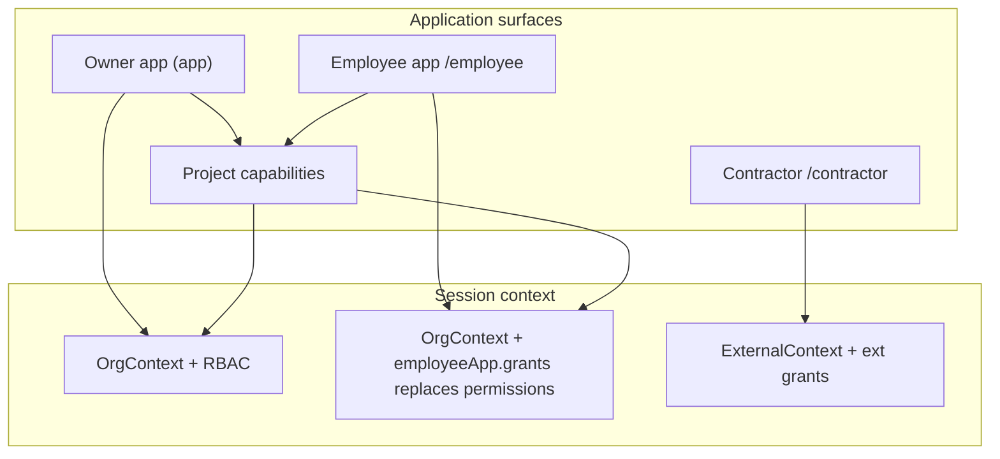
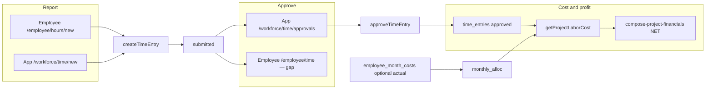
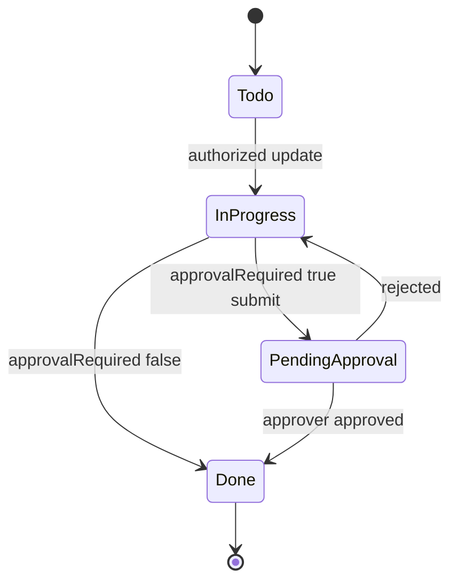

# ProjectFlow — Employee + Contractor All-Roles Completion Master Plan

**מיקום קנוני (יחיד):** [`.cursor/plans/employee_contractor_all_roles_completion_master.plan.md`](.cursor/plans/employee_contractor_all_roles_completion_master.plan.md) (`isProject: true`)

**Authoritative audit (read-only, do not re-run discovery):** [`docs/audits/PROJECTFLOW-EMPLOYEE-CONTRACTOR-ACCESS-WORKFLOW-AUDIT-2026-10-10.md`](docs/audits/PROJECTFLOW-EMPLOYEE-CONTRACTOR-ACCESS-WORKFLOW-AUDIT-2026-10-10.md)

**Prior release work (preserve):** Oct-9 master build in [`.cursor/plans/complete_implementation_master.plan.md`](.cursor/plans/complete_implementation_master.plan.md) — **do not regress** billing/SUMIT/finance fixes.

**Mode now:** PLAN ONLY — no implementation, commit, push, deploy, or Production SQL.

---

## 1. Executive objective

Deliver **one coordinated Build** that lets **every authorized internal employee** operate through **`/employee/**`** with **grant-adaptive** surfaces, while **`/(app)/**` Owner/back-office remains fully functional. Close **all 19 audit findings** (TL/EA/CP/UX/OFF/SYS) with reuse of existing modules, server actions, permission keys, project capabilities, and contractor isolation — **no second ERP**, **no destructive app merge**.

---

## 2. Final Owner decisions (locked for Build)

| Decision | Build implication |
|----------|-------------------|
| All internal employees → Employee App when they have `employee` role + active `employee_app_accounts` | Extend editor, nav, routes, guards — not org-Owner bypass |
| Permissions = explicit grants, not job title | Presets are **defaults only**; Owner toggles in [`employee-app-access-panel.tsx`](src/modules/employee-app/ui/employee-app-access-panel.tsx) |
| Task default: `approvalRequired = false` | **PRESERVE** DB default ([`drizzle/schema/tasks.ts`](drizzle/schema/tasks.ts)); optional approval only when configured |
| Secretary/accountant/PM must not need org Owner | Grant `CRM_*`, finance ops, etc. on employee plane where listed below |
| `(app)` preserved | Shared services; employee pages pass `surface="employee"` like [`BillingOrgDetailView`](src/modules/billing/ui/billing-org-detail-view.tsx) |
| Contractor separate | No internal payroll/settings; complete portal UX on existing `submitContractorBid` / `submitHandoverChecklistItem` backends |
| Mobile | Fix **confirmed** UX-001/UX-002 only; no broad mobile redesign |
| Production data | No bulk fake data, load tests, or mass scans; targeted vitest/integration only |
| SQL | Prepare migrations **0178+** if RLS/grants require it; **STOP before apply** per [`AGENTS.md`](AGENTS.md) |

---

## 3. Exact scope

**In scope**

- Employee permission editor + presets + nav for: CRM, meetings manage, workforce cost, finance/SUMIT **operations** (not org settings admin), reports read where granted
- Employee routes wrapping existing modules (CRM, workforce, meetings, billing/AP/SUMIT send paths, notifications)
- Task lifecycle parity: main app + employee + approval notifications + command-center deep links
- **Approved project hours → labor cost → profitability** (§9); GM attendance exemption preserved; optional actual monthly employer cost
- Contractor: tender bid submit UI, handover submit UI, inspection detail route, task/evidence/notifications parity where backend exists
- SYS terminology UX; EA-005 activity scoping; optional icon mobile nav (UX-001)

**Out of scope (protections)**

- Customer portal (UI-001/002 defer from Oct-9 plan)
- Google/Outlook calendar (PM-012)
- Merging `(app)` and `/employee` into one shell
- New paid infra; Production SQL without explicit post-report Owner approval
- Re-auditing 41 domains from scratch

---

## 4. Architecture — four planes (unchanged)



**Reuse pattern:** Page → `assertEmployeeAppContext` + `employeeHasPermission` / `assertEmployeeCanExercise*` → call **same** application services as `(app)` → UI adapter with `surface="employee"` and [`employee-surface-styles`](src/modules/employee-app/ui/employee-surface-styles.ts).

**Enforcement stack (every new route):** nav filter → page guard → server action → RLS (`has_org_permission`, employee grant resolution in [`enrich-context.ts`](src/modules/employee-app/application/enrich-context.ts)).

---

## 5. Audit traceability matrix (19/19 — zero deferrals)

| ID | Sev | Disposition | Requirement | Primary reuse | Key files | Package | Verification | Acceptance |
|----|-----|-------------|-------------|---------------|-----------|---------|--------------|------------|
| **TL-001** | CRITICAL | FIX | Block `status→done` when `approvalRequired` and no approved request | [`assertTaskCompletionApprovalSatisfied`](src/modules/tasks/application/submit-task-approval.ts) (already used in employee path) | [`update-task.ts`](src/modules/tasks/application/update-task.ts), [`work/actions.ts`](src/app/[locale]/(app)/work/actions.ts) `updateTaskAction` / `updateTaskFieldsAction`, any bulk status helpers | **B** | Unit: updateTask rejects done; integration: mirror [`employee-pm-task-lifecycle.test.ts`](tests/integration/employee-app/employee-pm-task-lifecycle.test.ts) for org member | Main app cannot mark done without approval when flag true |
| **TL-002** | CRITICAL | FIX | UI to set/clear `approvalRequired` on create/edit for authorized editors | [`createTask`](src/modules/tasks/application/create-task.ts), [`updateTask`](src/modules/tasks/application/update-task.ts), schema already supports field | [`task-detail-sheet.tsx`](src/modules/tasks/ui/task-detail-sheet.tsx), work board/calendar actions, [`employee-task-create-fields.tsx`](src/modules/employee-app/ui/employee-task-create-fields.tsx), [`employeeCreateTaskAction`](src/app/[locale]/employee/(shell)/tasks/actions.ts), employee task edit | **B** | Unit: create/update passes flag; manual: create task with approval on main + employee | Owner/PM can configure optional approval |
| **TL-003** | MEDIUM | FIX | Notify assignee/approver on submit + decide | [`emitNotification`](src/modules/notifications/application/emit.ts), copy in [`notifications/domain/copy.ts`](src/modules/notifications/domain/copy.ts) | New `notify-task-approval.ts`; hook from [`submitTaskApprovalRequest`](src/modules/tasks/application/submit-task-approval.ts), [`decideApprovalRequest`](src/modules/approvals/application/decide.ts) when `entityType==='task'` | **B** | Integration: emit with dedupe; listNotifications recipient | Approver receives in-app notification with correct deep link |
| **TL-004** | LOW | PRESERVE | Default false | DB default | [`drizzle/schema/tasks.ts`](drizzle/schema/tasks.ts) | — | Existing schema test | No code change |
| **EA-001** | HIGH | FIX | Task cards show real `approvalRequired` | TaskCardData | [`map-employee-pm-task-card.ts`](src/modules/employee-app/application/map-employee-pm-task-card.ts), [`map-employee-task-to-calendar-card.ts`](src/modules/employee-app/application/map-employee-task-to-calendar-card.ts) | **B** | Unit serialize cards | Badge visible when flag true |
| **EA-002** | MEDIUM | IMPLEMENT | Employee notification center | Same RPC as org [`listNotifications`](src/modules/notifications/application/list.ts); pattern from [`contractor/.../notifications/page.tsx`](src/app/[locale]/contractor/(portal)/notifications/page.tsx) | New `/employee/notifications` + shell badge; [`get-employee-shell.ts`](src/modules/employee-app/application/get-employee-shell.ts) nav item gated on `NOTIFICATIONS_READ` or implicit for all employee users with linked `userId` | **B** | Extend [`tests/integration/notifications/isolation.test.ts`](tests/integration/notifications/isolation.test.ts) for employee session | Employee sees assignments/approvals; deep links use `/employee/...` |
| **EA-003** | HIGH | FIX | Status transitions via shared lifecycle + activity | [`transitionTask`](src/modules/tasks/domain/lifecycle.ts), [`updateTask`](src/modules/tasks/application/update-task.ts) or extracted `applyTaskStatusChange` | Refactor [`updateEmployeePmTaskStatus`](src/modules/employee-app/application/employee-pm-tasks.ts) — remove raw SQL status patch; preserve `actorEmployeeId` activity | **B** | Extend employee-pm-task-lifecycle tests | Same transition rules as main app; approval gate preserved |
| **EA-004** | MEDIUM | FIX | Consistent error UX on employee task pages | [`mapEmployeeTaskActionError`](src/app/[locale]/employee/(shell)/tasks/actions.ts) | Employee task detail + forms use shared error banner components | **B** | Unit action error mapping | Domain errors show translated keys not raw exceptions |
| **EA-005** | MEDIUM | FIX | Task activity only after task read auth | Employee task assert helpers | [`load-task-activity-for-display.ts`](src/modules/tasks/application/load-task-activity-for-display.ts) + [`task-activity.tsx`](src/modules/tasks/ui/task-activity.tsx) — call `assertEmployeeCanExerciseTaskPermission` or org `getTaskDetail` gate before query | **F** | Integration: cross-org task id → NotFound | URL cannot leak activity |
| **CP-001** | MEDIUM | IMPLEMENT | Tender bid submission | [`submitContractorBid`](src/modules/contractor-procurement/application/tenders.ts) | [`contractor/.../tenders/page.tsx`](src/app/[locale]/contractor/(portal)/projects/[projectId]/tenders/page.tsx) + detail route `[packageId]` + server actions | **E** | Reuse [`dg-fixtures-procurement`](tests/setup/dg-fixtures-procurement.ts) integration | Invited contractor submits bid once |
| **CP-002** | MEDIUM | IMPLEMENT | Handover item submit | [`submitHandoverChecklistItem`](src/modules/contractor-closeout/application/closeout.ts) | [`handover/page.tsx`](src/app/[locale]/contractor/(portal)/projects/[projectId]/handover/page.tsx) + actions | **E** | [`closeout-field-lock.test.ts`](tests/integration/dg-procurement/closeout-field-lock.test.ts) pattern | Contractor can submit owned checklist items |
| **UX-001** | MEDIUM | FIX | Icon + label bottom nav (align with contractor) | [`portal-shell`](src/modules/contractor-portal/ui/portal-shell.tsx) icon pattern | [`employee-bottom-nav.tsx`](src/modules/employee-app/ui/employee-bottom-nav.tsx), [`employee-navigation.ts`](src/modules/employee-app/application/employee-navigation.ts) — add `iconKey` map | **F** | Unit nav snapshot; visual spot-check one screen | Icons on primary tabs; RTL unchanged |
| **UX-002** | LOW | FIX | Contractor body double-scroll | Employee fix in [`globals.css`](src/app/globals.css) `:has([data-pf-employee-app])` | Add `data-pf-contractor-portal` on portal shell + matching CSS block | **F** | Manual mobile contractor dashboard | No empty page scroll |
| **OFF-001** | HIGH | IMPLEMENT | CRM/leads via Employee App | CRM module pages under `(app)/crm` | Add `CRM_READ`/`CRM_MANAGE` to [`permission-editor.ts`](src/modules/employee-app/application/permission-editor.ts); routes `/employee/crm`, `/employee/crm/opportunities/...`; nav in [`get-employee-shell.ts`](src/modules/employee-app/application/get-employee-shell.ts); update **secretary** preset with CRM grants (Owner can revoke) | **C** | [`management-office-personas.test.ts`](tests/unit/employee-app/management-office-personas.test.ts) + CRM permission unit | Secretary with grant sees CRM without `(app)` login |
| **OFF-002** | HIGH | IMPLEMENT | HR/payroll cost per grant | Workforce module | Add `WORKFORCE_COST_READ`/`WORKFORCE_COST_MANAGE` to editor; routes `/employee/workforce` (hub), `/employee/workforce/cost`, `/employee/workforce/payroll` reusing `(app)/workforce/*` loaders with employee guards; extend `/employee/team` links | **D** | Employee permission scope tests; no salary without grant | HR employee sees cost only with explicit grant |
| **OFF-003** | MEDIUM | IMPLEMENT | Bookkeeper SUMIT/statutory **operations** on employee | Billing + SUMIT providers (Oct-9 FIN-004/005) | Grant keys: keep `INTEGRATIONS_READ` **out of editor** for credential edit; add operational keys already in catalog (`BILLING_MANAGE`, `MONTH_CLOSE_*`, `TAX_*` as appropriate) to editor subsets; employee billing detail actions for send/credit/sync mirroring owner with `surface="employee"` guards — **not** [`settings/integrations`](src/app/[locale]/(app)/settings/integrations) | **D** | Mock statutory provider tests | Bookkeeper sends invoice from `/employee/billing` without Owner settings |
| **SYS-001** | MEDIUM | FIX | Distinguish org `manager` vs project PM | [`ROLE_TEMPLATES`](src/shared/permissions/role-templates.ts) | Rename display `manager.name` → "Organization Manager" (+ he/ar/ru locale keys); help text in roles UI + link to project capabilities doc | **A** | Snapshot locale strings | UI no longer says org manager = "Project Manager" only |
| **SYS-002** | MEDIUM | DOC + light UX | Field worker surface clarity | Presets vs org `worker` | Doc section in plan release report; optional banner on `(app)` field-ops when membership also has active employee account ("Open Employee App") — **no forced redirect** | **A** | Doc only + optional banner behind feature-less flag | No permission collapse |
| **SYS-003** | LOW | FIX | Command center links to correct surface | [`collect-tasks.ts`](src/modules/command-center/data/collect-tasks.ts) | When recipient has active employee app + task assignee/approver context, set `href` to `/employee/tasks/{id}` (and `?tab=approvals`); helper `resolveTaskDeepLink(context, taskId)` | **B** | Unit collect-tasks href | Employee approver lands on employee task |

**Additional contractor partials (audit §11–12, not separate IDs):**

| Gap | FIX | Backend | UI | Package |
|-----|-----|---------|-----|---------|
| Inspection detail | Add `[inspectionId]/page.tsx` | [`listContractorInspections`](src/modules/inspections) + existing detail loader if present else add `getContractorInspection` | Link from list page | **E** |
| Contract/agreement workflow | PRESERVE read; add actions only if grant allows (changes ack) | [`getContractorAgreement`](src/modules/subcontracts) | Review [`changes/page.tsx`](src/app/[locale]/contractor/(portal)/projects/[projectId]/contracts/[agreementId]/changes/page.tsx) for submit gaps vs caps | **E** |

---

## 6. Employee permission matrix (editor + presets)

**Extend [`EMPLOYEE_PERMISSION_EDITOR_GROUPS`](src/modules/employee-app/application/permission-editor.ts):**

| Group | Keys to add | Scopes |
|-------|-------------|--------|
| commercial | `CRM_READ`, `CRM_MANAGE` | `all_organization` |
| meetings | `MEETINGS_MANAGE` | `assigned_only`, `all_organization` |
| workforce | `WORKFORCE_COST_READ`, `WORKFORCE_COST_MANAGE` | `assigned_only`, `all_organization` |
| financials | `MONTH_CLOSE_READ`, `MONTH_CLOSE_MANAGE`, `TAX_MANAGE`, `AUDIT_READ`, `REPORTS_READ` (if in catalog) | `all_organization` only where finance-appropriate |
| notifications | `NOTIFICATIONS_READ` | `self_only` / implicit |

**Do not add:** `SETTINGS_MANAGE`, full `INTEGRATIONS_*` credential admin, `ROLES_*`, org deletion — Owner `(app)` only.

**Preset updates ([`presets.ts`](src/modules/employee-app/application/presets.ts)) — defaults, Owner overrides:**

- `secretary`: add `CRM_READ`, `CRM_MANAGE`, optional `MEETINGS_MANAGE` (scope `all_organization`)
- `office_admin` / `office`: add `CRM_READ`; bookkeeper-style: ensure AP/billing already present; add `MONTH_CLOSE_READ` only if product wants default (prefer **custom** grant by Owner)
- `management`: do **not** auto-add org-wide profit; keep existing toggles
- `project_manager` employee preset: no automatic `PROJECT_PROFIT_READ` expansion

**Nav updates ([`buildEmployeeNavItems`](src/modules/employee-app/application/get-employee-shell.ts)):**

- `/employee/crm` → `CRM_READ`
- `/employee/notifications` → linked user + not revoked
- `/employee/workforce` → `WORKFORCE_READ` or cost read
- `/employee/reports` → `REPORTS_READ` / `PROJECT_FINANCIALS_READ` (partial mirrors existing domain 23)

---

## 7. Contractor grant matrix (no change to templates)

Preserve [`EXTERNAL_GRANT_TEMPLATES`](src/shared/external/grant-templates.ts) (4). UI completion maps capabilities → actions:

| Capability | Route | Action |
|------------|-------|--------|
| `ext.bid.submit` | tenders | `submitContractorBid` |
| `ext.handover.submit` | handover | `submitHandoverChecklistItem` |
| `ext.inspection.view` | inspections + detail | read/submit checklist if spec exists |
| `ext.task.*` | tasks | existing collaboration tests green |

---

## 8. Module-by-module implementation (employee surfaces)

| Domain | Existing employee routes | Build work |
|--------|-------------------------|------------|
| CRM/leads | None | New CRM adapter pages; server actions call existing CRM module |
| Clients/quotes/meetings | clients, quotes, meetings read | CRM hub; meetings create when `MEETINGS_MANAGE` |
| Tasks | 92 routes | Package B lifecycle |
| Billing/AP/expenses | billing, ap, expenses | Package D SUMIT ops on detail views |
| Workforce/HR | team, time, attendance, hours/new | Package D: **§9 labor workflow** — approve UI gap, cost review mirror, profitability read |
| Projects/DG execution | mirrors exist | PRESERVE guards; only fix links/notifications |
| Documents | yes | PRESERVE |
| Procurement/tenders employee | employee tenders | PRESERVE; contractor package separate |

---

## 9. Employee Project Hours, Approved Labor Allocation and Project Profitability

**Owner policy (locked):** שעות פרויקט מאושרות בלבד נכנסות ל-Actual של עלות עבודה בפרויקט; נוכחות ≠ הקצאת פרויקט; שעות לא מוקצות = עלות ברמת חברה; **אין** הקצאה אוטומטית של נוכחות/שכר לפרויקטים; **אין** כפילות מול expenses/payroll; רווחיות **נטו ללא VAT** (מנוע financials קיים).

### 9.1 Current implementation evidence (code trace)

| Layer | Path | Status |
|-------|------|--------|
| **Policy / lifecycle** | [`timesheet-lifecycle.ts`](src/modules/workforce/domain/timesheet-lifecycle.ts) — attendance vs `time_entries`; Actual = `recorded` + `approval_status=approved` only | **IMPLEMENTED AND CONNECTED** |
| **Employee report UI** | [`/employee/hours/new`](src/app/[locale]/employee/(shell)/hours/new/page.tsx) → [`createTimeEntryAction`](src/app/[locale]/(app)/workforce/time/actions.ts) → [`createTimeEntry`](src/modules/workforce/application/time-entries.ts) | **IMPLEMENTED** (permission `TIME_MANAGE`, scope via employee grants) |
| **Manager approve (engine)** | [`approveTimeEntry`](src/modules/workforce/application/timesheets.ts) / [`approveTimesheet`](src/modules/workforce/application/timesheets.ts); [`assertNotSelfTimeApproval`](src/modules/workforce/application/scoped-operational-approval.ts) | **IMPLEMENTED AND CONNECTED** |
| **Manager approve UI (Owner app)** | [`/(app)/workforce/time/approvals`](src/app/[locale]/(app)/workforce/time/approvals/page.tsx) + actions | **IMPLEMENTED AND CONNECTED** |
| **Manager approve UI (Employee app)** | [`/employee/time`](src/app/[locale]/employee/(shell)/time/page.tsx) lists [`listEmployeePendingTimeApprovals`](src/modules/employee-app/application/employee-operational.ts) | **PARTIAL** — display only; **no** approve/return/submit actions |
| **Project labor Actual (approved hours)** | [`sumProjectLaborCost`](src/modules/workforce/data/time-entries.repository.ts) filters `approvalStatus='approved'` | **IMPLEMENTED AND CONNECTED** |
| **Profitability integration** | [`getProjectLaborCost`](src/modules/workforce/application/project-labor-cost.ts) → [`compose-project-financials`](src/modules/financials/application/compose-project-financials.ts) + [`mergeResidualTimeAndMonthlyAllocatedLabor`](src/modules/workforce/domain/labor-recognition.ts) | **IMPLEMENTED AND CONNECTED** |
| **Monthly employer cost (estimated + optional actual)** | [`employer-month-costs.ts`](src/modules/workforce/application/employer-month-costs.ts), UI [`MonthlyEmployerCostReview`](src/modules/workforce/ui/monthly-employer-cost-review.tsx) on [`/(app)/workforce/employees/[employeeId]`](src/app/[locale]/(app)/workforce/employees/[employeeId]/page.tsx) | **IMPLEMENTED** on `(app)`; **PARTIAL** on `/employee` (OFF-002) |
| **Apply allocation → projects** | [`applyMonthlyEmployerCostAllocation`](src/modules/workforce/application/employer-month-costs.ts), [`monthly-allocation.ts`](src/modules/workforce/domain/monthly-allocation.ts), SQL trigger `recognition_source` | **IMPLEMENTED AND CONNECTED** |
| **Retroactive corrections** | [`correctTimeEntry`](src/modules/workforce/application/time-entries.ts) (void+replace); [`correctMonthlyEmployerCostActual`](src/modules/workforce/application/employer-month-costs.ts); month-close gates [`assertMonthOpenForRewrite`](src/modules/month-close/application/manage-periods.ts) | **IMPLEMENTED**; employee surface for corrections **NOT VERIFIED** |
| **GM attendance exemption** | `compensationClass: 'owner_manager'` — [`attendance-workday.ts`](src/modules/workforce/domain/attendance-workday.ts), collectors skip GM — [`owner-manager-attendance-exemption.test.ts`](tests/integration/workforce/owner-manager-attendance-exemption.test.ts) | **IMPLEMENTED AND CONNECTED** — **PRESERVE** |
| **GM manual project hours** | GM may log time without attendance; monthly recognition path for owner_manager in [`monthly-cost-recompute.ts`](src/modules/workforce/application/monthly-cost-recompute.ts) / employer-month-costs | **IMPLEMENTED** (tests CASE 2 in exemption suite) |
| **Double-count prevention** | [`labor-recognition.ts`](src/modules/workforce/domain/labor-recognition.ts) displacement; Oct-9 **WF-001** `labor-expense-integrity`; billing≠payment preserved | **IMPLEMENTED** — **PRESERVE** |
| **Unallocated company cost** | Non-project time entries (`kind` ≠ project); month-close completeness / WF-009 unallocated hours banner (Owner app) | **CONNECTED** on `(app)`; employee banner **optional** in Package D if grants warrant |
| **Audit W6** | Attendance → payroll cost on `(app)`; employee time approve partial | **PARTIAL** — closed by Package D |



### 9.2 Employee reporting permissions (no new engine)

| Permission | Employee use | Scope |
|------------|--------------|--------|
| `ATTENDANCE_SELF` | Clock in/out on `/employee/time` | `self_only` — **optional** per employee |
| `TIME_MANAGE` | Log project hours [`/employee/hours/new`](src/app/[locale]/employee/(shell)/hours/new/page.tsx) | `self_only` / `assigned_only` / `all_organization` per grant |
| `TIME_APPROVE` | Must approve submitted entries before Actual | `assigned_only` / `all_organization`; scoped via [`assertCanApproveProjectTimeEntry`](src/modules/workforce/application/scoped-operational-approval.ts) |
| `WORKFORCE_COST_READ` / `MANAGE` | View/adjust monthly employer cost + allocation runs | Owner/HR/bookkeeper — employee routes **Package D** |
| `PROJECT_FINANCIALS_READ` | Project profitability panels (read-only labor slice) | Existing employee project financial mirrors where granted |

**Rule H:** `TIME_MANAGE` without `ATTENDANCE_SELF` is valid (office/architect/consultant/GM).

### 9.3 General Manager — preserve existing policy

- **Do not** require clock-in/out for `compensationClass === 'owner_manager'`.
- **Do not** remove self-service project time logging ([`loadQuickLogFormData`](src/modules/workforce) includes linked employee / assignable projects per existing rules).
- Approved hours follow **same** `approveTimeEntry` path (no auto-approve on create — [`timesheet-lifecycle.ts`](src/modules/workforce/domain/timesheet-lifecycle.ts)).
- **Build:** regression only — [`attendance-requirement.test.ts`](tests/unit/workforce/attendance-requirement.test.ts), [`owner-manager-attendance-exemption.test.ts`](tests/integration/workforce/owner-manager-attendance-exemption.test.ts); **no** new mandatory attendance for org `manager` role.

### 9.4 Required implementation changes (minimal — reuse only)

| ID | Gap | Package D deliverable |
|----|-----|------------------------|
| **LAB-WF-001** | Employee manager cannot approve from `/employee/time` | Wire [`approveTimeEntryAction`](src/app/[locale]/(app)/workforce/time/actions.ts) / return/submit via employee-safe wrappers + `mapServerActionError`; reuse workforce UI fragments or compact employee actions on pending rows |
| **LAB-WF-002** | OFF-002: monthly actual cost + allocation on employee | Adapter page e.g. `/employee/workforce/employees/[id]/cost` embedding [`MonthlyEmployerCostReview`](src/modules/workforce/ui/monthly-employer-cost-review.tsx) with `surface="employee"` + `assertCanManageWorkforceCost` / read gates |
| **LAB-WF-003** | Office/multi-project reporting UX | **PRESERVE** [`TimeEntryForm`](src/modules/workforce/ui/time-entry-form.tsx); verify `loadQuickLogFormData` respects employee project scope — **TEST-ONLY** unless defect found |
| **LAB-WF-004** | Retroactive hour/cost corrections from employee | If `TIME_MANAGE` + policy allows: expose [`correctTimeEntry`](src/modules/workforce/application/time-entries.ts) on employee hour detail **only** when month open — mirror `(app)` gates; else **PRESERVE** manager-only correction on `(app)` |
| **LAB-WF-005** | Notifications for time approval | Optional hook to Package B [`emitNotification`](src/modules/notifications/application/emit.ts) on submit/approve — **only if** not already covered by [`scan-conditions.ts`](src/modules/notifications/application/scan-conditions.ts) `TIME_APPROVE` recipients |

**Explicitly out of scope:** new payroll engine, new profitability engine, auto-attendance→project allocation, changing VAT/profit formulas.

### 9.5 Focused verification (Package D + regression)

| Test / evidence | Purpose |
|-----------------|--------|
| [`timesheet-approval.test.ts`](tests/integration/workforce/timesheet-approval.test.ts) | Approve gate + permission |
| [`employee-actual-employer-cost.test.ts`](tests/integration/workforce/employee-actual-employer-cost.test.ts) | Optional actual month + allocation correction |
| [`owner-manager-attendance-exemption.test.ts`](tests/integration/workforce/owner-manager-attendance-exemption.test.ts) | GM policy |
| [`labor-recognition.test.ts`](tests/unit/workforce/labor-recognition.test.ts) + WF-001 integrity | No double count |
| **New (Build):** integration employee approve time entry → `sumProjectLaborCost` > 0 for project | End-to-end approved-hours → project cost |
| **New (Build):** employee permission test — unapproved submitted hours excluded from financial read | Rule C |

### 9.6 Acceptance criteria (labor workflow)

- [ ] Employee with `TIME_MANAGE` logs hours to project without required attendance when grant allows  
- [ ] Submitted hours **do not** increase project labor Actual until manager approves  
- [ ] Approved hours flow into [`getProjectLaborCost`](src/modules/workforce/application/project-labor-cost.ts) and project profitability (NET, no VAT)  
- [ ] Unallocated / non-project time does not inflate project profitability  
- [ ] Optional actual monthly employer cost overrides estimate; revert-to-estimate preserved; retro allocation recalculates without duplicate Actual  
- [ ] `owner_manager` remains attendance-exempt; manual project hours + approval path unchanged  
- [ ] Manager with `TIME_APPROVE` can complete approval on **Employee App** (LAB-WF-001)  
- [ ] No regression to Oct-9 financial invariants (billing≠payment, commitment≠expense)

### 9.7 Package ownership update

- **Primary owner:** **Package D** (finance/HR/workforce surfaces)  
- **Depends on:** Package A (`WORKFORCE_COST_*`, `TIME_APPROVE` in editor — already partially present)  
- **Coordinates with:** Package B only for LAB-WF-005 notifications  
- **Does not touch:** Package E contractor time model  

---

## 10. Task approval lifecycle (Owner policy)



**Rules**

- Create/edit: `approvalRequired` optional checkbox (default unchecked) — **TL-002**
- Done: call [`assertTaskCompletionApprovalSatisfied`](src/modules/tasks/application/submit-task-approval.ts) in **both** [`updateTask`](src/modules/tasks/application/update-task.ts) and employee transition — **TL-001**, **EA-003**
- Submit: [`submitTaskApprovalRequest`](src/modules/tasks/application/submit-task-approval.ts) + [`assertCanSubmitTaskApproval`](src/modules/tasks/application/task-approval-auth.ts)
- Decide: [`decideApprovalRequest`](src/modules/approvals/application/decide.ts) + [`assertNotSelfTaskApproval`](src/modules/tasks/application/task-approval-auth.ts)
- On approved decide for task entity: allow assignee to complete (employee submit path already in lifecycle test)
- Contractor tasks: **PRESERVE** separate collaboration engine — do not map `approvalRequired` to PM tasks

---

## 11. Work packages, file ownership, parallel agents

| Pkg | Lead owner files | Parallel safe? |
|-----|------------------|----------------|
| **A** Roles/nav/SYS | `role-templates.ts`, locales, `permission-editor.ts`, `presets.ts`, `get-employee-shell.ts`, `employee-app-access-panel.tsx` | Yes — start first (1 day) |
| **B** Tasks/approvals/notifications | `update-task.ts`, `employee-pm-tasks.ts`, task UI, `collect-tasks.ts`, new notify helper, `/employee/notifications` | After A editor keys for NOTIFICATIONS |
| **C** CRM/meetings/office | new `src/app/.../employee/crm/**`, CRM UI adapters | After A CRM keys |
| **D** Finance/HR/SUMIT/LAB-WF | billing views, workforce cost mirrors, **§9** time-approve on employee, `MonthlyEmployerCostReview` adapter | After A; coordinate with B on LAB-WF-005 notifications |
| **E** Contractor portal | tender/handover/inspection pages + actions | Independent |
| **F** Security/mobile/integration | `load-task-activity-for-display.ts`, `globals.css`, portal shell data attr, vitest matrix | Last merge |

**Conflict rules:** B owns `update-task.ts`; D must not fork billing engine; E must not touch employee grants; single Lead integrates.

---

## 12. Dependencies and integration order

1. **A** → editor + presets + nav scaffolding  
2. **B** → task gates (blocks acceptance of policy)  
3. **C + D** in parallel (CRM vs finance)  
4. **E** contractor UI (parallel)  
5. **F** security/mobile + **B** EA-005  
6. Lead: cross-cutting tests + Hebrew completion report → **STOP for Owner**

---

## 13. Migration / SQL strategy

**Default expectation:** **no schema change** — `approval_required` exists; employee grants table exists ([`0088_employee_app_foundations.sql`](drizzle/migrations/0088_employee_app_foundations.sql)).

**Prepare 0178+ only if:**

- RLS gap for employee CRM/workforce routes (verify with `tests/unit/employee-app/authorization-audit.test.ts` before writing SQL)
- New index for notification list by employee-heavy queries (unlikely)

**Process:** journal/meta update → local PGlite verify → report block:

```
SQL / MIGRATION PREPARED = YES/NO
FILE = drizzle/migrations/0178_*.sql
PURPOSE = ...
READY FOR OWNER REVIEW = YES
```

**Do not apply** until Owner explicitly authorizes after Hebrew report.

---

## 14. Security and confidentiality

- Salary/labor cost: `WORKFORCE_COST_*` + scope; RLS unchanged philosophy  
- Financial separation: PM employee preset must not gain profit without grant  
- Employee session: grants replace org permissions ([`resolveEmployeeAppEffectivePermissions`](src/modules/employee-app/application/enrich-context.ts))  
- Contractor: `requireExternalScope` on every new action  
- Activity leak: **EA-005** mandatory before release  

---

## 15. Mobile / RTL treatment

| Item | Action |
|------|--------|
| UX-001 | Icons in bottom nav only; preserve text labels for a11y |
| UX-002 | Contractor `data-pf-contractor-portal` + CSS mirror employee |
| RTL | Use existing `employee-surface-styles`; no layout rewrite |
| Tables | PRESERVE intentional horizontal scroll in tabs; fix only page-level overflow if reproduced with evidence |
| General mobile | **NO CHANGE** unless Build finds regression with test/screenshot |

---

## 16. Focused verification strategy

| Area | Tests |
|------|-------|
| Tasks | [`employee-pm-task-lifecycle.test.ts`](tests/integration/employee-app/employee-pm-task-lifecycle.test.ts), new main-app updateTask approval test, task-approval-auth unit |
| **Labor / profitability §9** | [`timesheet-approval.test.ts`](tests/integration/workforce/timesheet-approval.test.ts), [`employee-actual-employer-cost.test.ts`](tests/integration/workforce/employee-actual-employer-cost.test.ts), [`owner-manager-attendance-exemption.test.ts`](tests/integration/workforce/owner-manager-attendance-exemption.test.ts), new approve→`sumProjectLaborCost` integration |
| Employee auth | [`authorization-audit.test.ts`](tests/unit/employee-app/authorization-audit.test.ts), [`employee-permission-scope.test.ts`](tests/unit/employee-app/employee-permission-scope.test.ts) |
| Office personas | [`management-office-personas.test.ts`](tests/unit/employee-app/management-office-personas.test.ts) — extend CRM nav |
| Contractor | existing contractor-portal + procurement closeout tests; new tender UI integration |
| Notifications | isolation test + employee deep link unit |
| Regression | Targeted vitest subsets per package — **not** full E2E matrix |

**No Production** load or bulk project creation.

---

## 17. Release sequence (future Build, after this plan approved)

1. Complete all packages + zero-open-findings checklist  
2. One local CI-equivalent preflight per [`docs/RELEASE-PREFLIGHT.md`](docs/RELEASE-PREFLIGHT.md)  
3. **Hebrew completion report** (findings table, screenshots list, SQL packet)  
4. **STOP** — Owner review  
5. On approval: single commit → push main → CI → Vercel BUILDING/READY check  
6. Apply Production SQL **only** if separate explicit authorization  

---

## 18. Acceptance criteria

- [ ] 19/19 audit findings addressed per §5 (TL-004 = PRESERVE documented)  
- [ ] **§9 labor workflow** acceptance (§9.6) including LAB-WF-001..005 as applicable  
- [ ] Secretary can operate CRM on `/employee` with grants only  
- [ ] Bookkeeper/finance employee flows on billing/AP without Owner settings  
- [ ] HR cost visible only with `WORKFORCE_COST_*`  
- [ ] Optional task approval enforced main + employee; UI to configure  
- [ ] Employee notification inbox with working deep links  
- [ ] Contractor tender + handover submit end-to-end in integration tests  
- [ ] `(app)` smoke: owner dashboard, FAB, project tabs unchanged  
- [ ] No open CRITICAL/HIGH from audit list  

---

## 19. Zero-open-findings completion gate

Build Lead marks each ID **DONE** in plan todos only when merged + targeted test green. Release blocked until:

- Audit: `TL-001 … SYS-003` = complete; `TL-004` = PRESERVE verified.  
- Labor: **LAB-WF-001** (employee approve UI) = complete; **LAB-WF-002** tied to OFF-002; **LAB-WF-003** = PRESERVE or verified; **LAB-WF-004/005** = done or explicitly PRESERVE with test evidence.

---

## 20. Build-ready execution checklist (Owner presses Build — no new prompt)

1. Branch from `main`; lock journal at **0177** baseline  
2. Run package **A → B → (C||D||E) → F** with file locks above (**D includes §9**)  
3. Update this plan todos in real time  
4. Prepare SQL if needed; stop before apply  
5. Hebrew report + gate §19  
6. Wait for Owner release authorization  
