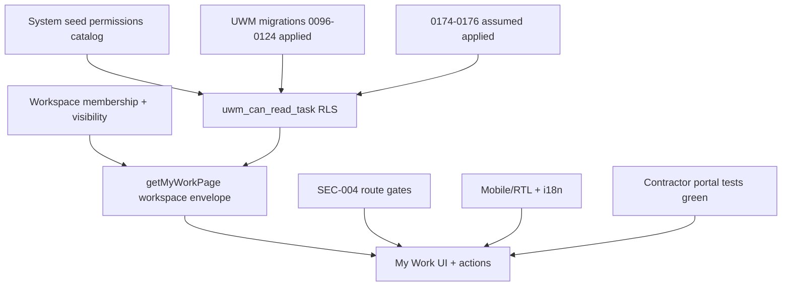

# Planner+ release plan

**Baseline:** `2f13eec6`  
> **Authority:** [planner_plus_multi_industry_master.plan.md](planner_plus_multi_industry_master.plan.md). Workload reassign is **real**, not stub.

**Mode:** annex — execute only when Owner presses Build on master plan.

---

## Context (inspection summary)

| Area | Current state @ baseline |
|------|---------------------------|
| Tasks permissions | `tasks.read/create/update/…/manage_all` in `src/shared/permissions/catalog.ts`; seeded via `drizzle/seed/system.ts` |
| Workspace scope | `getWorkspaceScope` → `full` (WORKSPACES_MANAGE) or `member_only` (TASKS_READ); drives `getMyWorkPage` workspace ID set |
| DB task visibility | RLS `tasks_select` → `app.uwm_can_read_task` (0124 employee alignment); workspace + project content via `uwm_has_workspace_content_access` |
| Project team | Migration **0154** (`project_team.admin`, capabilities); **0174** is SEC-001/002/003 RLS (not project-team DDL) |
| My Work hub | `/work` → 9 views prefetched; `queryMyWorkPage` filters by workspace IDs; calendar views are **workspace-wide**, not assignee-only |
| Contractor portal | `tests/integration/collaboration/contractor-tasks.test.ts` (Track G / 0160) — isolation, RLS, lifecycle, audience |
| FAB | `quick-create.tsx` — portal to `body`, RTL `left-4` / LTR `right-4`, bottom offset above mobile nav |
| Mobile My Work tabs | `overflow-x-auto`; labels `hidden sm:inline` (icons-only on narrow screens) |
| he-IL | `tasks.json` `myWork.pageTitle` = "היום" vs EN "My Work" (copy mismatch) |
| Workload reassign | **Build:** wire to `assign-task.ts` in `workload-expandable-rows.tsx` (today: stub link — override per master) |
| SEC-004 | `requireDeveloperGcExecutionPage` on some execution screens; nav gate tested; **browser deep-link proof still EXTERNAL** |
| CI @ baseline | Push/PR: `quality` only (`db:check-journal`, typecheck, lint, unit, build). UI/integration/migration/e2e = **manual** `workflow_dispatch` |

---

## 1. RBAC invariants — cross-project task list (My Work / portfolio-style reads)

**Layers (defense in depth — all must hold):**

1. **Route / module gate**
   - `/work` requires `tasks.read` + `work_management` module (`work/page.tsx`).
   - Server actions under `work/actions.ts` must continue to call task application APIs that `assertPermission` / task mutation grants (no new bypass paths).

2. **App workspace envelope (My Work prefetch)**
   - `getMyWorkPage` builds `workspaceIds`:
     - `WORKSPACES_MANAGE` → all non-archived workspaces.
     - Else → union of org-visible workspaces + explicit workspace memberships (`findWorkspaceIdsByActor`).
   - **Invariant:** My Work never queries workspaces outside this set (empty set → empty page).

3. **RLS row filter (authoritative for row leakage)**
   - Every `tasks` SELECT runs on user-bound executor; policy uses `uwm_can_read_task(org, workspace, project, task_id)`.
   - Org-member path: `tasks.read` or `tasks.manage_all` **and** `uwm_has_workspace_content_access`.
   - Employee path: workspace content **and** `uwm_employee_can_exercise_task_permission` for `tasks.read` with grant scope (`self_only` / `assigned_only` / `granted_projects` / `all_organization`).
   - **Invariant:** A user cannot see a task merely because it appears in a workspace list query — RLS must return zero rows for out-of-scope projects/restricted workspaces.

4. **Cross-project aggregation semantics**
   - Views `today|overdue|this_week|upcoming|waiting|completed|no_project` list **all tasks the caller may read** within allowed workspaces (PM hub), not “assigned to me only”.
   - Views `assigned_to_me|following` additionally filter by assignee/follower identity.
   - **Invariant:** Do not “fix” calendar views to assignee-only without product sign-off — that would change Planner+ behavior.

5. **Post-0174 org vs project roles (SEC-003)**
   - After Owner applies **0174**, `app.has_org_permission` ignores `role_assignments.project_id IS NOT NULL`.
   - **Invariant:** Org-wide UI (My Work, workload) must not treat project-scoped role grants as org-wide `tasks.read`; project-scoped access continues via `app.has_project_permission` / project team capabilities / workspace project links.
   - **Regression:** Re-run `tests/integration/migration/uwm-0096-0112-access-integrity.test.ts` scoped cases + any new 0174 parity test once migration is prepared/applied on test DB.

6. **Project team (0154) interaction**
   - Per-project authority lives in `project_members` capabilities (`project_team.manage`, domain caps) — not org role display names.
   - **Invariant:** Quick-create project actions and execution surfaces respect capability guards; `project_team.admin` remains org-wide team administration only.

7. **Financial / client confidentiality on task cards**
   - `mapTasksToCardDataForOrg` loads client names via projects join **without** `clients.read` check.
   - **Invariant for release:** Preserve existing financial column redaction elsewhere; for Planner+ **do not add** profit/cost/budget fields to task cards. **Hardening (optional follow-up):** omit `clientName` on cards when caller lacks `clients.read`.

8. **Contractor / external principals**
   - Contractors use external context + portal list APIs — **never** org My Work routes.
   - **Invariant:** `listContractorPortalTasks` returns only grant-scoped vendor tasks (existing integration tests).

---

## 2. Mobile / FAB / RTL — minimal plan

| Item | Minimal change | Verify |
|------|----------------|--------|
| FAB position | Already RTL-aware (`localeDir === 'rtl' ? 'left-4' : 'right-4'`) + bottom nav offset | `tests/e2e/mobile.spec.ts` (`assertFabClearsBottomNav`) |
| FAB hide rules | `shouldHideQuickCreateForRoute` + toolbar on `/projects/new` | `tests/unit/shell/quick-create-path.test.ts`, mobile spec |
| My Work tabs | Keep horizontal scroll; consider `dir={localeDir}` on tab `nav` if scroll origin wrong in RTL | Manual `/he-IL/work` + one Playwright assertion (no overflow) |
| Tab labels mobile | Icons + badges only below `sm` — add `aria-label={t(v.labelKey)}` on tab buttons if missing | a11y spot-check |
| he-IL copy | Align `myWork.pageTitle` / `pageDescription` with EN hub meaning (not only "היום") | `tests/unit/i18n/*` parity or dg-locale-parity slice for `tasks` keys |
| Work page + FAB | Confirm FAB does not cover last task row / active tab | extend mobile spec or release-smoke touch |

**Out of scope this wave:** inline workload reassign UI; full 43-test Playwright regression unless Owner dispatches `full_regression`.

---

## 3. Focused test list (per work package)

Run targeted commands during development; full preflight only at release (see §4).

### WP-A — Security / 0174 / SEC-004 / project team

```bash
npm run test:unit -- tests/integration/audit-verification/sec-004-execution-nav-gate.test.ts
npm run test:unit -- tests/unit/audit/verification-81-findings-execution-2026-10-09.test.ts
npm run test:integration -- tests/integration/project-team/project-team.test.ts
npm run test:integration -- tests/integration/project-team/team-surfaces.test.ts
```

If 0177 prepared (test DB only, Owner-approved apply for **0177 only**):

```bash
npm run test:integration -- tests/integration/migration/uwm-0096-0112-access-integrity.test.ts
# Plus migration hardening job if drizzle/** changed:
npm run test:migration
```

SEC-004 browser (EXTERNAL / manual dispatch):

```bash
npm run playwright:smoke
# Add one authenticated case: non-developer_gc project → execution URL → 404
```

### WP-B — My Work / cross-project task list

```bash
npm run test:unit -- tests/unit/tasks/my-work-assigned-to-me.test.ts
npm run test:unit -- tests/unit/tasks/planner-board.test.ts
```

**Add (planned):** integration test — two projects, restricted workspace, user A vs B — My Work prefetch counts match RLS-visible rows.

### WP-C — Contractor portal task scope

```bash
npm run test:integration -- tests/integration/collaboration/contractor-tasks.test.ts
npm run test:unit -- tests/unit/portal/vendor-scopes.test.ts
npm run test:unit -- tests/unit/contractor-portal/routes.test.ts
```

### WP-D — Mobile / FAB / RTL

```bash
npm run test:unit -- tests/unit/shell/quick-create-path.test.ts
npm run test:unit -- tests/unit/shell/project-quick-create.test.ts
npx playwright test tests/e2e/mobile.spec.ts --project=desktop-he
```

**Add (planned):** `/he-IL/work` mobile — tabs scroll, no horizontal page overflow.

### WP-F — Workload (real reassign)

```bash
npm run test:unit -- tests/unit/tasks/my-work-assigned-to-me.test.ts  # pattern reference only
# Target get-team-workload unit/integration if touched:
npm run test:integration -- tests/integration/migration/uwm-0096-0112-access-integrity.test.ts -t "workload"
```

Manual: workload page loads with `workload.read`; reassign action requires `tasks.assign` and updates assignees in UI.

---

## 4. Release sequence — one coordinated release

1. **Freeze scope** — Planner+ UI (My Work, workload reassign, FAB), security fixes (SEC-004 route audit), i18n — single branch.
2. **SQL STOP** — If **0177** (new migration) ships in repo:
   - Report: `SQL / MIGRATION PREPARED = YES`, file, purpose, data/schema mutation, risk.
   - **Do not** `db:migrate` on Production/shared DB until Owner explicit apply approval.
3. **Local preflight (before first push)** — match **current** `.github/workflows/ci.yml`:
   - `npm ci`
   - `npm run db:check-journal`
   - `npm run typecheck`
   - `npm run lint`
   - `npm run test:unit`
   - `npm run build` (CI env vars for Supabase public keys)
   - If `drizzle/**` changed: `npm run test:migration` (or wait for CI `migration` job).
4. **Manual CI extras (Planner+ touch set)** — GitHub `workflow_dispatch`:
   - `run_integration_tests: true` (UWM + contractor + project-team)
   - `run_playwright_smoke: true`
   - Optional: `run_ui_tests: true` if task UI components changed materially
5. **Single commit/push** → monitor `quality` + conditional `migration`.
6. **Owner applies 0174** on Production (separate step, after review).
7. **Vercel** — confirm deployment for pushed SHA (`BUILDING` or `READY` per AGENTS.md).

**Note:** `docs/RELEASE-PREFLIGHT.md` table lists UI/integration on every push; **ci.yml @ baseline differs** — treat workflow file as source of truth.

---

## 5. File ownership (avoid merge conflicts)

| Owner | Paths |
|-------|--------|
| **Security / RBAC** | `drizzle/migrations/0174_*`, `src/shared/permissions/**`, `src/modules/rbac/**`, `src/modules/project-workspace/server/require-developer-gc-execution.ts`, execution `screen.tsx` routes |
| **Project team** | `src/modules/project-team/**`, `tests/integration/project-team/**` |
| **Tasks / My Work** | `src/modules/tasks/application/my-work.ts`, `data/my-work.repository.ts`, `ui/my-work-view.tsx`, `src/app/[locale]/(app)/work/**` |
| **Workload** | `src/modules/tasks/application/get-team-workload.ts`, `src/app/[locale]/(app)/workload/**` |
| **Shell / FAB** | `src/components/shell/quick-create.tsx`, `navigation.ts`, `tests/e2e/mobile.spec.ts` |
| **i18n** | `src/locales/he-IL/tasks.json`, `src/locales/en/tasks.json` |
| **Contractor** | `src/modules/collaboration/application/contractor-tasks.ts`, `tests/integration/collaboration/contractor-tasks.test.ts` |
| **Release / CI docs** | `docs/RELEASE-PREFLIGHT.md` (snapshot sync only), `.github/workflows/ci.yml` (read-only unless Owner requests CI change) |

---

## 6. Dependencies



- **My Work** depends on workspaces module + RLS; workload reassign uses same `assign-task` path.
- **0174–0176** assumed applied; **0177** is the only new migration in this release (PREPARED ONLY until Owner apply).
- **SEC-004** page gates independent of 0174 but same release train for security narrative.
- **FAB** independent of task mutations; depends on shell layout tokens (`--pf-bottomnav-total-height`, `--pf-fab-gap`).

---

## 7. Acceptance criteria

- [ ] User without `tasks.read` gets 404 on `/work` (unchanged).
- [ ] User with `tasks.read` sees only tasks allowed by RLS across linked projects/workspaces; restricted workspace tasks hidden from non-members.
- [ ] Employee grants: `assigned_only` / `self_only` cannot expand visibility via My Work prefetch (RLS-enforced).
- [ ] Contractor A never sees Contractor B tasks (integration test pass).
- [ ] Execution deep links for non-`developer_gc` projects return 404 on all guarded routes (not nav-only).
- [ ] `/he-IL/work`: mobile tabs usable (scroll, no page horizontal overflow); hub title/description sensible in Hebrew.
- [ ] FAB clears bottom nav on RTL dashboard; hidden on focused create flows with toolbar alternative.
- [ ] Workload reassign mutates assignees via `assign-task`; unauthorized users cannot reassign; counts refresh.
- [ ] No new financial fields on task surfaces; no regression to workforce cost / project profit gates.
- [ ] Release: one push; `quality` green; Owner informed if **0177** awaits Production apply.

---

## 8. Risks

| ID | Risk | Mitigation |
|----|------|------------|
| **SEC-004** | Nav hides execution but unguarded URLs leak GC surfaces | Complete route audit for `requireDeveloperGcExecutionPage`; smoke URL 404; keep `sec-004-execution-nav-gate.test.ts` |
| **SEC-003 / 0174** | Project-scoped roles stop counting as org-wide after apply | Re-run UWM access integrity tests; verify My Work for project-only role holders |
| **Financial confidentiality** | Task cards show client names without `clients.read`; workload could expose assignee load across projects | No cost/profit on cards; optional clientName gate; workload requires `workload.read` |
| **Semantic** | Calendar My Work views show team-wide open work — surprise for field users | Document in release notes; use `assigned_to_me` tab as default for employee personas if product agrees |
| **CI gap** | Push does not run integration/E2E | Mandatory `workflow_dispatch` for Planner+ release |
| **Migration** | **0177** PREPARED ONLY — not Production apply without Owner OK | Journal check + stop block |
| **Workload reassign** | Duplicate assign / notification noise | Single `assign-task` path; idempotent UI state |
| **he-IL** | `pageTitle` "היום" mislabels hub | Fix copy before release (WP-D) |

---

## Baseline reference commits / artifacts

- Permissions catalog: `src/shared/permissions/catalog.ts` (UWM + `project_team.admin`)
- Employee scopes: `src/shared/permissions/scopes.ts`
- 0174 prep: `drizzle/migrations/0174_audit_events_contracts_select_rls.sql`
- Project team: `drizzle/migrations/0154_project_team_capabilities.sql`, `src/modules/project-team/**`
