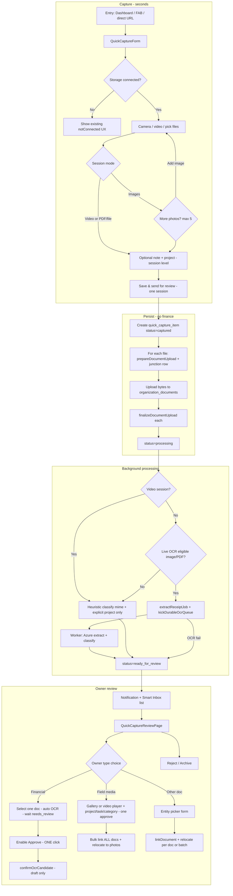
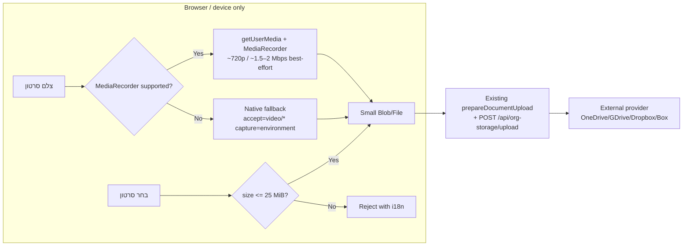

# Quick Capture / Smart Inbox — Implementation Plan

**Status:** Plan approved in scope. **Build** starts only after Owner approves this plan. **SQL apply** is a **post-implementation** gate — not a mid-development stop.

**Canonical plan file:** [`.cursor/plans/quick_capture_smart_inbox.plan.md`](.cursor/plans/quick_capture_smart_inbox.plan.md)

---

## 0. Owner corrections summary (final deltas)

| Decision | Value |
|----------|-------|
| **OCR EXISTING READER PATH** | `finalizeDocumentUpload` → `process-capture.ts` → **`extractReceiptJob()`** + **`kickDurableOcrQueue()`** → durable worker **`processQueuedJob()`** → **`AzureDocumentIntelligenceProvider.extractDocument()`** → **`mapAzureAnalyzeResult()`** / **`canonicalToCandidates()`** → vendor match + duplicate index → `ocr_extraction_jobs.status = needs_review`. Same pipeline as [`ocr-review-panel.tsx`](src/modules/ocr/ui/ocr-review-panel.tsx) upload (which calls `extractReceiptAction` → same `extractReceiptJob`). Quick Capture calls the **application service directly**, not a new engine. |
| **OCR FLAG BEHAVIOR** | `OCR_INGESTION_ENABLED=true` + live Azure credentials = **`isOcrIngestionEnabled()`** = **`getOcrFeatureMode() === 'live'`**. This is the **same gate** the existing manual reader uses (`extractReceiptAction` blocks when false). It gates **live HTTP analyze**, not a separate Quick Capture flag. **Quick Capture feature** (capture + inbox) works without OCR; **automatic invoice reading** runs when `isOcrIngestionEnabled()` AND `isOcrSupportedMime(mime)` — never silently skip OCR on a Quick Capture–only gate. If OCR cannot run (flag off / provider not live), capture still saves; review shows reader-unavailable state; Owner classifies manually. **Required production config for auto-read:** `OCR_INGESTION_ENABLED=true`, `OCR_PROVIDER=azure`, `OCR_PROVIDER_API_KEY`, `OCR_PROVIDER_ENDPOINT`, worker `CRON_SECRET` for `/api/internal/ocr-worker`. |
| **OFFLINE V1** | **REMOVED** — no IndexedDB queue, no `offline_sync` source, no product-sync-transport extension, no offline QC tests. Upload fail → show error + retry; never report success. |
| **NOTIFICATION IMPLEMENTATION** | **`emitNotification({ type: 'capture_needs_review', dedupeKey, deepLink: '/quick-capture/<id>' })`** on transition to `ready_for_review`. Resolve on approve/reject/archive. Bell/inbox reuse existing persistent notification + actionable merge. |
| **NEW COMMAND CENTER HEAVY COLLECTOR** | **NO** — do not add `collectQuickCaptureNeedsReview` or any CC scan. Smart Inbox page queries `quick_capture_items` directly (indexed status query). |
| **MIGRATION PREFLIGHT REQUIRED** | **YES** — at implementation start, read current `drizzle/migrations/meta/_journal.json` + files; use **next** number; never rewrite applied migrations. |
| **SQL APPLY REQUIRES OWNER APPROVAL** | **YES** — but **after** full feature implementation completes. Migration SQL **prepared during** build; **never applied** until explicit Owner SQL approval. |
| **FULL APPLICATION IMPLEMENTATION BEFORE SQL REVIEW** | **YES** — complete all app work in one pass; do **not** stop midway when migration file is ready. |
| **MID-IMPLEMENTATION SQL STOP** | **NO** |
| **SQL REVIEW OCCURS AFTER FEATURE CODE IS COMPLETE** | **YES** — final report includes full SQL package + schema diff. |
| **AFTER SQL APPROVAL CONTINUE THROUGH MIGRATE + BUILD + PUSH + PRODUCTION READY** | **YES** — one continuous release chain; **no second implementation approval**. Vercel must reach **READY** (not BUILDING). |
| **NO SECOND IMPLEMENTATION APPROVAL REQUIRED** | **YES** — SQL approval covers migrate + commit + push + Vercel. |
| **IMPLEMENTATION APPROVAL ≠ SQL APPROVAL** | Plan/build approval first; SQL approval is the **final database gate only**. |
| **OWNER REVIEW COUNT** | **ONE** — Smart Inbox review is the single human step. **Approve is never used to start OCR.** Multi-image financial: type + doc selection auto-starts OCR; Owner waits on same page; **one** final Approve → **`confirmOcrCandidate()`**. |
| **MULTI-IMAGE FINANCIAL OCR STARTS BEFORE FINAL APPROVE** | **YES** — selecting Financial + one gallery doc auto-triggers `extractReceiptJob` + poll; Approve disabled until `needs_review`. |
| **FINAL APPROVE COUNT** | **ONE** — never Approve → OCR → Approve again. |
| **APPROVE NEVER USED JUST TO START OCR** | **YES** |
| **OCR FAILURE CREATES NO FINANCIAL ENTITY** | **YES** — show **נסה שוב**; Owner may switch to Field media / Other Document. |
| **FAILED UPLOAD POLICY** | **`status = failed`** (preserve row). UI: **Retry upload** or **Archive/Delete**. Never `ready_for_review`. No financial impact. |
| **STORAGE MOVE METADATA SAFE ACROSS 4 PROVIDERS** | **YES** — on successful `moveFile()`, apply full **`ProviderFileItem`** return (`id`, `name`, `parentId`, `mimeType`, `sizeBytes`, `modifiedAt`, `etag`, `webUrl`) to `documents` + `storage_files`; never re-upload bytes. On move failure: keep original file accessible; show non-destructive warning + retry. |
| **SESSION MODES (v1)** | **Exactly one mode per session:** **A)** 1–5 images **OR** **B)** exactly 1 video **OR** **C)** exactly 1 PDF/file. **No mixing** (images+video, video+PDF, images+PDF all rejected). |
| **MAX IMAGES** | **5** — product limit v1; not a bulk scanner. |
| **MAX VIDEOS PER SESSION** | **1** — no multi-video / bulk video in v1. |
| **VIDEO OCR / AI** | **NO** — never call `extractReceiptJob()` for video MIME; no frame OCR, transcription, or AI video analysis. |
| **VIDEO FINANCIAL CREATION** | **NO** — video never classified as financial; never creates expense/AP. |
| **FIELD_PHOTO → FIELD_MEDIA** | **YES** — internal detected/owner type renamed to `field_media` (covers field images, multi-image sessions, field video). No production Quick Capture data yet; avoid misleading `field_photo` label for videos. User-facing copy varies by `session_kind` (תמונת שטח / סרטון שטח / תיעוד מהשטח). |
| **VIDEO SIZE LIMIT** | **25 MiB (26,214,400 bytes)** — same as existing [`MAX_DOCUMENT_SIZE_BYTES`](src/modules/documents/domain/file-rules.ts) enforced at `validateUploadConstraints()` + prepare/upload. **Do not invent a larger cap or raise Vercel/server limits blindly.** Reuse existing external-storage upload path (`POST /api/org-storage/upload/[documentId]` streams body to provider). Raising the global document cap requires **separate Owner approval** — not part of Quick Capture v1. |
| **VIDEO MIME (v1)** | Extend [`file-rules.ts`](src/modules/documents/domain/file-rules.ts) allowlist after inspection: **`video/mp4`**, **`video/quicktime`** (iPhone MOV), **`video/webm`**. Server-side validation authoritative; reject unsupported formats with i18n error. |
| **VIDEO REUPLOAD ON APPROVAL** | **NO** — same canonical document; relocate via `moveFile()` only. |
| **OPTIMIZED VIDEO RECORDING** | **YES** — for **[ צלם סרטון ]**, prefer **client-side** `getUserMedia` + `MediaRecorder` to produce a smaller file **before** upload (~720p, ~1.5–2 Mbps video bitrate **best-effort**). Purpose: practical field clips within 25 MiB; minimize Vercel bandwidth. **Exact resolution/bitrate NOT guaranteed.** |
| **SERVER/VERCEL VIDEO COMPRESSION** | **NO** — never FFmpeg on Vercel, ffmpeg.wasm on server, server transcoding, frame extraction workers, temporary large-video storage on Vercel, or a second upload pipeline. Vercel receives only the already-created client Blob via existing upload path. |
| **NATIVE VIDEO CAPTURE FALLBACK** | **YES** — if optimized `MediaRecorder` unavailable/unreliable → fallback to native `accept="video/*"` + `capture="environment"`. Do **not** block Quick Capture when optimized recording unsupported. |
| **EXISTING GALLERY VIDEO COMPRESSION** | **NO in v1** — **[ בחר סרטון ]**: if ≤25 MiB upload normally; if >25 MiB reject with translated UX. No ffmpeg.wasm or heavy client transcoding for arbitrary gallery files. |
| **NEW SQL FOR VIDEO RECORDING** | **NO** — no bitrate/codec/compression-state columns or transcoding job tables. Existing `session_kind=video` + canonical document MIME/size metadata sufficient. |
| **ONE CAPTURE / ONE NOTIFICATION / ONE REVIEW** | **YES** — one `quick_capture_item`, one `emitNotification`, one review page per session (including video). |
| **FIELD MEDIA APPROVAL** | **YES** — images: one Approve bulk-links + relocates **all** session docs; video: one Approve links + relocates **the single** video doc. Target folder: existing project **`photos`** semantic folder (same as field images) — **no new `/videos` hierarchy**. |
| **MULTIPLE IMAGES AUTO-CREATE MULTIPLE FINANCIAL RECORDS** | **NO** — never 5 images → 5 invoices. |
| **NORMALIZED CAPTURE↔DOCUMENT RELATION** | **YES** — `quick_capture_item_documents` junction; **no** document ID JSON array. |
| **SQL APPLIED** | **NO** — prepare only until Owner approves. |
| **READY FOR OWNER FINAL APPROVAL** | **YES** |
| **DO NOT IMPLEMENT YET** | **YES** |

---

## 1. Current Architecture Found (reuse map)

### Document upload + external storage (canonical file path)

| Concern | Reuse |
|---------|--------|
| Upload prepare/finalize | [`src/modules/documents/application/upload-document.ts`](src/modules/documents/application/upload-document.ts) → `prepareDocumentUpload()`, [`manage-document.ts`](src/modules/documents/application/manage-document.ts) → `finalizeDocumentUpload()` |
| Client bytes upload | [`src/modules/documents/client/upload-document-bytes.ts`](src/modules/documents/client/upload-document-bytes.ts) |
| Camera/gallery/video picker | [`open-file-picker.ts`](src/modules/documents/client/open-file-picker.ts), [`field-ops-photo-staging.tsx`](src/app/[locale]/(app)/field-ops/field-ops-photo-staging.tsx); **new** [`record-field-video.ts`](src/modules/quick-capture/client/record-field-video.ts) for optimized `MediaRecorder` path; native fallback via `accept="video/*"` + `capture="environment"` |
| Client video encoding | **Browser/device only** — `navigator.mediaDevices.getUserMedia` + `MediaRecorder`; **no server-side compression/transcoding** |
| Upload size / MIME gate | [`src/modules/documents/domain/file-rules.ts`](src/modules/documents/domain/file-rules.ts) — **`MAX_DOCUMENT_SIZE_BYTES = 25 MiB`** today; video MIME **not yet allowed** — extend allowlist in implementation |
| Document download / byte-range | [`/api/org-storage/download/[documentId]`](src/app/api/org-storage/download/[documentId]/route.ts) — streams with `Accept-Ranges`; reuse for inline `<video>` in review (no transcoding) |
| Attachments UI reference | [`src/modules/documents/ui/document-attachments.tsx`](src/modules/documents/ui/document-attachments.tsx) |
| Storage gate | [`src/modules/external-storage/application/org-storage-gate.ts`](src/modules/external-storage/application/org-storage-gate.ts) |
| Provider upload | [`src/modules/external-storage/application/file-service.ts`](src/modules/external-storage/application/file-service.ts) → `uploadDocumentToExternalStorage()` |
| Semantic folders | [`src/modules/external-storage/domain/semantic-folders.ts`](src/modules/external-storage/domain/semantic-folders.ts) — initial capture → `organization_documents`; field media approval → `photos` (images **and** video); financial → `vendor_invoices` |
| File move (approval relocate) | Provider `moveFile()` in all 4 adapters; today only user-initiated via [`browser-service.ts`](src/modules/external-storage/application/browser-service.ts) — **new thin wrapper required** (see §4) |
| Document linking | [`src/modules/documents/application/link-document.ts`](src/modules/documents/application/link-document.ts) → `linkDocumentToEntity()` |
| Owner types | [`src/modules/documents/domain/types.ts`](src/modules/documents/domain/types.ts) — `organization`, `project`, `vendor`, `client`, `task`, `work_order`, etc. |

### OCR / financial intake (reuse, do not rebuild)

| Concern | Reuse |
|---------|--------|
| Job enqueue | [`extract-receipt.ts`](src/modules/ocr/application/extract-receipt.ts) → `extractReceiptJob()` — **never creates financial entities** |
| Worker | [`process-job.ts`](src/modules/ocr/application/process-job.ts), [`/api/internal/ocr-worker`](src/app/api/internal/ocr-worker/route.ts) |
| Vendor match | [`vendor-matching.ts`](src/modules/ocr/domain/vendor-matching.ts) → `matchVendors()` |
| Project/PO/agreement suggestions | [`load-review-suggestions.ts`](src/modules/ocr/application/load-review-suggestions.ts), [`project-matching.ts`](src/modules/ocr/domain/project-matching.ts) |
| Duplicate warnings | [`duplicates.ts`](src/modules/ocr/domain/duplicates.ts) → `detectDuplicateHits()` — warn only, `duplicateOverride` required |
| Draft target inference | [`canonical.ts`](src/modules/ocr/domain/canonical.ts) → `suggestedDraftTarget()`, `documentTypeKey` |
| Human confirm → draft only | [`confirm-candidate.ts`](src/modules/ocr/application/confirm-candidate.ts) → `confirmOcrCandidate()` → `createExpense()` / `createVendorBillDraftFromOcr()` |
| Review UI (financial section) | [`ocr-review-panel.tsx`](src/modules/ocr/ui/ocr-review-panel.tsx) — embed as child panel, not duplicate |
| Existing OCR inbox | [`/documents/ocr-review`](src/app/[locale]/(app)/documents/ocr-review/page.tsx) — remains for power users; Smart Inbox is the field entry |

**Important:** Smart Inbox **capture** is not gated by OCR. **Automatic invoice reading** uses the **existing live reader gate** (`isOcrIngestionEnabled()` — same as `extractReceiptAction` / OCR review upload). Quick Capture calls **`extractReceiptJob()`** from application code (same entry as batches/SUMIT), not a parallel engine or a weaker skip gate.

### Notifications / Command Center

| Concern | Reuse |
|---------|--------|
| Emit | [`src/modules/notifications/application/emit.ts`](src/modules/notifications/application/emit.ts) → `emitNotification()` |
| Persistent notification emit | [`emit.ts`](src/modules/notifications/application/emit.ts) — **use this** for capture alerts |
| Bell/inbox UI | [`notification-bell.tsx`](src/modules/notifications/ui/notification-bell.tsx), [`actionable-inbox.ts`](src/modules/notifications/application/actionable-inbox.ts) |
| CC collectors | **Do NOT add** for Quick Capture — existing OCR CC collectors are unrelated |

### Entry points (today)

| Surface | File | Gap |
|---------|------|-----|
| Quick Create FAB | [`quick-create-actions.ts`](src/components/shell/quick-create-actions.ts) L158–159 — **explicit TODO: "Skip Quick Create until a dedicated capture route exists"** |
| Dashboard shortcuts | [`dashboard-quick-access.ts`](src/modules/tenancy/domain/dashboard-quick-access.ts) |
| Mobile nav | [`navigation.ts`](src/components/shell/navigation.ts), [`mobile-nav.tsx`](src/components/shell/mobile-nav.tsx) |

### Field ops (photo routing target, not capture UI)

| Concern | Reuse |
|---------|--------|
| Field media categories (closed set) | Same semantic labels for images **and** video: `progress`, `before`, `after`, `defect`, `installation`, `documentation` on `document_links.label` (field-media-neutral; same pattern as [`categories.ts`](src/modules/documents/domain/categories.ts)) |
| Project media folder | `semanticFolderForDocumentOwner` + **`photos`** — reuse for field images **and** field video (no separate videos folder) |
| Optional task link | `linkDocumentToEntity({ ownerType: 'task', ... })` |
| Optional work order | `ownerType: 'work_order'` |

### Why existing entities are insufficient alone

| Entity | Why not sole inbox |
|--------|-------------------|
| `ocr_extraction_jobs` | Financial/OCR-specific statuses; no owner note, explicit project, field-media/other routing |
| `external_expense_imports` | SUMIT-only provider; financial-only |
| `vendor_portal_ap_candidates` | Portal-submitted AP candidates; not mobile capture |
| `documents` alone | No lifecycle, classification, or review state |

**Decision:** New orchestration entity `quick_capture_items` + normalized **`quick_capture_item_documents`** junction (1–5 `documents` per session) + optional `ocr_extraction_jobs`, and canonical approval services.

---

## 2. Proposed User Flow



### Lifecycle statuses (`quick_capture_items.status`)

| Status | Meaning |
|--------|---------|
| `captured` | Row created; upload in progress |
| `processing` | File stored; OCR/classification running |
| `ready_for_review` | Owner can review (includes OCR failed — manual review OK) |
| `approved` | Routed to canonical entity; financial draft may exist |
| `rejected` | Owner declined; no financial impact |
| `archived` | Removed from active inbox |
| `failed` | Upload never completed — row **preserved** with `status=failed`; Retry or Archive/Delete; never `ready_for_review` |

### Detected type (`detected_type` + `detection_confidence`: `confirmed` | `suggested` | `unknown`)

| Type | Meaning |
|------|---------|
| `financial_document` | Invoice/receipt/financial PDF |
| `field_media` | Site/progress/defect **image(s) or video** |
| `other_document` | General business doc |
| `unknown` | Owner must choose |

Owner override via `owner_selected_type` always wins at review.

User-facing type labels (i18n, dynamic by `session_kind`):
- images → "תמונת שטח" / field photo copy
- video → "סרטון שטח" / field video copy
- generic → "תיעוד מהשטח" / field media copy

### Session file rules (v1)

**One session = exactly ONE mode. Never mix modes.**

| Mode | `session_kind` | Allowed | Limit |
|------|----------------|---------|-------|
| **Images** | `images` | 1–5 images (jpeg/png/webp/heic…) | Max **5**; show **[ הוסף תמונה ]** after first |
| **Video** | `video` | Exactly **1** supported video (mp4/quicktime/webm) | Max **1** video; no multi-video |
| **PDF** | `pdf` | Exactly **1** `application/pdf` | OCR page limits apply when eligible |
| **Other file** | `file` | Exactly **1** non-image, non-video allowed doc | Same upload size cap |
| **Mixed** | — | **Not allowed** | images+video, video+PDF, images+PDF all **rejected** at submit |

One Save → **one** `quick_capture_item` → **one** notification → **one** review.

### Video use case (field / site documentation)

Primary: walkthroughs, defect documentation, installation progress, before/after, site conditions, issues easier to show in motion.

Typical flow: **[ צלם סרטון ]** or **[ בחר סרטון ]** → optional note → optional project → **[ שמור ושלח לבדיקה ]** → one item → one document → one notification → one review → one approve.

**[ צלם סרטון ]** uses an **optimized client-side recording path** when supported — smaller file at source (~720p / ~1.5–2 Mbps targets) so practical clips fit the **25 MiB** cap without uploading a large original to Vercel for compression.

**[ בחר סרטון ]** uploads an existing gallery file as-is (≤25 MiB); no v1 client transcoding for oversized gallery picks.

---

## 3. Data Model

### Reuse

- **`documents`** — each physical image/PDF is its own canonical `document` (external storage unchanged; no duplicate bytes)
- **`document_links`** — per document at inbox: `ownerType=organization`, `ownerId=<orgId>`, `label=inbox_capture`; after approval add project/vendor links per doc
- **`ocr_extraction_jobs`** — at most **one** auto-OCR job per session when single image/PDF; optional `ocr_job_id` on junction row

### New table: `quick_capture_items` (session header)

**Drizzle:** [`drizzle/schema/quick-capture.ts`](drizzle/schema/quick-capture.ts)

| Column | Type | Notes |
|--------|------|-------|
| `id` | uuid PK | |
| `organization_id` | uuid FK → organizations | cascade delete |
| `created_by_user_id` | uuid FK → profiles | |
| `status` | text + check | see lifecycle |
| `source` | text | `quick_capture`, `dashboard`, `fab` |
| `session_kind` | text + check | `images` \| `video` \| `pdf` \| `file` — derived at submit; mutually exclusive modes |
| `document_count` | integer | denormalized 1–5 for inbox badge (1 for video/pdf/file; 1–5 for images) |
| `owner_note` | text nullable | **session-level** — never financial truth |
| `explicit_project_id` | uuid FK → projects nullable | **session-level** structured context |
| `detected_type` | text nullable | session-level classification |
| `detection_confidence` | text nullable | confirmed/suggested/unknown |
| `owner_selected_type` | text nullable | review override |
| `suggested_project_id` | uuid nullable | |
| `suggested_vendor_id` | uuid nullable | |
| `suggestion_metadata` | jsonb | per-doc hints keyed by documentId; duplicate hits; note-match |
| `primary_ocr_job_id` | uuid FK → ocr_extraction_jobs nullable | single-doc auto-OCR or multi-image financial selected doc |
| `selected_financial_document_id` | uuid FK → documents nullable | exactly one doc when Owner picks financial source in multi-image review |
| `routed_entity_type` | text nullable | primary routed entity if single; or `document_link_batch` |
| `routed_entity_id` | uuid nullable | |
| `processing_error_code` | text nullable | |
| `processing_error_message` | text nullable | |
| `idempotency_key` | text nullable | session retry dedupe |
| `captured_at` | timestamptz | |
| `processed_at` / `reviewed_at` / `approved_at` / `rejected_at` / `archived_at` | timestamptz nullable | |
| timestamps | | `created_at`, `updated_at` |

**No `document_id` on this table** — use junction.

### New table: `quick_capture_item_documents` (normalized relation)

| Column | Type | Notes |
|--------|------|-------|
| `id` | uuid PK | or composite `(quick_capture_item_id, document_id)` |
| `quick_capture_item_id` | uuid FK → quick_capture_items | cascade delete |
| `document_id` | uuid FK → documents | RESTRICT or SET NULL per doc delete policy |
| `organization_id` | uuid FK | org-scoped integrity (match parent) |
| `position` | integer NOT NULL | 0-based display order |
| `ocr_job_id` | uuid FK nullable | per-doc only if ever needed; single-doc sessions use header `primary_ocr_job_id` |
| `created_at` | timestamptz | |

**Constraints:**
- `UNIQUE (quick_capture_item_id, document_id)`
- `UNIQUE (quick_capture_item_id, position)`
- Check: `position >= 0 AND position < 5`
- Session document count enforced in application: 1–5 for `images`, exactly 1 for `video`/`pdf`/`file`
- Migration check constraint on `session_kind`: `images | video | pdf | file`
- Application validation: reject mixed MIME sets (e.g. image + video in one session)

**Indexes:**
- `(quick_capture_item_id, position)` — gallery order
- `(document_id)` — reverse lookup
- On `quick_capture_items`: `(organization_id, status, captured_at DESC)`, `(organization_id, created_by_user_id, captured_at DESC)`, unique partial idempotency

**RLS:** Same org-membership pattern as `ocr_extraction_jobs` (migration references [`0051_review_integrity_closure.sql`](drizzle/migrations/0051_review_integrity_closure.sql) style).

**Audit events** (add to [`src/shared/audit/actions.ts`](src/shared/audit/actions.ts)):
- `quick_capture.created`
- `quick_capture.processing_completed` / `processing_failed`
- `quick_capture.type_changed`
- `quick_capture.approved`
- `quick_capture.rejected`
- `quick_capture.routed`

---

## 4. Storage Flow

### Video upload architecture (no server compression)



**Forbidden on Vercel/server:** FFmpeg, ffmpeg.wasm server-side, transcoding workers, frame extraction, temporary large-video buffering for re-encode, second upload pipeline.

### Capture-time (immediate, safe — per file, one session)

1. Client stages **one session mode** in [`QuickCaptureForm`](src/modules/quick-capture/ui/quick-capture-form.tsx): 1–5 images **or** 1 video **or** 1 PDF/file (thumbnails for images; single video/file slot; remove/replace before Save; mode switch clears other mode)
2. On Save: create **`quick_capture_item`** (`status=captured`) + session note/project
3. For **each** staged file (loop, ordered `position`):
   - `prepareDocumentUpload({ ownerType: 'organization', ownerId: orgId, mimeType, sizeBytes, label: 'inbox_capture' })` → **`organization_documents`**
   - Client POST bytes → [`/api/org-storage/upload/[documentId]`](src/app/api/org-storage/upload/[documentId]/route.ts)
   - `finalizeDocumentUpload()`
   - Insert **`quick_capture_item_documents`** row (`position`, `document_id`)
4. Update `document_count`; when all files finalized → `status=processing`

**Partial upload failure:** If any file in session fails, session → **`status=failed`** (preserve item + successful junction rows). UI: **Retry failed files** or **Archive/Delete** entire session. Never `ready_for_review` until **all** session files are stored. No financial impact.

### Approval-time (relocate, same file)

New application helper: **`relocateDocumentToSemanticFolder()`** in [`src/modules/external-storage/application/relocate-document-file.ts`](src/modules/external-storage/application/relocate-document-file.ts)

- Resolve target folder via existing `resolveUploadFolderId()` / `resolveProjectScopedUploadFolderId()`
- Call provider **`moveFile()`** — same adapter on OneDrive, Google Drive, Dropbox, Box
- On success: apply the **complete** returned **`ProviderFileItem`** to canonical records:
  - `documents`: `external_file_id`, `external_parent_folder_id`, `external_etag`, `storage_path` (as name/id per existing conventions), plus any web/view fields the module already stores
  - `storage_files`: `external_file_id`, `external_parent_folder_id`, `checksum` unchanged, `etag`, filename, size/mime if returned
- **Never re-upload bytes** merely to change folders
- If move fails: approval/business link may still succeed at inbox location; original file **must remain accessible**; show non-destructive relocation warning + **Retry move** — never lose the file

| Approved type | Target semantic folder |
|---------------|------------------------|
| Field media → project (1–5 images or 1 video) | **`photos`** under project — **relocate each** session document (same folder for images and video; inspect [`semantic-folders.ts`](src/modules/external-storage/domain/semantic-folders.ts) — no new `/videos` tree) |
| Financial → expense/AP draft (single doc) | `vendor_invoices` via existing OCR confirm linking — **never for video** |
| Other → project/client/vendor | `documents` or `general_files` per doc or batch |

---

## 5. OCR / Classification Flow

### Existing reader path (mandatory reuse)

**Trace (current production reader):**

1. Document bytes finalized → [`extractReceiptJob()`](src/modules/ocr/application/extract-receipt.ts) (application layer; no financial writes)
2. [`kickDurableOcrQueue()`](src/modules/ocr/application/kick-queue.ts) → [`/api/internal/ocr-worker`](src/app/api/internal/ocr-worker/route.ts)
3. [`processQueuedJob()`](src/modules/ocr/application/process-job.ts) → [`AzureDocumentIntelligenceProvider`](src/modules/ocr/domain/azure-provider.ts)
4. [`mapAzureAnalyzeResult()`](src/modules/ocr/domain/azure-mapper.ts) → [`canonicalToCandidates()`](src/modules/ocr/domain/canonical.ts)
5. [`matchVendors()`](src/modules/ocr/domain/vendor-matching.ts) + [`detectDuplicateHits()`](src/modules/ocr/domain/duplicates.ts)
6. Job → `needs_review`; suggestions land in `ocr_extraction_jobs.extracted_candidates` / `rawMetadata`

**UI equivalent today:** [`ocr-review-panel.tsx`](src/modules/ocr/ui/ocr-review-panel.tsx) upload → **`extractReceiptAction`** (server action wrapper that calls the same `extractReceiptJob` after `isOcrIngestionEnabled()` check).

**Quick Capture must use step 1–6 identically** via application services — **not** `extractReceiptAction` (to avoid double UI gate) but **with the same live eligibility check** before enqueue.

### Video — explicit OCR exclusion (v1)

**Never** for video sessions or video MIME types:

- Do **not** call `extractReceiptJob()`
- Do **not** extract frames, transcribe audio, or run AI video analysis
- Do **not** generate financial candidates from video
- Classification: video → **`field_media`**, `suggested` (never `financial_document`)

[`isOcrSupportedMime()`](src/modules/ocr/domain/cost-controls.ts) already excludes video — Quick Capture must also gate on `session_kind !== 'video'` before any OCR enqueue.

### When OCR auto-runs on capture

**Single document sessions only** (`document_count === 1` — one image **or** one PDF; **never video**):

After all files finalized, if **`session_kind !== 'video'`** AND **`isOcrIngestionEnabled()`** AND [`isOcrSupportedMime(mime)`](src/modules/ocr/domain/cost-controls.ts):

```ts
extractReceiptJob(context, {
  documentId: soleDocumentId,
  workflow: 'general',
  idempotencyKey: `qc:${captureId}`,
});
kickDurableOcrQueue();
```

- Store `primary_ocr_job_id` on capture item
- Surface extracted fields + vendor/project suggestions in review from linked OCR job

**Multi-image sessions (`document_count` 2–5):**

- **Do NOT** auto-enqueue `extractReceiptJob` per image (would imply multiple financial candidates)
- **Do NOT** stitch images or build multi-page OCR — existing architecture does not support multi-image as one invoice document
- Run **session-level heuristic classify** only (`field_media` likely when explicit project + all image mimes)
- Store per-image inspection hints in `suggestion_metadata.byDocument[documentId]` if useful — **no financial drafts**
- Financial meaning assigned in review: Owner sets type **Financial document** + selects **one** gallery image → see §7 (OCR starts **before** Approve, not on Approve)

**Do NOT** skip auto-OCR because a separate "Quick Capture ingestion flag" is false — there is none; use **`isOcrIngestionEnabled()`** only.

**If live reader unavailable** (flag off, stub provider, missing credentials): capture still saves → `ready_for_review` with `detected_type=unknown` and processing note; Owner chooses type manually. UI must **not** pretend OCR ran.

**Required env for auto-read (same as existing OCR):**

| Variable | Value |
|----------|-------|
| `OCR_INGESTION_ENABLED` | `true` |
| `OCR_PROVIDER` | `azure` |
| `OCR_PROVIDER_API_KEY` | Azure Document Intelligence key |
| `OCR_PROVIDER_ENDPOINT` | Azure DI endpoint URL |
| `CRON_SECRET` | Worker auth for OCR drain |

(`AZURE_OCR_LIVE_HTTP_READY` is `true` in code — adapter is wired.)

### Classification (deterministic v1 — no new AI engine)

New domain: [`src/modules/quick-capture/domain/classify-capture.ts`](src/modules/quick-capture/domain/classify-capture.ts)

**Inputs:** mime, explicit_project_id, owner_note (hint only), OCR job result if present

**Rules (priority order):**

1. If **`session_kind === 'video'`** or video MIME → **`field_media`**, `suggested` — **never** financial
2. If **`document_count >= 2`** and all image mimes → default **`field_media`**, `suggested` (unless Owner overrides) — **never** auto-financial
3. If single doc + OCR succeeded with `documentTypeKey` in invoice/receipt types → `financial_document`, `suggested`
4. If single doc + OCR strong vendor + (reference OR gross/net) → `financial_document`, `suggested`
5. If single image + OCR weak + (explicit project OR note project match) → `field_media`, `suggested`
6. If single PDF/image weak OCR → `other_document`, `unknown`
7. Else → `unknown`

**Never:** auto-set `confirmed` except when `explicit_project_id` is set at capture → pre-fill project as `confirmed` structured context for **project only**, not vendor/finance.

When live reader unavailable: skip OCR-based rules; use mime + explicit project + optional fuzzy project name match from note against `listProjectsForOrg` names (suggestion metadata only).

---

## 6. Auto-Suggestion / Matching Rules

Hierarchy (stored in `suggestion_metadata.provenance` per field):

1. **CONFIRMED structured:** `explicit_project_id` from capture form
2. **Structured IDs:** OCR vendor match `exact_identifier` → `suggested_vendor_id`
3. **Canonical relationships:** `loadOcrReviewSuggestions()` memory / open PO / engagement → project
4. **OCR fields:** amounts, dates, reference — display only until Owner accepts
5. **Free-text note:** fuzzy project name substring match → `suggestion_metadata.noteProjectHints[]` — **never** vendor identity, duplicate resolution, or financial amounts
6. **AI/fuzzy:** not in v1 beyond existing OCR vendor matching

UI badges: **Confirmed / Suggested / Unknown** on each relation chip in review.

---

## 7. Financial Document Routing

### Financial safety — multi-image

| Rule | Behavior |
|------|----------|
| **Never** | 5 images → 5 expenses / 5 AP bills automatically |
| **Single image or PDF** | Normal auto-OCR + one `confirmOcrCandidate` → **one** draft |
| **Multi-image session** | No auto financial drafts; Owner must confirm financial meaning in review |
| **Multi-image → financial** | See **Multi-image financial review flow** below — OCR on selection, **one** Approve after `needs_review` |
| **Multi-page invoice** | If truly one PDF — already single doc; OCR handles page count. **No image stitching.** |

### Multi-image financial review flow (2–5 images)

**Forbidden:** Approve → start OCR → Approve again.

**Correct sequence on the same review page:**

1. Owner sets type → **Financial document**
2. Owner selects **exactly one** image in the gallery as the financial document
3. **Immediately on selection** (server action, not Approve):
   - **Server must first verify** `selectedFinancialDocumentId` is a member of this capture via **`quick_capture_item_documents`** for the same `quick_capture_item_id` + org context — **reject** if not (never trust client-supplied doc id alone)
   ```ts
   assertCaptureSessionDocument(context, captureId, selectedFinancialDocumentId);
   extractReceiptJob(context, {
     documentId: selectedFinancialDocumentId,
     workflow: 'general',
     idempotencyKey: `qc:${captureId}:${documentId}`,
   });
   kickDurableOcrQueue();
   ```
   - Persist `selected_financial_document_id` + `primary_ocr_job_id`
4. **UI while OCR runs** (poll existing job status — same mechanism as [`ocr-review-panel.tsx`](src/modules/ocr/ui/ocr-review-panel.tsx)):
   - Message: **"מפענח את המסמך..."** (`quickCapture.review.parsingDocument`)
   - Stay on **same** review page — no new navigation / review cycle
   - **Disable** final **[ אשר ]** — no financial entity created
5. When OCR job → **`needs_review`**:
   - Populate embedded OCR fields (vendor, amounts, dates, duplicates, project/vendor suggestions)
   - Owner may edit fields
   - **Enable** **[ אשר ]**
6. **ONE** click **[ אשר ]** → **`confirmOcrCandidate()`** only — **one** draft expense/AP/credit
7. Capture → `approved`; relocate **selected** document; link per existing OCR confirm

**Changing selected financial image** after OCR started: cancel/replace job per existing OCR cancel patterns if needed, re-enqueue for new selection — still **one** final Approve.

### OCR failure (multi-image or single-doc financial)

- Capture **stays** in review (`ready_for_review`) — not approved
- Show clear reader failure + **[ נסה שוב ]** → re-run `extractReceiptJob` for same selected doc (**after** same junction membership check)
- Owner may change type to **Field media** / **Other document** — no financial truth from failed OCR
- **Never** create expense/AP from failed or in-progress OCR

### ONE Owner review — no double approval

Smart Inbox review **is** the Owner confirmation step. **Exactly one** final **[ אשר ]** per capture session.

**Single-doc sessions (`document_count === 1`):** OCR may already have run at processing time; when job is `needs_review`, **one** Approve → **`confirmOcrCandidate()`**.

**Multi-image financial:** OCR completes **before** Approve is enabled; **one** Approve → **`confirmOcrCandidate()`**.

Requirements for Approve (all financial paths):

1. `selected_financial_document_id` (or sole session document) **verified** via `quick_capture_item_documents` for this capture + org — reject if document exists in `documents` but is **not** in session
2. `primary_ocr_job_id` status = **`needs_review`** (not queued/processing/failed)
3. **One** **`confirmOcrCandidate()`** — not one per image
4. `duplicateOverride` when duplicate hits — same as OCR review
5. **No second Smart Inbox approve**

**After `confirmOcrCandidate`:** existing PF draft lifecycle only.

**No parallel expense/AP services. No per-image financial creation. Approve never starts OCR.**

---

## 8. Field Media Routing

**Primary use cases:**
- **Images:** 2–5 site photos of same work/defect/progress — **one gallery, one approve**
- **Video:** 1 field walkthrough/defect/progress clip — **one inline player, one approve**

On approve with type `field_media`:

1. **Do not** call `confirmOcrCandidate` or create expense/AP — **for any** session document (including video)
2. Review UI:
   - **Images:** gallery/grid/carousel of all session images
   - **Video:** inline `<video controls>` using existing secure download URL ([`/api/org-storage/download/[documentId]?disposition=inline`](src/app/api/org-storage/download/[documentId]/route.ts) supports byte-range); if browser cannot play MIME, fall back to existing document-open/view mechanism — **no transcoding, no server-side thumbnails/posters**
   - Owner confirms once: project (required), optional task/work_order, field media category (closed enum), session note
3. **Approve loop** over `quick_capture_item_documents` ordered by `position`:
   - **Images:** bulk link all session docs
   - **Video:** link the single video document
   - `linkDocumentToEntity({ ownerType: 'project', ownerId, label: category })` per doc
   - optional second link to `task` / `work_order` per doc if selected
   - `relocateDocumentToSemanticFolder(..., 'photos', projectId)` per doc — **same external file, move only**
   - supersede org inbox links
4. Capture → `approved`; `routed_entity_type = 'document_link_batch'` (or document_link + metadata listing doc ids)
5. **One** notification; **one** approve — not per image/frame

Categories (`progress`, `before`, `after`, `defect`, `installation`, `documentation`) remain field-media-neutral — semantic for both photos and video.

---

## 9. Other Document Routing

On approve with type `other_document`:

1. Owner picks destination: project / client / vendor / organization (session-level or per-doc if mixed — default: **same destination for all** session docs)
2. Category from [`DOCUMENT_CATEGORIES`](src/modules/documents/domain/categories.ts) or `other`
3. Loop all junction docs: `linkDocumentToEntity()` + relocate each
4. No financial entities created

---

## 10. Notification + Smart Inbox

### Notification (primary alert path — no heavy CC collector)

Add `capture_needs_review` to [`NOTIFICATION_EVENT_TYPES`](src/modules/notifications/domain/types.ts), domain `documents`.

On capture → `ready_for_review`, call existing **[`emitNotification()`](src/modules/notifications/application/emit.ts)**:

```ts
await emitNotification(context, {
  recipientUserId: /* org owners / DOCUMENTS_MANAGE per existing recipients pattern */,
  type: 'capture_needs_review',
  title, body, // from quickCapture.notifications.* (financial / field_media / video / unknown variants)
  dedupeKey: `capture_needs_review:${captureId}`,
  deepLink: `/quick-capture/${captureId}`,
  entityType: 'quick_capture',
  entityId: captureId,
});
```

- Bell + `/notifications` reuse existing persistent inbox + actionable merge — **no new scan pipeline**
- Resolve notification on approve / reject / archive

### Command Center — explicitly out of scope for v1

**Do NOT** add `collectQuickCaptureNeedsReview` or any new Command Center collector.

Rationale: avoid another expensive recompute on every bell/Today read. Owner alert = stored notification with deep link.

*(If a CC item is ever needed later, it must be ONE cheap indexed query — not rollups, labor, or financial recomputation. Not in v1.)*

### Smart Inbox page (direct query)

Route: **`/quick-capture/inbox`** — server query:

```sql
SELECT ... FROM quick_capture_items
WHERE organization_id = ? AND status IN ('ready_for_review', 'processing', 'failed')
ORDER BY captured_at DESC
```

Uses index `(organization_id, status, captured_at DESC)` — no dashboard-wide work.

List shows:
- **First image** thumbnail, **video icon** for `session_kind=video`, or PDF icon
- Count badge when `document_count > 1` (e.g. **"3 תמונות"** / i18n `quickCapture.inbox.photoCount`)
- type badge (field media / video / financial / other), project/vendor suggestion, note snippet, date, status
→ tap opens `/quick-capture/[captureId]` review (gallery or video player)

**One capture batch = one notification** — never one notification per image or per video.

Optional home pending count: single `COUNT(*)` with same indexed filter — not a CC collection.

Existing `/documents/ocr-review` and `/expenses/received` remain; Smart Inbox is the unified mobile entry.

---

## 11. UX / Mobile Design

### ONE shared capture component

[`src/modules/quick-capture/ui/quick-capture-form.tsx`](src/modules/quick-capture/ui/quick-capture-form.tsx) — used by all entry points.

**Layout (mobile-first, RTL-safe):**

```
[ צלם עכשיו ]
[ צלם סרטון ]
[ בחר תמונות / סרטון / קובץ ]   ← one mode: images (1–5) OR 1 video OR 1 PDF/file

[ thumb1 ] [ thumb2 ] ... OR [ video slot ] OR [ file slot ]
[ הוסף תמונה ]                   ← images only; hidden at 5 or when video/PDF chosen

הערה (אופציונלי)                  ← session-level
[________________________]

פרויקט (אופציונלי)                ← session-level
[ ללא שיוך ▼ ]

[ שמור ושלח לבדיקה ]              ← submits ENTIRE session once
```

- **v1 session modes:** 1–5 images **OR** 1 video **OR** 1 PDF/file — mutually exclusive; not a scanning app
- **[ צלם סרטון ] — optimized client recording (preferred when supported):**
  - Inspect browser/device support at runtime before implementation
  - `navigator.mediaDevices.getUserMedia({ video: { facingMode: 'environment', width: { ideal: 1280 }, height: { ideal: 720 } }, audio: true })` + `MediaRecorder`
  - When supported, request **`videoBitsPerSecond: 1_500_000` to `2_000_000`** (best-effort; modest audio bitrate)
  - Select recorder MIME via `MediaRecorder.isTypeSupported()` — must map to approved policy (`video/mp4`, `video/quicktime`, `video/webm`); if browser cannot produce a supported format → **native fallback** (no transcoding to convert containers)
  - **Targets, not guarantees** — actual resolution, bitrate, codec, container = browser output
  - Lightweight UX during record: duration timer; track accumulated Blob size if practical; warn as approaching 25 MiB; stop/finalize locally before exceeding cap (~1.5 Mbps ≈ 2+ min; ~2 Mbps ≈ 1.5–2 min — planning estimates only)
  - **No complex recording editor**
- **Fallback:** if optimized recording unavailable/unreliable → native `accept="video/*"` + `capture="environment"` (rear camera preferred); same 25 MiB cap; clear "video too large" if needed
- **[ בחר סרטון ]:** upload if ≤25 MiB; reject if larger — **no** ffmpeg.wasm / heavy client transcoding in v1
- Use cleanest mobile implementation — do not enlarge or complicate the capture screen
- Thumbnail UX (images): reuse [`field-ops-photo-staging.tsx`](src/app/[locale]/(app)/field-ops/field-ops-photo-staging.tsx) pattern; cap **5**
- Max taps: **capture/upload → optional text → optional project → SAVE → DONE**
- **Capture screen ONLY:** capture/upload, optional note, optional project, Save — **no** supplier, category, or type selection at capture (review-only)
- Video too large / unsupported MIME → show i18n error from server `validateUploadConstraints`; never `ready_for_review` until stored
- Storage disconnected → reuse [`DocumentAttachments`](src/modules/documents/ui/document-attachments.tsx) alert + link to `/settings/storage`
- Network/upload failure → error + **Retry**; never show success
- **No offline queue in v1** — existing general offline modules untouched

### Client-side optimized video recording (detail)

**Scope:** lightweight browser feature only — [`record-field-video.ts`](src/modules/quick-capture/client/record-field-video.ts).

| Aspect | Plan |
|--------|------|
| **When** | **[ צלם סרטון ]** only — not required for gallery pick |
| **API** | `getUserMedia` + `MediaRecorder` when inspect confirms support |
| **Camera** | `facingMode: 'environment'` (rear) preferred on mobile |
| **Resolution target** | width ideal 1280, height ideal 720 (~720p) — best-effort |
| **Bitrate target** | `videoBitsPerSecond` 1_500_000–2_000_000 when API allows; modest audio bitrate |
| **MIME selection** | Runtime `MediaRecorder.isTypeSupported()` → pick safest format compatible with `video/mp4`, `video/quicktime`, `video/webm` policy |
| **Size guard** | Track Blob size during record if practical; warn near 25 MiB; stop before cap |
| **Fallback** | Native file input `accept="video/*"` + `capture="environment"` |
| **Gallery pick** | No heavy transcoding — validate size only |
| **Server** | Receives final Blob via existing upload path only — **zero** re-encode |

**Business flow unchanged:** `session_kind=video`, `field_media`, no OCR/finance, one approve, `moveFile()` on approval.

**SQL:** no additional tables/columns for recording metadata.

### ONE review page

[`src/modules/quick-capture/ui/quick-capture-review.tsx`](src/modules/quick-capture/ui/quick-capture-review.tsx)

- **Top/Left:** **Gallery** (images) or **inline video player** (video sessions) or PDF inline preview (PDF sessions)
- **Bottom/Right:** type selector (invoice/receipt · field media · other), suggestion chips, session note, type-specific fields
- Actions: **אשר** · **שנה שיוך** · **דחה** — **one** final approve per session
- **Financial (single doc):** embed OCR panel; Approve enabled when job `needs_review`
- **Financial (multi-image):**
  - Owner picks type Financial + **one** gallery image → **auto** `extractReceiptJob` (not on Approve)
  - Show **"מפענח את המסמך..."** while processing; **disable Approve**
  - When `needs_review`: show OCR fields + suggestions; **enable Approve**
  - OCR fail: **נסה שוב** or change type to Field media/Other — no financial entity
- **Field media:** project + category + optional task/WO — **one** Approve links all images or single video
- **Video:** no financial type option; default `field_media`; inline player + same approve flow as field images

### Entry points (single route `/quick-capture`)

| Entry | Registration |
|-------|--------------|
| Dashboard quick action | Add `quickCapture` key to [`dashboard-quick-access.ts`](src/modules/tenancy/domain/dashboard-quick-access.ts) catalog → `/quick-capture` |
| Mobile FAB | Add to [`quick-create-actions.ts`](src/components/shell/quick-create-actions.ts) — replace L158–159 TODO; pin high for `field` persona via existing emphasis ordering |
| Direct / global | Route accessible from shell; no third implementation |

Suggested labels (i18n keys, not hardcoded):
- FAB/menu: `nav.newMenu.quickCapture` → "קליטה מהירה" / "Quick capture"
- Dashboard: `dashboard.quickAccess.shortcuts.quickCapture` → "צלם / העלה"

---

## 12. Four-Language Plan

New namespace: **`quickCapture`** — add to [`MESSAGE_NAMESPACES`](src/shared/i18n/config.ts)

Files (all keys mirrored):
- [`src/locales/he-IL/quickCapture.json`](src/locales/he-IL/quickCapture.json)
- [`src/locales/en/quickCapture.json`](src/locales/en/quickCapture.json)
- [`src/locales/ar/quickCapture.json`](src/locales/ar/quickCapture.json)
- [`src/locales/ru/quickCapture.json`](src/locales/ru/quickCapture.json)

Also extend:
- [`nav.json`](src/locales/en/nav.json) — `newMenu.quickCapture`
- [`dashboard.json`](src/locales/en/dashboard.json) — shortcut label
- [`notifications.json`](src/locales/en/notifications.json) — `copy.capture_needs_review.*`

**No Command Center i18n** — no `commandCenter.json` keys, no CC source/copy/collector work for Quick Capture v1.

User-entered `owner_note` and filenames: stored as-is, not translated.

**Video / field media keys (minimum):** Record video, Choose video, Video, Field video, Field media, Video too large, Unsupported video format, Video upload failed, Recording video, Approaching size limit, Unsupported recording on this browser (fallback) — mirrored in HE/EN/AR/RU.

Verify with pattern from [`tests/unit/i18n/four-locale-product-verification.test.ts`](tests/unit/i18n/four-locale-product-verification.test.ts).

---

## 13. Exact Files to Modify / Create

### New module: `src/modules/quick-capture/`

| File | Why new |
|------|---------|
| `domain/types.ts` | Capture statuses, detected types, suggestion shapes |
| `domain/classify-capture.ts` | Type detection orchestration |
| `domain/note-project-hints.ts` | Fuzzy project hint from note (non-financial) |
| `domain/field-media-categories.ts` | Closed category enum (field-media-neutral: progress, defect, etc.) |
| `client/record-field-video.ts` | Lightweight `getUserMedia` + `MediaRecorder` helper: ~720p constraints, ~1.5–2 Mbps best-effort, MIME selection via `isTypeSupported`, size/duration tracking, native fallback signal — **no heavy media-processing module** |
| `domain/video-mime.ts` | Video MIME helpers + `isVideoSessionMime()` + map recorder output to approved upload MIME |
| `application/submit-capture.ts` | Create session + N× prepareDocumentUpload + junction rows |
| `application/finalize-capture-upload.ts` | Finalize all session docs → processing kick |
| `domain/capture-session-limits.ts` | Max 5 images OR 1 video OR 1 PDF/file; mutual exclusivity validation |
| `application/process-capture.ts` | OCR enqueue + classification |
| `application/assert-capture-session-document.ts` | Verify doc ∈ `quick_capture_item_documents` for capture + org |
| `application/start-financial-ocr.ts` | Membership check → extractReceiptJob + kick queue (NOT on Approve) |
| `application/approve-capture.ts` | Final approve only — confirmOcrCandidate when job needs_review / field media link (bulk images or single video) |
| `application/poll-capture-ocr.ts` | Poll linked OCR job status for review UI |
| `application/reject-capture.ts` | Reject/archive |
| `application/list-inbox.ts` | Pending list queries |
| `application/quick-capture-actions.ts` | Server actions |
| `data/quick-capture.repository.ts` | Session CRUD |
| `data/capture-documents.repository.ts` | Junction CRUD + ordered list by position |
| `ui/quick-capture-form.tsx` | Shared capture UI + thumbnails + add photo + video record/pick slots |
| `ui/quick-capture-video-recorder.tsx` | Minimal in-form recorder UI (duration, approaching-limit warning, stop) — wraps `record-field-video.ts` |
| `ui/quick-capture-gallery.tsx` | Review gallery/carousel (images) |
| `ui/quick-capture-video-preview.tsx` | Inline video player via secure download URL (no transcoding) |
| `ui/quick-capture-inbox-list.tsx` | Pending list |
| `ui/quick-capture-review.tsx` | Unified review |
| `ui/quick-capture-project-select.tsx` | Thin wrapper over project list Select |
| `index.ts` / `server.ts` / `ui.ts` | Module barrels |

### New routes

| File | Purpose |
|------|---------|
| [`src/app/[locale]/(app)/quick-capture/page.tsx`](src/app/[locale]/(app)/quick-capture/page.tsx) | Capture form |
| [`src/app/[locale]/(app)/quick-capture/inbox/page.tsx`](src/app/[locale]/(app)/quick-capture/inbox/page.tsx) | Pending list |
| [`src/app/[locale]/(app)/quick-capture/[captureId]/page.tsx`](src/app/[locale]/(app)/quick-capture/[captureId]/page.tsx) | Review |

### Modify existing

| File | Change |
|------|--------|
| [`quick-create-actions.ts`](src/components/shell/quick-create-actions.ts) | Add `quickCapture` action → `/quick-capture` |
| [`dashboard-quick-access.ts`](src/modules/tenancy/domain/dashboard-quick-access.ts) | Add catalog entry |
| [`notifications/domain/types.ts`](src/modules/notifications/domain/types.ts) | New event type `capture_needs_review` |
| [`notifications/domain/copy.ts`](src/modules/notifications/domain/copy.ts) | Copy for new type |
| [`shared/audit/actions.ts`](src/shared/audit/actions.ts) | Audit constants |
| [`shared/i18n/config.ts`](src/shared/i18n/config.ts) | Namespace |
| [`ocr/ui/ocr-review-panel.tsx`](src/modules/ocr/ui/ocr-review-panel.tsx) | `embedded` prop — hide inbox chrome / upload; confirm only (single Owner approve) |
| [`external-storage/application/relocate-document-file.ts`](src/modules/external-storage/application/relocate-document-file.ts) | **New** — approval file move with full `ProviderFileItem` metadata sync |
| [`documents/domain/file-rules.ts`](src/modules/documents/domain/file-rules.ts) | Add video MIME allowlist + `EXT_TO_MIME` (mp4, mov, webm); keep **25 MiB** cap unless separate Owner approval |

### Schema / migration (prepare only — number from preflight)

| File | Change |
|------|--------|
| [`drizzle/schema/quick-capture.ts`](drizzle/schema/quick-capture.ts) | `quick_capture_items` + `quick_capture_item_documents` |
| [`drizzle/schema/index.ts`](drizzle/schema/index.ts) | Export |
| `drizzle/migrations/NNNN_quick_capture_inbox.sql` | **Number = next after journal preflight** — SQL + RLS |
| [`drizzle/migrations/meta/_journal.json`](drizzle/migrations/meta/_journal.json) | Append next idx only |

---

## 14. Migration Plan

**YES — migration required**

### Phase A — During implementation (no DB mutation)

**At implementation start:** preflight journal → next migration number.

**Continue building the complete feature** — parallel agents as needed — through:

- Drizzle schema code (`quick_capture_items`, `quick_capture_item_documents`)
- Migration SQL file + journal entry (**prepared, not applied**)
- Repositories, services, UI, OCR, notifications, i18n, tests (unit + UI pre-migration; DB integration after apply or local disposable DB only)
- Lead integration of all agent work

**Do NOT stop** when migration file is ready. **Do NOT stop** midway for SQL review.

**Forbidden during Phase A** (production or shared DB):

- `npm run db:migrate` / drizzle migrate against production
- Supabase SQL / `psql` against production
- Any `CREATE` / `ALTER` / `INSERT` / `UPDATE` / `DELETE` against production
- Any production DB mutation script

**Allowed during Phase A:** write migration file, update Drizzle schema/meta/journal, static/journal checks, targeted tests that do not require production DB.

### Phase B — After implementation complete (SQL review gate)

When **all** application work is integrated and **IMPLEMENTATION COMPLETE = YES**, deliver **one final implementation report** including:

```
MIGRATION PREFLIGHT =
LATEST MIGRATION FOUND =
PROPOSED NEW MIGRATION =

EXACT MIGRATION SQL =
EXACT SCHEMA DIFF =

NEW TABLES =
COLUMNS =
FOREIGN KEYS =
CHECK CONSTRAINTS =
UNIQUE CONSTRAINTS =
INDEXES =
RLS POLICIES =

DATA MUTATION =
BACKFILL =

IMPLEMENTATION COMPLETE = YES

DB MUTATION EXECUTED = NO
SQL APPLIED = NO
DB_MIGRATE RUN = NO

WAITING FOR CHATGPT SQL REVIEW = YES
WAITING FOR OWNER EXPLICIT SQL APPROVAL = YES
```

**Stop here only for database mutation.** Do not reopen planning. Do not request another implementation approval.

| Field | Value |
|-------|-------|
| **Migration number** | **From preflight** (example: may be `0131+` depending on journal at build time) |
| **Schema mutation** | CREATE `quick_capture_items` + `quick_capture_item_documents` + checks + indexes + RLS |
| **Optimized video recording SQL** | **None** — client-only feature; reuse canonical `documents` MIME/size; no bitrate/codec/transcoding tables |
| **Data mutation** | None (empty tables) |
| **Backfill** | None |
| **Rollback** | DROP junction then items |
| **Risk** | Low — isolated additive tables |

### Phase C — After ChatGPT review + Owner explicit SQL approval

**Continue immediately** — no second implementation approval:

1. Apply approved migration (Owner-approved SQL only)
2. Targeted DB/runtime checks **once**
3. Build
4. Commit
5. Push `main`
6. Verify Vercel Production **READY** for the pushed SHA — **do not stop while BUILDING**
7. **STOP**

No separate approval for commit / push / deploy after SQL approval.

**DO NOT APPLY SQL until Owner explicitly approves after reviewing the final SQL package.**

---

## 15. Targeted Tests

| Test | Asserts |
|------|---------|
| `tests/unit/quick-capture/classify-capture.test.ts` | MIME/OCR/heuristic type detection; note never sets vendor |
| `tests/unit/quick-capture/submit-capture.test.ts` | Session + junction rows; no expense/AP |
| `tests/unit/quick-capture/session-limits.test.ts` | Max 5 images OR 1 video OR 1 PDF/file; reject mixed modes; remove/reorder position |
| `tests/unit/quick-capture/video-session.test.ts` | Video session accepts exactly one supported video; video+images rejected; video+PDF rejected |
| `tests/unit/quick-capture/record-field-video.test.ts` | Optimized path when MediaRecorder/getUserMedia supported; rear-camera constraints requested; bitrate/resolution best-effort not assumed; unsupported → native fallback signal |
| `tests/unit/quick-capture/video-recorder-mime.test.ts` | Supported recorder MIME chosen from browser capability; unsupported recorder MIME → fallback |
| `tests/unit/quick-capture/video-gallery-size.test.ts` | Gallery video ≤25 MiB accepted; >25 MiB rejected with clear UX |
| `tests/unit/quick-capture/no-server-transcoding.test.ts` | No server-side compression/transcoding route or worker exists for Quick Capture video |
| `tests/integration/quick-capture/video-no-ocr.test.ts` | Video never enqueues `extractReceiptJob` |
| `tests/integration/quick-capture/video-field-media-routing.test.ts` | Video → `field_media`; no financial entity; explicit project preserved |
| `tests/integration/quick-capture/video-upload-failure.test.ts` | Video upload failure → `status=failed` + retry; never `ready_for_review` |
| `tests/integration/quick-capture/video-approve-relocate.test.ts` | Approval links/relocates same canonical video document (no re-upload) |
| `tests/unit/notifications/capture-needs-review-video.test.ts` | ONE notification per video session |
| `tests/integration/quick-capture/financial-approve.test.ts` | Single-doc: one Approve → one `confirmOcrCandidate` → one draft |
| `tests/integration/quick-capture/multi-image-financial-ocr-before-approve.test.ts` | Doc select starts OCR; Approve disabled until needs_review; one Approve only |
| `tests/integration/quick-capture/financial-doc-outside-session.test.ts` | Financial doc selection outside current capture session = **rejected** |
| `tests/ui/quick-capture-review-financial.test.tsx` | Parsing state; Approve disabled during OCR; retry on failure |
| `tests/integration/quick-capture/multi-image-no-financial.test.ts` | 3 images → approve field media → 3 links, zero expenses |
| `tests/integration/quick-capture/field-media-bulk-approve.test.ts` | One approve links + relocates all session image docs |
| `tests/integration/quick-capture/explicit-project.test.ts` | Capture project pre-fills review |
| `tests/integration/quick-capture/duplicate-warning.test.ts` | Duplicate hits warn; no auto-merge |
| `tests/ui/quick-capture-form.test.tsx` | Mobile form renders; storage gate; failed upload → retry |
| `tests/unit/notifications/capture-needs-review.test.ts` | **One** notification per session (not per image) |
| `tests/integration/quick-capture/ocr-auto-enqueue.test.ts` | Eligible capture calls `extractReceiptJob` when live reader on |
| `tests/integration/quick-capture/failed-upload.test.ts` | `status=failed`; never `ready_for_review` |
| Extend `four-locale-product-verification.test.ts` | `quickCapture` namespace keys |

---

## 16. Implementation Order / Parallel Workstreams

**One continuous implementation pass** — parallelize where files don't overlap. **Do not pause for SQL review until Phase B (everything below is done).**

| Stream | Owner | Depends on |
|--------|-------|------------|
| **A. Preflight journal + Drizzle schema + migration SQL file + repositories** | Agent 1 | Journal read first |
| **B. Submit/upload/finalize + failed/retry (images / video / PDF/file)** | Agent 2 | A |
| **C. process-capture + multi-image financial pre-Approve OCR** | Agent 3 | B |
| **D. Capture UI + routes + thumbnails + client video recorder** | Agent 4 | B |
| **E. Review UI + gallery + ONE approve flows** | Agent 5 | C |
| **F. emitNotification + Smart Inbox + dashboard/FAB** | Agent 6 | A, C |
| **G. i18n HE/EN/AR/RU** | Agent 7 | D, E, F |
| **H. relocate-document-file (full ProviderFileItem metadata)** | Agent 2 or 5 | — |
| **I. Targeted tests + lead integration** | Lead | All streams |

**Lead integrator:** merge shared files, integrate all agents, confirm **IMPLEMENTATION COMPLETE = YES**, then emit Phase B SQL report. **No CC collector changes.**

---

## 17. Acceptance Checklist

- [ ] Session modes: 1–5 images OR 1 video OR 1 PDF/file; no mixing
- [ ] Video: max 1 per session; 25 MiB cap enforced via existing document upload validation
- [ ] **[ צלם סרטון ]:** optimized client MediaRecorder path when supported (~720p / ~1.5–2 Mbps best-effort)
- [ ] Optimized recording unavailable → native capture fallback (Quick Capture not blocked)
- [ ] No server/Vercel transcoding, FFmpeg, or second upload pipeline for video
- [ ] Recording UX: duration + approaching-size warning; stop before exceeding 25 MiB when practical
- [ ] **[ בחר סרטון ]:** ≤25 MiB upload as-is; >25 MiB rejected — no gallery transcoding in v1
- [ ] Recorder MIME selected from browser capability; unsupported → fallback (no container transcoding)
- [ ] Video MIME: mp4/quicktime/webm only (server authoritative)
- [ ] One Save → **one** inbox item + **one** notification (including video)
- [ ] Session note + project apply to whole capture
- [ ] Multi-image field media: **one** approve links all docs
- [ ] Video field media: **one** approve links single doc to project `photos`
- [ ] Multi-image never auto-creates multiple financial records
- [ ] Video never enqueues OCR / AI / transcription
- [ ] Video never classified as financial; never creates expense/AP
- [ ] Single image/PDF: existing OCR reader runs when live
- [ ] No profitability/finance impact until approve
- [ ] Financial items reuse OCR reader + confirm flow
- [ ] Field media (images + video) never create expenses
- [ ] Video review: inline player or safe document-open fallback; no transcoding
- [ ] Video upload failure → `status=failed` + retry; never `ready_for_review`
- [ ] Structured suggestions with Confirmed/Suggested/Unknown
- [ ] Owner can override type and relations
- [ ] `emitNotification(capture_needs_review)` on ready_for_review; click opens review
- [ ] No new Command Center heavy collector
- [ ] ONE Owner approve on financial (OCR completes before Approve enabled on multi-image)
- [ ] Approve never used to start OCR; multi-image financial doc select auto-enqueues reader
- [ ] OCR failure: retry or change type; no financial entity
- [ ] Failed upload → `status=failed` + retry; never ready_for_review
- [ ] Inbox list shows pending items
- [ ] External storage used (org_documents → final folder)
- [ ] Duplicate warnings only; no auto-delete
- [ ] HE/EN/AR/RU UI complete
- [ ] No WhatsApp; no second OCR/storage/notification subsystem
- [ ] Full feature implemented before SQL review gate; migration prepared not applied until Owner SQL approval
- [ ] After SQL approval: migrate → build → commit → push → Vercel Production **READY** (not BUILDING)
- [ ] Financial doc ID outside capture session rejected server-side

---

## 18. Risks / Compatibility Notes

| Risk | Mitigation |
|------|------------|
| Live OCR not configured | Capture works; auto-read skipped with clear UI; manual type selection in review |
| OCR cost on eligible captures | Auto-enqueue only when `isOcrIngestionEnabled()` + supported mime — same gate as existing reader |
| Provider file move fails | Document remains accessible at inbox location; non-destructive warning + retry move |
| Migration not yet applied at end of Phase A | Expected — complete code first; production push only in Phase C after SQL apply |
| Mid-implementation SQL stop | **Forbidden** — only stop at Phase B SQL report, not when migration file is written |
| Multi-page PDF | One uploaded PDF file; existing OCR page limits apply |
| Multi-image session | **v1: 1–5 images OR 1 video OR 1 PDF/file** — gallery or video player review; no stitch/OCR fusion; no bulk scanner |
| Video at 25 MiB cap | Optimized client recording targets smaller files at source; still short clips only — clear "Video too large" / approaching-limit UX; raising cap is separate Owner decision |
| MediaRecorder variance | Resolution/bitrate/codec not guaranteed across browsers — treat as best-effort; native fallback when unreliable |
| Optimized recording unsupported | Degrade to native `accept="video/*"` capture — do not block feature |
| Gallery video >25 MiB | Reject at validation — no v1 client transcoding (ffmpeg.wasm etc.) |
| Server compression temptation | **Forbidden** — never add Vercel-side re-encode; bandwidth savings come from client recording only |
| Video inline playback | Browser MIME support varies (MOV on non-Safari); fallback to document-open; no transcoding in v1 |
| Mixed session attempt | Client + server reject images+video, video+PDF, images+PDF |
| Partial multi-upload failure | Session `failed`; retry failed files; never ready_for_review until all stored |
| Multi-image financial async OCR | Doc selection starts OCR; Approve disabled until `needs_review`; same-page poll — never double Approve |
| OCR reader failure on selected doc | Stay in review; **נסה שוב**; switch type to field/other; no financial entity |
| Permission model | Capture requires `DOCUMENTS_MANAGE`; financial approve also needs `EXPENSES_CREATE` or `AP_MANAGE` as appropriate |
| Existing OCR review page | Unchanged; Smart Inbox links to same confirm services |

---

## 19. Final Implementation Scope

**In scope (v1 complete):**
- Mobile-first capture: **1–5 images OR 1 video OR 1 PDF/file** per session; **צלם סרטון** (client-optimized MediaRecorder ~720p best-effort) + native fallback + **בחר סרטון** + thumbnails + **הוסף תמונה**
- `quick_capture_items` + **`quick_capture_item_documents`** junction
- Each file = normal `document` in external storage
- Auto **existing** OCR reader on eligible captures (`extractReceiptJob` pipeline)
- Unified review with type override — **ONE Owner approve**
- Financial → `confirmOcrCandidate` → draft only (then normal PF lifecycle)
- Field media → link + relocate session docs (bulk images or single video; one approve)
- Video → `field_media` only; extend `file-rules.ts` MIME allowlist; **25 MiB** cap unchanged
- Multi-image financial safety — no auto multi-draft
- Other → entity document link + relocate
- `emitNotification` + Smart Inbox list (indexed query)
- Dashboard + FAB entry points (one component)
- 4-locale i18n
- Migration **preflight + prepared** (number from journal)
- Targeted tests

**Explicitly out of scope:**
- WhatsApp ingestion
- Second OCR engine
- Multi-image OCR stitch / image fusion as one invoice
- Bulk upload beyond 5 images; multi-video sessions
- Video OCR / transcription / frame extraction / AI analysis
- Video transcoding / server-side thumbnails / FFmpeg on Vercel
- ffmpeg.wasm or heavy client transcoding for gallery videos
- Server-side video compression workers or second upload pipeline
- Bitrate/codec/compression DB columns or transcoding job tables
- Raising global document size cap (separate decision)
- Auto-posting/finalizing financial records
- Auto duplicate merge/delete
- PDF download feature
- Broad dashboard redesign
- SQL **apply** without Owner approval (preparing SQL during build is required)

---

## 20. Implementation vs SQL approval (summary)

| Question | Answer |
|----------|--------|
| **FULL APPLICATION IMPLEMENTATION BEFORE SQL REVIEW** | **YES** |
| **MID-IMPLEMENTATION SQL STOP** | **NO** |
| **SQL PREPARED DURING IMPLEMENTATION** | **YES** |
| **SQL APPLIED BEFORE OWNER APPROVAL** | **NO** |
| **SQL REVIEW OCCURS AFTER FEATURE CODE IS COMPLETE** | **YES** |
| **AFTER SQL APPROVAL CONTINUE THROUGH MIGRATE + BUILD + PUSH + PRODUCTION READY** | **YES** |
| **NO SECOND IMPLEMENTATION APPROVAL REQUIRED** | **YES** |
| **VERCEL FINAL STATE** | **READY only** — not BUILDING |
| **QUICK CAPTURE COMMAND CENTER WORK** | **NONE** |
| **SELECTED FINANCIAL DOCUMENT MEMBERSHIP VALIDATED SERVER-SIDE** | **YES** |

---

---

## 21. Video support confirmation (plan delta)

```
VIDEO SUPPORT = YES
MAX VIDEOS PER SESSION = 1
SESSION MODES = 1–5 IMAGES OR 1 VIDEO OR 1 PDF/FILE
VIDEO OCR = NO
VIDEO AI/TRANSCRIPTION = NO
VIDEO FINANCIAL CREATION = NO
FIELD_PHOTO RENAMED/GENERALIZED TO FIELD_MEDIA = YES (no production QC data; covers images + video)
VIDEO STORED IN EXISTING EXTERNAL STORAGE = YES (canonical document; OneDrive/GDrive/Dropbox/Box)
VIDEO REUPLOAD ON APPROVAL = NO (relocate via moveFile only)
VIDEO SIZE LIMIT = 25 MiB (26,214,400 bytes) — existing MAX_DOCUMENT_SIZE_BYTES in file-rules.ts
VIDEO MIME V1 = video/mp4, video/quicktime, video/webm (extend allowlist; server authoritative)
VIDEO PREVIEW = inline <video> via /api/org-storage/download byte-range OR document-open fallback
VIDEO DESTINATION FOLDER = existing project photos semantic folder (no /videos hierarchy)
OPTIMIZED VIDEO RECORDING = YES
COMPRESSION/ENCODING LOCATION = CLIENT/DEVICE ONLY
SERVER/VERCEL TRANSCODING = NO
TARGET RESOLUTION = APPROX 720p BEST-EFFORT
TARGET VIDEO BITRATE = APPROX 1.5–2 Mbps BEST-EFFORT
EXACT BITRATE/RESOLUTION GUARANTEED = NO
NATIVE CAPTURE FALLBACK = YES
EXISTING VIDEO GALLERY COMPRESSION = NO IN V1
NEW SQL REQUIRED FOR THIS CHANGE = NO
SQL APPLIED = NO
```

**READY FOR OWNER FINAL PLAN APPROVAL = YES**

**DO NOT IMPLEMENT UNTIL OWNER APPROVES THIS PLAN.**

**SQL apply remains a separate explicit Owner approval — but only after the complete feature is built (Phase B → Phase C).**
