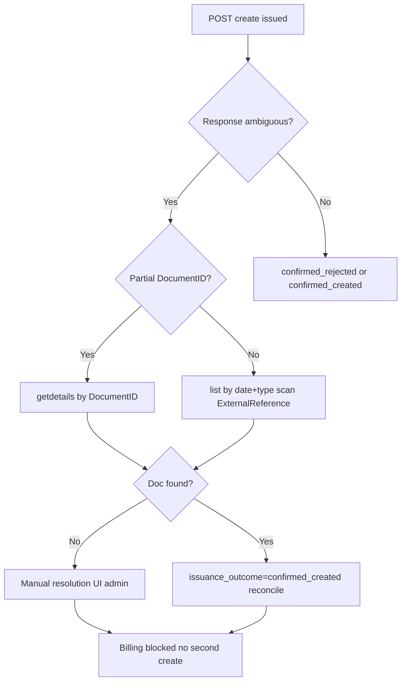

# ProjectFlow ↔ SUMIT Test Environment — FINAL PLAN (Phase 0, Revised)

**Status: APPROVED — IMPLEMENTATION IN PROGRESS (Milestone A).**  
**Owner approval:** 2026-09-18. Production / Receipt / Credit / Expense = BLOCKED or DEFERRED.

**Canonical location:** `.cursor/plans/sumit_integration_phase_0.plan.md`  
**Revised:** 2026-09-18 (Owner review pass 2)

---

## Owner review — canonical answer block

| Field | Value |
|-------|-------|
| **AMBIGUOUS PROVIDER OUTCOME DESIGN** | Three outcomes (`confirmed_rejected` / `confirmed_created` / `ambiguous`); DB lock (`in_flight`) before provider call; ambiguous blocks all new creates |
| **SAFE RETRY RULE** | New `create` **only** after `confirmed_rejected` + row closed (`cancelled`). Never on timeout/ambiguous/mismatch |
| **DUPLICATE ISSUANCE INVARIANT** | ≤1 blocking row per `(org, billing, tax_invoice)` where blocking = `issuance_outcome IN (in_flight, ambiguous, confirmed_created)` |
| **DOCUMENT STATUS DESIGN** | Existing enum; narrow `failed` to confirmed pre-create rejection only; mismatch/timeout never use `failed` |
| **RECONCILIATION STATUS DESIGN** | New `reconciliation_status`: pending / matched / mismatch / not_available + `reconciliation_metadata jsonb` |
| **AMOUNT MISMATCH BEHAVIOR** | `status=issued` + `reconciliation_status=mismatch`; preserve external ID/number; block re-issue; UI blocking banner |
| **SUMIT LOOKUP/RECOVERY CAPABILITY** | `getdetails` by DocumentID or Type+Number; `list` by date/type (no ExternalReference filter — client scan) |
| **SUMIT EXTERNAL REFERENCE CAPABILITY** | YES — `Details.ExternalReference` on create; returned on getdetails; PF sends deterministic key |
| **SUMIT NATIVE IDEMPOTENCY** | **NO** — PF owns duplicate protection; same PF key ≠ safe retry without lookup |
| **EXISTING TAX_SNAPSHOT CONTENT** | subtotalAmount, taxAmount, totalAmount, currency, capturedAt; vat_mode on column; no ratePercent/ruleId yet |
| **NEW TAX SNAPSHOT FIELD REQUIRED** | **NO** (separate column) — optional extend JSON with vatMode/ratePercent at finalize |
| **CUSTOMER SNAPSHOT FINAL DESIGN** | `customer_snapshot jsonb`; Swagger-min fields; finalize capture; deliberate historical action — no silent backfill |
| **CREDENTIALS_REF DECISION** | **KEEP** as opaque vault pointer — do not drop |
| **CREDENTIAL VAULT FINAL DESIGN** | `app.invoicing_provider_credential_refs` (service-only) + seal `APIKey`; CompanyID non-secret |
| **PRODUCTION POSSIBLE IN MVP** | **NO** (required) |
| **OWNER ACTIONS REQUIRED BEFORE CODING** | **None** |
| **OWNER ACTIONS REQUIRED BEFORE LIVE TEST** | Test Configuration org + keys via secure connect only |
| **READY FOR OWNER APPROVAL** | **YES** |

---

## Revision summary (Owner corrections applied)

| # | Correction | Plan change |
|---|------------|-------------|
| 1 | Ambiguous timeout ≠ safe retry | Three-outcome issuance model; no blind re-create |
| 2 | Amount mismatch ≠ document failure | Separate reconciliation from document lifecycle |
| 3 | `failed` must not unlock duplicate issuance | Redesigned DB invariants + `issuance_outcome` |
| 4 | No duplicate tax snapshot | Use/extend existing `tax_snapshot`; drop `tax_rule_snapshot` column |
| 5 | Customer snapshot with deliberate historical capture | One canonical snapshot; no silent backfill |
| 6 | Swagger = agent responsibility | Verified from official OpenAPI (see §SUMIT API) |
| 7 | Test org ≠ coding blocker | Split Owner actions: before coding vs before live test |
| 8 | Production impossible in MVP | Hard-deny; no prod UI; no `SUMIT_ALLOW_PRODUCTION` in MVP |
| 9 | Minimize schema churn on `credentials_ref` | Keep as opaque vault pointer; service-only blob table |
| 10 | Auth from Swagger | `CompanyID` + `APIKey` required; only `APIKey` sealed |
| 11 | Milestones A→D | Tax invoice first; receipt/credit deferred |
| 12 | Future expense path | Recorded only; separate future phase |
| 13 | Test setup docs | Direct onboarding links; support chat not mandatory |

---

## Required revised report (canonical answers)

### AMBIGUOUS PROVIDER OUTCOME DESIGN

Three explicit outcomes after every create attempt:

| Outcome | Meaning | PF behavior |
|---------|---------|-------------|
| **1 — Confirmed rejection** | SUMIT returned explicit error; no `DocumentID` in response | Mark `issuance_outcome=confirmed_rejected`. Document row may be `cancelled` or terminal failed-pre-create. **Only case allowing a new create attempt** (after row archived/closed). |
| **2 — Confirmed success** | Response contains `DocumentID` (+ optional `DocumentNumber`) | Mark `issuance_outcome=confirmed_created`, `status=issued` or `pending`, store external refs, run reconciliation. **Block all future creates for this billing.** |
| **3 — Ambiguous** | Network timeout, 5xx, incomplete response, or cannot determine whether doc was created | Mark `issuance_outcome=ambiguous`, `status=pending`. **Block duplicate create immediately.** Enter recovery workflow. |

**Issuance attempt lock (before provider call):**

1. Begin DB transaction.
2. Assert no blocking row for `(org, billing_record_id, kind=tax_invoice)`.
3. Insert `external_statutory_documents` with `status=requested`, `issuance_outcome=in_flight`.
4. Commit — billing is now locked.
5. Call SUMIT `POST /accounting/documents/create/`.
6. On response, update outcome per table above.

Once step 4 commits, **no second create** for that billing until outcome is resolved.

**Important:** Reusing the same PF idempotency key / `ExternalReference` is **not** a safe retry after ambiguous timeout. SUMIT has **no native create idempotency** — a second create may produce a second document. Recovery must use lookup or manual resolution only.

### Ambiguous recovery workflow (mandatory)



1. **Partial response** — if `DocumentID` present despite timeout → immediate `getdetails`.
2. **No DocumentID** — `list` filtered by billing `issue_date` ±1 day, `DocumentTypes=[Invoice]`, scan results for PF `ExternalReference`.
3. **Match found** — promote to `confirmed_created`, store IDs, run reconciliation.
4. **No match** — remain `ambiguous`; expose **manual resolution** (admin enters DocumentID or Type+Number from SUMIT UI); **never** auto-create.
5. **Admin manual link** — `getdetails` to confirm → `confirmed_created`.

### SAFE RETRY RULE

| Situation | Allowed action |
|-----------|----------------|
| Confirmed rejection (outcome 1) | New create allowed after explicit close of rejected attempt |
| Confirmed success (outcome 2) | No create; refresh/reconcile only |
| Ambiguous (outcome 3) | **No create.** Recovery only via lookup or manual resolution |
| Amount mismatch after confirmed create | **No create.** Reconciliation workflow only |
| User double-clicks | Blocked by in-flight / blocking row + UI disable |

**Never:** auto-send a second `create` on timeout or ambiguous error.

### DUPLICATE ISSUANCE INVARIANT

**At most one blocking external tax invoice per `(organization_id, billing_record_id, kind='tax_invoice')`.**

A row is **blocking** when:

```
issuance_outcome IN ('in_flight', 'ambiguous', 'confirmed_created')
```

**NOT blocking (fresh create permitted):** only when no row exists OR all prior rows are terminal with `issuance_outcome=confirmed_rejected` AND `status=cancelled`.

**Partial unique index (revised):**

```sql
UNIQUE (organization_id, billing_record_id, kind)
WHERE issuance_outcome IN ('in_flight', 'ambiguous', 'confirmed_created')
```

Do **not** exclude generic `failed` from blocking logic by treating it as retry-eligible. **`failed` must never unlock a new create** unless paired with `issuance_outcome=confirmed_rejected` and explicit close.

**Terminal states permitting fresh create:** **only** `issuance_outcome=confirmed_rejected` AND `status=cancelled` (or no prior row).

**Never retry-eligible:** `failed` with unknown outcome, `ambiguous`, `confirmed_created`, `in_flight`, or `issued` (including reconciliation mismatch).

### DOCUMENT STATUS DESIGN

Keep existing enum; **narrow semantics:**

| Status | Meaning |
|--------|---------|
| `requested` | Local row created; call not yet sent or just starting |
| `pending` | Provider accepted / in progress / **ambiguous awaiting resolution** |
| `issued` | Provider document confirmed (`DocumentID` known) |
| `allocated` | Allocation reference stored (Phase 6) |
| `credited` | Externally credited (Phase 5) |
| `cancelled` | Attempt closed without issued doc (confirmed rejection cleanup) |
| `failed` | **Reserved for confirmed pre-create rejection only** — not for mismatch, not for ambiguous timeout |

### RECONCILIATION STATUS DESIGN

**New field:** `reconciliation_status` on `external_statutory_documents`:

| Value | When |
|-------|------|
| `pending` | Document confirmed; amounts not yet compared |
| `matched` | NET/VAT/GROSS within tolerance |
| `mismatch` | Document exists; amounts differ materially |
| `not_available` | Provider response lacks breakdown |

**New field:** `reconciliation_metadata jsonb` — expected vs actual amounts, comparedAt, tolerance used.

Reconciliation is **orthogonal** to `status`. A document can be `status=issued` + `reconciliation_status=mismatch`.

### AMOUNT MISMATCH BEHAVIOR

When SUMIT returns `DocumentID` but amounts ≠ billing:

1. Set `status=issued` (document **exists** at SUMIT).
2. Set `issuance_outcome=confirmed_created`.
3. Set `reconciliation_status=mismatch`.
4. Store details in `reconciliation_metadata`.
5. **Block** any new tax invoice for this billing.
6. UI: blocking error banner — "חשבונית הונפקה ב-SUMIT אך הסכומים אינם תואמים — נדרש טיפול."
7. Actions: View in SUMIT, refresh details, admin review (Phase 6). **No retry create.**

---

## SUMIT API (agent-verified Swagger)

**Official OpenAPI:** `https://api.sumit.co.il/swagger/v1/swagger.json`  
**Swagger UI:** `https://app.sumit.co.il/help/developers/swagger/index.html`

**Agent responsibility (not Owner):** Master/Agent A captures exact Create/Get/List request/response schemas from OpenAPI before Milestone B provider work. Owner does **not** export Swagger manually.

**Blocker for Milestone B (not Milestone A):** "Exact official Create/Get/List schema verified by agent" — **resolved at plan time** from OpenAPI; maintained in implementation as `docs/integrations/sumit-openapi-reference.md` (created during Milestone A, not Phase 0).

### Accounting document endpoints (Swagger)

| Endpoint | MVP scope | Purpose |
|----------|-----------|---------|
| `POST /accounting/documents/create/` | **Milestone B** | Issue tax invoice (Type `0`) |
| `POST /accounting/documents/getdetails/` | **Milestone B** | Recovery + refresh + reconciliation source |
| `POST /accounting/documents/list/` | **Milestone B** | Ambiguous recovery scan |
| `POST /accounting/documents/getpdf/` | Metadata only | URL via create/getdetails response; no PF download |
| `POST /accounting/documents/send/` | Out of MVP | Email send deferred |
| `POST /accounting/documents/cancel/` | Out of MVP | Use credit flow in Milestone D |
| `POST /accounting/documents/addexpense/` | **Future phase** | AP/supplier — record only |

Create request requires (`Accounting_Documents_Create_Request`): `Credentials`, `Details` (requires `Customer`, `Type`), optional `Items`, `Payments`, `VATIncluded`, `VATRate`, `ExternalReference`.

Create response (`Accounting_Documents_Create_Response`): `DocumentID`, `DocumentNumber`, `CustomerID`, `DocumentDownloadURL`, `DocumentPaymentURL`.

### SUMIT LOOKUP/RECOVERY CAPABILITY

| Endpoint | Capability | Recovery use |
|----------|------------|--------------|
| `POST /accounting/documents/getdetails/` | Lookup by `DocumentID` **or** (`DocumentType` + `DocumentNumber`) | Primary recovery if partial response or admin supplies number |
| `POST /accounting/documents/list/` | Filter: `DocumentTypes`, `DocumentNumberFrom/To`, `DateFrom/DateTo`, paging | Secondary: narrow by issue date + type; scan for matching `ExternalReference` |
| `POST /accounting/documents/create/` | Returns `DocumentID`, `DocumentNumber`, URLs | Success path |

**Gap:** `list` has **no** `ExternalReference` filter. Recovery strategy:

1. If timeout but partial response had `DocumentID` → `getdetails` immediately.
2. Else set `ExternalReference` on create to deterministic PF key → on ambiguous, `list` by date range + type → match `ExternalReference`.
3. If no match → **manual resolution** UI; never auto-create.

### SUMIT EXTERNAL REFERENCE CAPABILITY

`Details.ExternalReference` (string, nullable) on create — Swagger: *"Document external reference (expense invoice number)."*

**PF mapping:** deterministic key, e.g. `pf:{billingRecordId}:tax_invoice:v1`.

Also returned on `getdetails`. Customer-level: `Customer.ExternalIdentifier` for customer upsert.

### SUMIT NATIVE IDEMPOTENCY

**None documented.** No idempotency header/key in OpenAPI. PF owns all duplicate protection.

### Auth payload (`Core_APICredentials`)

| Field | Secret? | Storage |
|-------|---------|---------|
| `CompanyID` (int64) | No | Connection metadata (server-side) |
| `APIKey` (string) | **Yes** | Sealed in service-only vault |

`APIPublicKey` (`Core_APIPublicCredentials`) — client-side flows only; not required for server document create.

---

## Existing `tax_snapshot` — do not duplicate

### EXISTING TAX_SNAPSHOT CONTENT

Frozen at finalize via `captureTaxSnapshot()` in `src/modules/billing/domain/tax.ts`:

```typescript
interface TaxSnapshot {
  subtotalAmount: string;   // NET
  taxAmount: string | null; // VAT
  totalAmount: string;      // GROSS
  currency: string;
  capturedAt: string;
}
```

**Also on billing row:** `vat_mode` column (migration 0082). **Not in tax_snapshot today:** `ratePercent`, `taxRuleId`.

### NEW TAX SNAPSHOT FIELD REQUIRED = **NO** (separate column)

Extend existing `tax_snapshot` JSON at finalize optionally:

```json
{ "vatMode": "exclusive", "ratePercent": 18 }
```

**Do not add `tax_rule_snapshot` column.**

### What SUMIT issuance still needs (from existing PF data)

| SUMIT field | PF source |
|-------------|-----------|
| `Details.Type` | `0` (Invoice) for tax invoice |
| `Details.ExternalReference` | PF deterministic issuance key |
| `Details.Date` / `DueDate` | `billing_records.issue_date` / `due_date` |
| `Details.Currency` | `billing_records.currency` |
| `Items[]` | `billing_lines` (description, line_total, optional qty/unit) |
| `VATIncluded` | derived from `vat_mode` (`inclusive` → true) |
| `VATRate` | extended `tax_snapshot.ratePercent` or org default |
| Amount reconciliation | `tax_snapshot` NET/VAT/GROSS vs getdetails `DocumentValue` / line items |

---

## CUSTOMER SNAPSHOT FINAL DESIGN

**Required:** `billing_records.customer_snapshot jsonb` — single canonical buyer snapshot.

**Swagger-min fields** (`Accounting_Typed_Customer` on create — only store issuance-relevant):

| Snapshot key | SUMIT field | Required by SUMIT |
|--------------|-------------|-------------------|
| `name` | `Customer.Name` | **Yes** for new customer |
| `companyNumber` | `Customer.CompanyNumber` | Optional (VAT/ח.פ. per SUMIT desc) |
| `externalIdentifier` | `Customer.ExternalIdentifier` | Optional — PF `clientId` for upsert |
| `email` | `Customer.EmailAddress` | Optional |
| `phone` | `Customer.Phone` | Optional |
| `address` | `Customer.Address` | Optional |
| `city` | `Customer.City` | Optional |
| `postalCode` | `Customer.ZipCode` | Optional |
| `noVat` | `Customer.NoVAT` | Optional — when zero-rated client |
| `clientId` | (PF internal) | Eligibility + audit |
| `capturedAt` | — | Immutability audit |

Do **not** store fields SUMIT does not use (website, contacts beyond billing, project refs).

- Capture at **finalize** when `client_id` present (from `clients` + `party_identifiers`).
- **Historical billings without snapshot:** issuance **blocked**.
- **Deliberate capture action:** show live client values → Owner confirms → write snapshot once → never modify finalized amounts.
- **No silent backfill** from today's client master on old billings.

---

## CREDENTIALS_REF DECISION

**KEEP** `external_invoicing_provider_connections.credentials_ref` as **opaque vault pointer**.

| Location | Content |
|----------|---------|
| `credentials_ref` on connection row | Opaque pointer only |
| `app.invoicing_provider_credential_refs` (new, service-only) | Sealed `{ apiKey, companyId }` — 0087 pattern |

**Do NOT drop** `credentials_ref` in migration 0093.

### CREDENTIAL VAULT FINAL DESIGN

Connect flow (server action, `SETTINGS_MANAGE`): receive `apiKey` + `companyId` once → seal → vault → pointer on connection row → never return to client. Reuse `token-seal.ts`.

---

## PRODUCTION POSSIBLE IN MVP = **NO** (required)

- No production connect UI
- App rejects non-test connection in MVP
- No `SUMIT_ALLOW_PRODUCTION` env in MVP
- **Goal:** impossible to accidentally issue a real document in this cycle

---

## SUMIT test environment (updated official docs)

**Test Configuration** — free, no time limit:

- Direct signup links in [מסלול בדיקות](https://help.sumit.co.il/he/articles/15291230)
- Name includes **"בדיקות"**; red label; VAT **999999998**
- ~100 operations + 400 API/automation calls/month
- No ITA/allocation in test; no test→production conversion
- Support chat **not mandatory** — [בדיקות ותהליכי אינטegrציה](https://help.sumit.co.il/he/articles/5840939)

---

## Milestone execution order

### MILESTONE A — Test connection (no live SUMIT for most work)

Credential vault, connection service, test-only settings UI, mocked SumitProvider, unit tests. Agent maintains OpenAPI reference during implementation.

### MILESTONE B — One tax invoice end-to-end (live SUMIT test)

One finalized billing → one SUMIT test Tax Invoice (type `0`) → `DocumentID`/`DocumentNumber` stored → reconciliation matched → duplicate/ambiguous blocked → billing UI.

**Gate:** Milestone B verified before C/D.

### MILESTONE C — Receipt (deferred)

### MILESTONE D — Credit (deferred)

---

## Future capability — expense/AP (record only)

Swagger: `POST /accounting/documents/addexpense/`, types 15–22. **Not part of current AR integration.** Separate future phase.

---

## Migration plan (revised `0093_invoicing_sumit_hardening.sql`)

**Prepare only after approval. Do not apply.**

| Change | Notes |
|--------|-------|
| `app.invoicing_provider_credential_refs` | Service-only sealed storage |
| **Keep** `credentials_ref` | Opaque pointer — do not drop |
| `issuance_outcome` | `in_flight`, `confirmed_rejected`, `confirmed_created`, `ambiguous` |
| `reconciliation_status` + `reconciliation_metadata` | Separate from document status |
| `idempotency_key` | PF key; also SUMIT `ExternalReference` |
| Partial unique index | Blocking outcomes only |
| `customer_snapshot jsonb` | Buyer freeze |
| Extend `captureTaxSnapshot()` | Optional `vatMode`, `ratePercent` in JSON |
| RLS hardening | `install_org_table_rls` on connection table |

---

## Provider architecture

**YES — `SumitStatutoryProvider`** inside existing `StatutoryInvoicingProvider`. Extend `BillingRecordBridgeRef` only.

---

## Billing eligibility

E1–E16 from prior plan, plus:

- E17: No blocking external doc row (DUPLICATE ISSUANCE INVARIANT)
- E18: Connection `status=connected` (test only)

---

## PDF / View

No PDF download in PF. `DocumentDownloadURL` → `external_url` → "View in SUMIT".

---

## OWNER ACTIONS

### BEFORE CODING — **None**

### BEFORE LIVE TEST (Milestone B)

1. Create SUMIT Test Configuration business
2. Install Income module; generate API keys
3. Enter credentials **only** via secure connect UI
4. **Never** paste private key into chat, git, docs, or commits

---

## EXACT IMPLEMENTATION AGENT PLAN

| Agent | Ownership | Key files (exclusive) |
|-------|-----------|------------------------|
| **A — Provider + API client** | SUMIT HTTP, OpenAPI mapping, ambiguous handling | `src/modules/invoicing-integration/providers/sumit/**`, `docs/integrations/sumit-openapi-reference.md` |
| **B — Persistence + secrets** | Migration 0093 prep, vault, indexes | `drizzle/migrations/0093_*`, `drizzle/schema/invoicing-integration.ts`, `drizzle/schema/billing.ts`, `data/credentials.repository.ts` |
| **C — Application orchestration** | Issuance lock, 3-outcome flow, recovery, reconciliation, bridge | `application/request-external-document.ts`, `application/build-statutory-bridge.ts`, `application/reconcile-external-amounts.ts`, `application/resolve-statutory-provider.ts`, `application/manage-provider-connection.ts`, `billing/application/finalize-billing-record.ts` |
| **D — UI** | Test connect + billing panel; blocking banners | `invoicing-integration/ui/**`, `settings/integrations/**`, `billing/[billingRecordId]/page.tsx` |
| **E — Tests** | Invariant, reconciliation, ambiguous-no-retry | `tests/unit/invoicing-integration/**`, `tests/integration/invoicing-integration/**` |
| **Master** | Integration, conflict resolution, Milestone gates | Cross-cutting review; **no C/D until B live-verified** |

**Parallelization:** B first → (A + C) parallel → D → E. **No two agents edit same file concurrently.**

**Credentials rule:** private API key enters **only** via secure connect server action — never git, docs, chat, or test fixtures committed.

---

## Test plan (additions)

| # | Test | Asserts |
|---|------|---------|
| T1 | Ambiguous timeout | No second create; `issuance_outcome=ambiguous` |
| T2 | Confirmed rejection | New create after close |
| T3 | Amount mismatch | `issued` + `reconciliation_status=mismatch` |
| T4 | ExternalReference recovery | List scan finds doc after simulated timeout |
| T5 | Blocking index | Second blocking insert fails |

---

## FINAL REPORT SUMMARY

| Field | Value |
|-------|-------|
| AMBIGUOUS PROVIDER OUTCOME DESIGN | Three outcomes; lock before call; no blind retry |
| SAFE RETRY RULE | Create only after confirmed_rejected + closed |
| DUPLICATE ISSUANCE INVARIANT | One blocking row per billing+kind |
| DOCUMENT STATUS DESIGN | Narrow `failed`; mismatch ≠ failed |
| RECONCILIATION STATUS DESIGN | Separate field: pending/matched/mismatch/not_available |
| AMOUNT MISMATCH BEHAVIOR | issued + mismatch; block re-issue |
| SUMIT LOOKUP/RECOVERY CAPABILITY | getdetails; list+ExternalReference scan |
| SUMIT EXTERNAL REFERENCE CAPABILITY | YES — `Details.ExternalReference` |
| SUMIT NATIVE IDEMPOTENCY | **NO** |
| EXISTING TAX_SNAPSHOT CONTENT | NET/VAT/GROSS/currency/capturedAt |
| NEW TAX SNAPSHOT FIELD REQUIRED | **NO** — extend JSON optional |
| CUSTOMER SNAPSHOT FINAL DESIGN | finalize + deliberate historical capture |
| CREDENTIALS_REF DECISION | **KEEP** opaque pointer |
| CREDENTIAL VAULT FINAL DESIGN | `app.invoicing_provider_credential_refs` + seal APIKey |
| PRODUCTION POSSIBLE IN MVP | **NO** |
| OWNER ACTIONS REQUIRED BEFORE CODING | **None** |
| OWNER ACTIONS REQUIRED BEFORE LIVE TEST | Test org + keys via secure connect |
| READY FOR OWNER APPROVAL | **YES** |

---

**STOP. No code, migrations, env changes, or SUMIT API mutations until Owner writes: `APPROVED — START IMPLEMENTATION`.**
