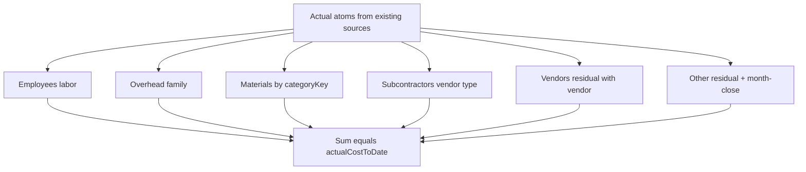

# Project Actual Breakdown (Owner 10-second view)

**Status:** Plan ready — await Owner approve to implement  
**Scope:** Display-only exclusive Actual partition; no second financial engine  
**Commit / push / deploy:** NONE until Owner review after implementation

## Overview

Add one display-only exclusive Actual breakdown (Employees / Subcontractors / Vendors / Materials / Other / Overhead) that reconciles exactly to `actualCostToDate`, then surface it as the Owner’s 10-second Project story on Overview + Financials with set-based drilldowns — without changing the financial engine.

## Implementation todos

| ID | Task |
|----|------|
| domain-classify | Add project-actual-breakdown domain + identity assert + material key helper |
| loaders | Set-based atom loader + employee/vendor/sub drilldowns (no N+1) |
| shared-ui | ProjectActualBreakdownView + mobile expandable category drills |
| overview-financials | Wire Overview story + reorganize Financials panel order |
| team-time | Team/Time summaries from same labor aggregate |
| tests-verify | Identity/seed/dedup/scale tests + typecheck/build; OWNER REVIEW report |

## Constraint lock

- **Reuse** [`composeProjectFinancials`](../../src/modules/financials/application/compose-project-financials.ts) / [`aggregateProjectCosts`](../../src/modules/financials/domain/cost-aggregation.ts) — no second Actual formula.
- Classification is a **display partition of the same atoms** that already feed Actual (expenses after Expense/AP dedup, workforce labor, recognized AP slices, month-close cost net).
- **No migrations** unless a missing index blocks the new set-based queries (default: **NONE**).
- **No commit/push/deploy**.

## Classification (exclusive waterfall)

Process each recognized Actual atom once, first match wins:

1. **Employees** — workforce labor only (`laborCost` residual time + monthly allocation). Never attendance. Never Mode-B labor expenses already excluded when workforce data exists.
2. **Overhead** — expense/allocation atoms with `costFamily === 'business_overhead'` (same as today’s `overheadActual` / family).
3. **Materials** — expense atoms whose `categoryKey` matches deterministic material keys (no guessing):
   - `materials`, `materials_*`, `*_materials`, or key contains `materials` (covers org defaults + profile seeds like `materials_gc`, `building_materials`, `install_materials`).
   - AP bill atoms: **only** if a reliable category exists on the bill/line; otherwise do **not** invent Materials from vendor type.
4. **Subcontractors** — remaining expense/AP atoms with vendor type `subcontractor` | `both` (same `isSubcontractor` rule as today).
5. **Vendors** — remaining expense/AP atoms with a vendor that are not already Subcontractors/Materials.
6. **Other expenses** — residual (no vendor, shared/direct leftovers, `asset_capital`, month-close cost net, anything unclassified).

**Hard identity:** after `roundMoney`, category totals **must** equal `financials.cost.actualCostToDate`. If floating residual cents remain from ordering, fold the delta into **Other** and fail the unit test if abs(delta) exceeds 0.01.

## Domain + application layer (single truth)

| Piece | Role |
|-------|------|
| `src/modules/financials/domain/project-actual-breakdown.ts` | Pure `buildProjectActualBreakdown(atoms, totalActual)` → categories, %, source counts, identity check |
| `src/modules/financials/application/get-project-actual-breakdown.ts` | Loads atoms set-based for one project; calls `getProjectFinancials` / cached financials for total + permissions; returns `ProjectActualBreakdown` |
| `src/modules/financials/application/get-project-actual-breakdown-drilldowns.ts` | Employee / vendor / sub / material / other / overhead drill rows — **same aggregates** Team/Time/Financials read |

### Employees drill (set-based)

- One query: residual time entries for project grouped by `employeeId` (hours, distinct work dates, sum cost) — extend patterns in `time-entries.repository.ts` / `sumProjectLaborCost`.
- One query: monthly allocation lines for project grouped by employee (from existing displacement tables).
- Merge in memory to per-employee total; period rows for expand.
- Missing cost: never ₪0 — surface unresolved state (existing partial rules).
- Sum of employee costs **=** Employees category **=** `laborActual` when workforce feeds Actual.

### Vendors / Subs drill

Classify expense+AP atoms with vendor metadata (extend contribution load to keep `vendorId`/`vendorName`/`vendorType` for breakdown only — engine unchanged). Replace island usage of `ProjectVendorActualPanel` as the primary Owner path (panel can wrap the shared breakdown category).

### Subcontractors drill extras

Commercial commitment / paid from existing subcontract loaders — labeled **ACTUAL vs COMMITMENT vs PAID**; only Actual in the breakdown total.

### Materials / Other / Overhead

List source expense/AP rows from the classified atoms + links to `/expenses?...` / AP records.

### Commitments / Forecast

- **Commitments block (display only):** reuse `committedOpen` / existing PO + subcontract remaining — clear split from Open AP payable.
- **Forecast formula UI:** show `Actual + Commitments + ETC = Forecast` and `Contract − Forecast = Forecast profit` using existing KPI fields from `resolveProjectKpiDisplay`.

## UI wiring

| Surface | Change |
|---------|--------|
| Overview `overview-tab.tsx` | After commercial summary: **תמונת הפרויקט** (contract / actual / commitments / forecast / billed / collected / profit) then **ממה מורכבת העלות בפועל?** shared breakdown (expandable rows). Visible without “More info”. |
| Financials `project-financials-panel.tsx` | Reorder: Contract → Actual Breakdown → Commitments → Forecast formula → Billing/Collection → Profit → Cash flow → Advanced (families / coverage / old KPI explain). |
| Shared UI | `ProjectActualBreakdownView` + category drill panels (mobile: stacked cards, 390px). |
| Team | Add hours + recognized labor cost from **same** employee aggregate (permission-safe). |
| Time | Project summary table above entries from **same** aggregate; must reconcile to Labor Actual. |

Hebrew owner labels via `financial` / `projects.overview` namespaces (עלות בפועל, עובדים, קבלני משנה, ספקים, חומרים, הוצאות אחרות, תקורה, …). English advanced keys only in advanced section.

## Performance

- All loaders: **O(1) query groups per project** (group-by employee/vendor in SQL or one fetch + memory group).
- Forbid `employees.map(await …)` / per-vendor DB loops.
- Integration scale test: 100 employees + many expense/AP rows → query count bounded (same pattern as `tests/integration/financials/batch-query-scale.test.ts`).

## Tests (must pass before Owner review)

1. **Identity unit:** seeded amounts Employees 10k + Subs 8k + Vendors 7.5k + Materials 5k + Other 8k + Overhead 5,018.64 = **43,518.64**; difference `0.00`.
2. **No double count:** Expense/AP match excluded; subcontractor not also Vendor; material category not also Vendor; labor not in expense categories.
3. **Permissions / missing labor cost** — no fake ₪0.
4. **Drilldown** reaches expected source ids.
5. **Team/Time** labor sum === Employees category.
6. Typecheck + build + targeted financial units.

## Out of scope this wave

- Redesigning compose / org rollup engine.
- Payroll / attendance as Actual.
- Inventing material Actual from usage-only records (usage stays operational on Usage tab).
- Commit/push/deploy.
